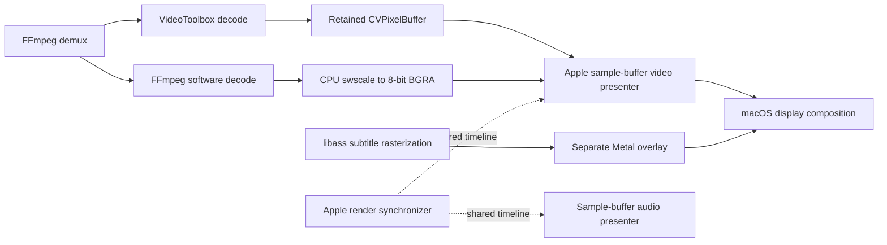

# Platinum findings register: structure, robustness, and user experience

Source review and editorial/architecture review: 2026-09-04, against Platinum
commit `dd3080e3` plus the inspected working tree. The reviewed chrome changes
were in AppModel, ElasticPlaybackControlBar, PlaybackControlBarHost,
PlayerRootView, and PlaybackChromeAndSidebarTests. This identifies the review
snapshot; capture the commit and working-tree diff again for implementation or
release qualification. No player was launched or physical playback qualified.

This is the living record for continued comparison and investigation. Keep
findings here rather than creating a new report for each search. Research and
documentation are ongoing. On 2026-09-04 the user authorized proceeding with all
items. Implementation follows the work groups below; investigations and product
decisions retain their own acceptance criteria rather than becoming assumed bugs.

Latest source comparison: [October source re-review](#source-re-review--2026-10-02).
This supersedes older missing-tool claims with the current implementation status.

Previous research: [playback parity closeout review](#playback-parity-closeout-review--2026-09-06)
(2026-09-06), against `025fc2d0` plus the startup-fix working tree. This separates
missing everyday tools from implemented behavior awaiting qualification, and
breaks P-003 into individual acceptance contracts. Packaging is not the focus of
this pass. The [120-item UX comparison](#ux-comparison-inventory--2026-09-05)
remains the interaction inventory; neither review establishes runtime parity.

Latest performance qualification: release render/CPU/memory and responsiveness results (reference omitted from this source export)
at product commit `a477d32b`: 16 standalone runtime profiles passed clock, queue
and failure checks; a 60-second HEVC gate and animated-ASS cost probe also passed.
The measured software-planar path saves about 67 MiB of physical footprint versus
BGRA on the matched 1080p fixture. Long-GOP 4K exact seeking (about 2.4 seconds to
preroll) and heavy animated libass rendering remain useful optimization targets.
Full glass/UI cost, controlled display cadence and long endurance remain open;
these profiles do not close physical display or mpv/IINA parity acceptance gates.

Seek follow-up: exact-seek decoder optimization and comparative research (reference omitted from this source export)
adopts guarded non-reference-frame skipping before exact targets, informed by
mpv's decoder adapter. All 60 release seeks completed with matching landing PTS;
median preroll decreased 29–50% across three long-GOP fixtures (4K H.264:
2.66 seconds to 1.65 seconds). Keyframe snapping, added decoder threads and a
second preview decoder are not part of this change. Physical input-to-display
latency and additional threading/resource qualification remain separate gates.

4K follow-up: bounded software acceleration with safe hardware handoff (reference omitted from this source export)
reduces matched expensive H.264 seeks by 52–59% while preserving exact output.
The 749-test suite, six-target pixel/PTS comparisons, 48 runtime seeks,
10 hardware control seeks and four resource profiles pass. The measured cost is
a temporary 426–433 MiB process-footprint peak; resumed hardware playback uses
about 3.4% of one CPU core. The policy is qualified for progressive 8-bit 4K
H.264 with planar output and explicit power/memory guards, not all 4K formats.

Initial UX verification: results and evidence for all 33 Verify rows (reference omitted from this source export)
(2026-09-05): 9 failed proposed checks, 1 confirmed policy difference, 15 partial,
and 8 unverified. The full fixture-enabled suite failed on a reproducible
thumbnail decode check; five additional expectations document known policy
failures. These results do not close the broader qualification requirements.

Latest UX implementation: interaction, lifecycle and behavior policies (reference omitted from this source export)
addresses the requested groups 1–4: scoped focus/presentation ownership, guarded
gesture transactions, click/dismissal behavior, OSD lifetime, controls preferences,
window/quit recovery, Open versus Add to Sources, paused restoration, history
opt-out, final-frame replay and recognized private-output disconnect handling.
The full fixture suite passed **741 tests**, with **217 app tests** passing
after the final gesture ownership adjustment. These rows have implemented
policies; actual accessibility/window/device task qualification remains open. The affected inventory rows now reflect that follow-up, including UX-020 and
UX-054; the linked verification record retains the historical evidence.

Prior implementation: seek profiling and thumbnail work reduction (reference omitted from this source export)
adds nearby forward thumbnail reuse, pre-target conversion avoidance with one
native EOF fallback frame, and per-stage failure/timing records. **721 tests
pass** with the fixture inventory required. All 54 native seeks in the larger
ten-second-GOP matrix complete, and the final thumbnail repeat returns 54/54
images. An earlier run missed 13/54 thumbnails under host contention; those
failures remain in the evidence. The original small-file nil-thumbnail failure was not
reproduced in ten fresh baseline processes and remains unexplained. Physical
input-to-visible-frame latency is still unmeasured. The preceding
seek robustness work (reference omitted from this source export)
fixes queued thumbnail deadlines, stale decoder/image reuse after source changes,
unrepresentable timestamps and retired seek-journal updates, and protects
presentation-fence capture. The earlier
seek performance work (reference omitted from this source export)
adds stage timing, early pre-target output rejection, bounded accumulated skip
destinations and 40 ms native-dispatch pacing while preserving exact final
targets. Software buffer checkouts decrease in three tested fixtures, and a
five-command burst needs two native seeks. The reliability fixes (reference omitted from this source export)
and earlier seven UX fixes (reference omitted from this source export)
retain their evidence. The original mid-clip thumbnail failure and broader
device/accessibility qualification remain open. UX-020/054 now have explicit
implemented policies in the latest follow-up.

## How to maintain this document

- IDs are permanent: `S-` structural, `U-` user experience/compatibility, `V-`
  validation, and `P-` product scope. Do not reuse an ID after closing it.
- Track evidence and disposition separately. Evidence is **confirmed**, **risk**,
  or **needs validation**. Disposition is **open**, **investigating**,
  **planned**, **in progress**, **implemented / awaiting validation**, **closed**, or **deferred**.
- P1 means high impact within the supported local-video scope; P2 means normal
  priority; P3 means optional expansion. Conditional priorities name the audience.
- Each finding needs a concrete observation, user/engineering consequence,
  source pointers, and a next check or acceptance criterion. File size and search
  absence alone do not establish a defect.
- Verify old findings against the current revision before promoting them into
  implementation work. Record a resolution and evidence when closing one; keep
  the ID and historical observation.
- Treat upstream development code, released features, model tests, generated
  fixtures, and physical playback as distinct evidence. An upstream option is
  not proof that every build, device, or IINA configuration supports it.
- **Confirmed** describes the observed source/probe behavior, not necessarily
  its visible impact. **Risk** means a plausible adverse consequence still needs
  reproduction or measurement. **Needs validation** identifies a qualification
  task. Keep that distinction in acceptance and status decisions.
- Prefixes are historical identifiers, not work classifications: U-007 is
  qualification, and U-005/U-008 include product-scope decisions. These 35 records
  are not 35 reproduced bugs or 35 equally urgent implementation tasks. U-015 was
  added by user request on 2026-09-05 after the original 34-record review.
- Temporary probes are research evidence, not durable regression coverage. When
  implementing a fix, preserve its reproducer/reference vectors in the repository
  and record the build, dependency versions, and relevant output artifacts.

The reviewed document was committed as `4a6d5369`. Implementation is now active.
Historical observations below describe the review snapshot; the status ledger
and resolution notes distinguish subsequent changes. Priority and authorization
do not change the evidence level or substitute for release qualification.

## Implementation status — 2026-09-05

The latest local runtime and packaged-window evidence is recorded in the
33-item UX verification (reference omitted from this source export), following
the twentieth checkpoint below. Earlier statements such as “no player was launched” describe
their individual checkpoints, not the cumulative qualification status.

| Findings | Current disposition | Delivered evidence and remaining work |
| --- | --- | --- |
| S-010 | Implemented / awaiting validation | Explicit per-frame swscale matrix/range, RGB attachment audit, and independent BT.601/709/2020 reference vectors including cached-context changes. Physical output remains unqualified. |
| S-011, U-014 | Implemented / awaiting validation | PiP source matrix/range, primaries/transfer, crop, rotation, and mirroring. Metal output pixels are tested for color and asymmetric geometry. Actual SDR captioned PiP seek/restore now passes; external-display and transformed real-window qualification remain. |
| S-012 | Implemented / awaiting validation | Both renderer notifications use the existing exact-seek/re-preroll transaction, retain transport/seek intent, avoid decoder-failure escalation, and reject retired renderers. Sleep/wake ownership is preserved. Physical route transitions remain pending. |
| U-006, U-009, U-012 | Implemented / awaiting validation | Persistent recovery UI offers source-specific Retry/Skip/Stop or Retry/Locate/Forget, Copy Details, and Dismiss. Failed attempts are distinct from committed playback; explicit skips try one item and never loop. Queue edits invalidate obsolete retry context. Real mount/permission, keyboard/VoiceOver, and window qualification remain. |
| U-010, U-011 | Implemented / awaiting validation | Pre-shuffle order persists across relaunch, additions/removals reconcile, explicit ordering ends shuffle, and a newer rewatch position wins over the historical watched badge. Coordinator/store tests cover the fixes; packaged UI remains unqualified. |
| U-002 | Implemented / awaiting validation | Unicode-first SRT decoding plus a persisted Settings fallback for Windows-1252, Windows-1251, Shift JIS, and ISO-8859-1. Byte-vector tests cover Western, Cyrillic, and Japanese text; WebVTT stays UTF-8. |
| S-004 | Implemented / awaiting validation | Immutable source snapshots now build/sort rows on the existing browser actor. Search reuses cached rows; cancellation fences publication. 1k/10k/100k actor workloads and cyclic folder snapshots are covered. Real rapid UI and nested-tree/display qualification remain. |
| U-004 | Implemented / awaiting validation | Persisted ordered language defaults, Automatic/Forced-only/Always/Off subtitle selection, commentary avoidance, and accessibility flags are applied before native decoder creation. Existing per-file settings retain precedence. ISO language aliases and shuffled stream orders have regression coverage; qualify actual multi-episode media. |
| S-008 | Implemented / awaiting validation | File/Locate/Finder/drop classification and canonical symlink resolution now use bounded background preparation. UI/persistence comparisons are lexical and perform no filesystem resolution. Sidebar reads share physical admission; up to 64 background requests may wait asynchronously within one deadline, while interactive opens fail fast. Stop/replacement/shutdown reject late publication and source additions retain their destination tab. Real stalled-volume qualification remains under V-001. |
| S-005 | Implemented / awaiting validation | App startup loads history on a background task before constructing the player; concurrent waiters share one read/model, Finder requests retain arrival order, and shutdown rejects late publication. Legacy and versioned 10k/100k snapshots are measured. Full-snapshot background writes remain; no history pruning or speculative database migration. |
| S-007 | Implemented / awaiting validation | Native construction compares filesystem versions before/after opening, then reports applicability after source commit and before restoring tracks/time. Changed content starts at zero and archives earlier history. Verified Locate carries history across a rename; unavailable version metadata suppresses restore/history writes without blocking EOF traversal. Cross-volume and mounted-share identity qualification remain. |
| U-003 | Implemented / awaiting validation | Output enumeration and selection now use Core Audio UIDs, preserve the saved preference, and report the actual route. Missing devices fall back through the existing route-recovery path; a rejected change stays a persistent nonfatal error. Signed audio delay now supports ±10 seconds with independent bounded audio decoding, sample trimming/silence and candidate replacement. The offset survives track changes and resets on a new file; physical routing and lip-sync qualification remain. |
| S-006 | Implemented / awaiting validation | Packaging verifies direct headers/configuration plus hashes and architectures of all 26 non-system native-library inputs, including the tenth increment's libavfilter/libvmaf additions. Actual copied inputs and bundle inventory must match; ambiguous resolution and conflicting basenames fail. Comparison of two clean release hosts remains. |
| S-003 | Closed (architecture investigation) | Field/operation ownership was mapped after implementation. Existing core, transaction, session, and presentation authority remains; demonstrated independent preparation/startup/projection lifetimes have narrow tested seams. No evidence justifies another playback manager or broad file-size refactor. Reopen if a concrete change reveals conflicting authority. |
| S-013 | Implemented / awaiting validation | Synchronizer media-time observation replaces the 33 ms wall timer. Requested cadence follows nominal video rate (24–120 Hz, 30 Hz fallback); subtitles Off retain 4 Hz EOF observation. Main-actor callbacks coalesce; paused redraw uses explicit packet/geometry/exposure/delay events. Paused callback and active-clock tests pass; displayed animation, busy-window energy and physical EOF timing remain unqualified. |
| S-001 | Implemented / awaiting validation | Core Audio discovery checks both stream capacity and configured speaker positions; decoding negotiates stereo/5.1/7.1 PCM at 48 kHz. Sample buffers carry explicit channel labels, output changes revise the existing audio format contract, and unknown/unsupported layouts retain stereo. Synthetic channel-identity and muted paused-session tests cover bytes and submission; physical speaker identity, HDMI/USB route changes and downmix listening remain unqualified. |
| S-009 | Implemented / awaiting validation | Production now selects the existing bounded planar path for supported NV12/P010 formats, retaining per-generation BGRA fallback. Independent YUV code-value tests, generated format/seek/replacement tests and conversion-only timing pass. Full-range inference is consistent with pixel format. Full-range ten-bit now also uses P010; 4:4:4, higher precision and unsupported inputs retain BGRA; physical HDR/display and end-to-end performance qualification remain. |
| U-001 | Implemented / awaiting validation | Embedded PGS/DVD/DVB display sets decode into bounded premultiplied bitmap regions through the main Metal overlay and SDR PiP compositor. DVB page selection/acquisition/expiry and fresh bitmap state on seek have authored-packet and generated-session coverage. PGS crop pixels, positions, updates and bounds have independent packet tests. External VobSub pairs now support bounded preparation, per-language track selection, independent timing and saved-language restoration. Real-media/window qualification remains. |
| V-003 | Closed (documentation correction) | Manual checklist now distinguishes native supported capabilities, unsupported operations, and unmeasured qualification. Architecture documents the separate subtitle/EOF timer. No qualification checkbox was marked passed. |
| S-002 | Implemented / awaiting validation | Decoder-owned automatic BWDIF field reconstruction uses bounded temporal storage, existing queue admission, format-change drain, seek reset and explicit source-field fallback. Generated field-order/timing/seek checks and the fixture-required regression suite pass. Physical motion, hardware-transfer and performance qualification remain. |
| U-013 | Implemented / awaiting validation | SDR P010 captions retain ten-bit compositor output, with Apple presentation precision still unqualified. PQ/HLG P010 now composes in bounded linear light with 203-nit caption white and retains P010 through Apple displayed-buffer tests. Color metadata eligibility, code-value references, alpha, expiry and text rendering are covered. Physical HDR brightness, tone mapping and PiP transitions remain unqualified. |
| U-005 | Discovery improvements implemented; remapping decision pending | Help-menu entry, expanded shortcut reference and capability-filtered optional actions are implemented. Character-based I/F/M/? routing and native text/control focus deferral now have regression coverage. Full remapping remains a product decision. |
| U-008 | Source inventory complete; language decision / visual qualification pending | English strings, explicit localization calls/resources, plurals, number/time formats, fixed-size surfaces and RTL readiness were inventoried below. Doubled-string empty-state layouts now pass rendered checks; full-interface expansion, RTL and translation qualification remain. |
| U-015 | Implemented / partial visual qualification | Label-region contrast, role opacity, source-generation reset, bounded full-style caching, matrix-aware samples, neutral fallback and transition safeguards are implemented. Native SDR before/after glass corpus is captured; external HDR/display and end-to-end accessibility checks remain. Glass and existing halo are unchanged. See the linked qualification record below. |
| U-007; V-001–V-002 | Partial local qualification; device qualification remains | Actual packaged AX seeking, a VoiceOver announcement and navigation-conflict regression, native PiP windows, and a thirty-minute native H.264 run are recorded below. Full accessible task sequences, stalled NAS, physical devices/displays and long packaged sessions remain unqualified. |
| P-001–P-004 | Parity closeout review; expansions pending | The implemented baseline remains local video on macOS 26. The September 6 review ranks individual missing local-playback tools under P-003 with acceptance contracts. Remote/music scope and older OS support remain undecided. No unsupported tool is marked implemented or qualified. |

Additional correction: SwiftPM tests compile current Metal source instead of
silently loading an older `default.metallib` left in the build bundle by packaging.
Packaged applications continue to prefer their compiled shader library.

Validation commands and results are recorded below after each implementation
checkpoint. Do not interpret source/test completion as packaged-player evidence.

## Assessment

Platinum has a credible local-video playback foundation. Its remaining gaps are
primarily compatibility, output handling, and evidence across real devices.
They do not justify replacing its deterministic core or native presentation
architecture on the evidence reviewed here.

IINA is powered by mpv, so these are not two independent playback-engine
benchmarks. Use mpv to compare playback semantics and IINA to compare the macOS
product experience. See [IINA](https://iina.io/) and its
[player implementation](https://github.com/iina/iina/blob/develop/iina/PlayerCore.swift).

## Current work groups and priorities

This is the single current sequencing guide. Related findings retain separate
acceptance checks; work in independent groups can proceed concurrently. Release
qualification is ongoing and should not block small, independently verifiable
correctness fixes. The first increment addresses S-010, S-012, U-009, and related
independently testable fixes. Continue the remaining acceptance work according
to the affected audience and evidence.

| Work group | Findings | Next step and dependency |
| --- | --- | --- |
| Software video output | S-010, S-009 | Correct matrix/range conversion and establish independent reference vectors. Then qualify the existing planar path and its BGRA fallback; precision is a correctness concern, while throughput improvement requires measurement. |
| Audio lifecycle and output | S-012, U-003, S-001 | Design repeatable route-event recovery through the existing core/runtime/session owners first. Device selection and negotiated PCM layouts can build on it; audio delay remains a separate timestamp-mapping feature. |
| PiP rendering | S-011, U-014, U-013 | Validate and correct color/geometry for accepted SDR input together. Expand HDR/10-bit subtitle composition only after those contracts hold. Reuse the existing PiP compositor. |
| Restore and navigation | U-009, U-010, U-011, U-012, S-007, S-008, U-006 | Preserve unavailable session context and consistent rewatch/order semantics. Define failed-entry and replacement-content policies. Recovery actions consume those outcomes; metadata/fingerprint work must remain bounded and off the UI actor when it can block. These changes need not wait for renderer work. |
| Media compatibility | U-001, U-002, U-004, S-002 | Rank subtitle formats/encodings, track preference policy, and deinterlacing by the supported collection. Each needs its own capability and acceptance contract. |
| Measured structural/performance work | S-003, S-004, S-005, S-013 | Measure responsibility coupling, sidebar projection, history costs, and subtitle cadence. Do not create refactor or optimization projects solely from file size, collection shape, or timer presence. |
| Release and qualification | S-006, V-001, V-002, V-003, U-007 | Record dependency provenance, correct capability documentation, and qualify mounts, output devices/displays, long sessions, and accessible workflows. Share fixtures/evidence with the relevant fixes without counting the same work twice. |
| Glass text legibility | U-015; coordinate qualification with U-007/V-002 | Audit font-color consumers and actual backgrounds, establish difficult-case baselines, then improve selection and temporal stability through the existing palette/sample owners. Keep glass materials and appearance unchanged. |
| Product decisions | U-005, U-008, P-001, P-002, P-003, P-004 | Decide remapping, languages, remote/music scope, individual playback tools, and OS support. Comparison with mpv/IINA alone does not schedule these features. |

## Architecture boundaries for implementation

`PlaybackCoordinator` is the concrete product type in `PlaybackController.swift`;
`PlaybackController` is its compatibility typealias, not a second coordinator.
Retain the following division of responsibility:

| Existing owner | Responsibility to preserve | Relevant changes |
| --- | --- | --- |
| [PlaybackCore / RecoveryCore](../Sources/SuperplayrPlaybackCore/PlaybackCore.swift) | Deterministic transport, lifecycle and recovery decisions; typed events/effects and revision authority. | Model route events and user intent without adding a competing native or UI recovery policy. |
| [PlaybackRuntimeDriver](../Sources/SuperplayrPlayer/Player/PlaybackRuntimeDriver.swift) | Bridge product commands/runtime observations to the core and execute its effects. | Extend the bridge for supported commands/events; do not let UI actions bypass the new policy. |
| [PlaybackCoordinator](../Sources/SuperplayrPlayer/Player/PlaybackController.swift) and [persistence stores](../Sources/SuperplayrCore/Persistence/PlaybackPersistenceStore.swift) | Source/playlist transactions, restore choices, settings, and persistence applicability. | Keep unavailable-source, rewatch, shuffle, and traversal semantics here. AppModel presents their outcomes. |
| [NativePlaybackRuntime](../Sources/SuperplayrNativePlayback/Production/NativePlaybackRuntime.swift) | Native effect execution, session replacement, operation identity/lifetime and event reporting. | Coordinate accepted recovery/reconfiguration work with the existing transactions and fences. |
| [MediaSession](../Sources/SuperplayrNativePlayback/Media/MediaSession.swift) | Demux/decode queues and worker lifetimes, generation checks, preroll and drain. | Quiesce affected workers and replenish discarded media during recovery; avoid spawning a second presentation loop. |
| [NativePresentationCoordinator](../Sources/SuperplayrNativePlayback/Presentation/NativePresentationCoordinator.swift) and presenters | Serialized sample submission, shared clock, renderer membership and flush/rebuild mechanisms. | Apply authorized presentation changes and report completion; a flush alone does not reconstruct discarded samples. |
| [VideoDecoder](../Sources/SuperplayrNativePlayback/Media/VideoDecoder.swift), [SubtitlePipeline](../Sources/SuperplayrNativePlayback/Subtitles/SubtitlePipeline.swift), [PiPSubtitleCompositor](../Sources/SuperplayrNativePlayback/Presentation/PiPSubtitleCompositor.swift) | Pixel conversion/metadata, subtitle source/render lifetime, and the separate PiP composition target. | Fix each route's interpretation and output contract locally; share reference fixtures and proven helpers where useful. |

S-003 is an investigation into these existing boundaries. It is not a prerequisite
to every fix or a proposal for another engine/manager layer. Introduce a new
abstraction only when a concrete change demonstrates shared behavior or an
independent lifetime that the current owners cannot express clearly.

## Overlap review: related findings are not duplicate defects

No finding was merged or deleted in the editorial review. The apparent overlaps
need shared planning and explicit boundaries:

| Findings | Boundary / shared work |
| --- | --- |
| S-009 / S-010 / S-011 | Precision and software conversion coefficients are independent; PiP uses a different conversion implementation. Share color vectors, retain route-specific acceptance. |
| S-011 / U-014 / U-013 | PiP color, geometry, and format eligibility need separate checks. Correct current supported input before expanding accepted formats. |
| S-001 / U-003 / S-012 | PCM layout, user controls, and automatic route-event recovery differ. U-003 itself has two independently deliverable requirements below. |
| U-006 / U-009 / U-012 | Error presentation consumes unavailable-source and failed-advance policy outcomes; a generic Retry button cannot supply those policies. |
| S-004 / S-008 / V-001 | Sidebar projection, pre-open metadata work, and established native I/O blocking occur at different boundaries. A decoder-open timeout cannot fix all three. |
| S-005 / S-007 / U-011 | History workload, content identity, and rewatch semantics share storage but do not require one database migration or combined fix. |
| V-002 / U-007 / rendering acceptance | V-002 owns cross-device release evidence; accessibility retains its task-specific checks under U-007. Reuse qualification artifacts rather than create duplicate test plans. |
| U-015 / U-007 / U-013 | U-015 improves UI font-color decisions over unchanged glass. U-007 retains end-to-end accessibility qualification; U-013 owns subtitle pixels in PiP video. Share visual evidence without merging those separate contracts. |
| P-003 / S-002 / U-014 | Optional image-adjustment controls do not subsume deinterlacing or correct interpretation of existing crop/orientation metadata. |

## Playback compatibility findings

Evidence: confirmed in source. Disposition: open. First recorded in pass 1.

| ID | Priority | Gap and consequence | Current source | Acceptance target |
| --- | --- | --- | --- | --- |
| U-001 | P1 | Image subtitles are unavailable. PGS, DVD/VobSub, and DVB streams are explicitly non-playable, so a compatible video can still lack usable dialogue subtitles. | [FFmpegStreamInfo.swift](../Sources/SuperplayrNativePlayback/Media/FFmpegStreamInfo.swift), `NativeSubtitleCapability` | Start with PGS and DVD compositions. Verify palettes, placement, forced events, expiry, backward seeking, track changes, resizing, and PiP using redistributable real fixtures. |
| U-002 | P1 | Unicode-first decoding and selectable Windows-1252/1251, Shift JIS, and Latin-1 fallback are implemented. WebVTT remains UTF-8. | [SubtitlePipeline.swift](../Sources/SuperplayrNativePlayback/Subtitles/SubtitlePipeline.swift), `prepareExternalData` | Support BOM-aware decoding and a selectable fallback encoding for SRT; test UTF-16, Windows-1252, and representative non-Latin encodings. Keep file/conversion size limits. |
| U-003 | P2; P1 for workflows needing explicit routing/sync correction | Device selection and signed audio delay are implemented and advertised. Device preferences survive temporary absence, and route changes reuse S-012 recovery. | [NativePlaybackRuntime.swift](../Sources/SuperplayrNativePlayback/Production/NativePlaybackRuntime.swift), `selectAudioOutputDevice`, `setAudioDelay`; [PlaybackController.swift](../Sources/SuperplayrPlayer/Player/PlaybackController.swift) | Two independent acceptance items: device selection and audio delay, specified below. Route-event recovery is S-012. |
| S-001 | P2; P1 for home-theater use | All decoded audio is converted to 48 kHz, two-channel PCM. Decoding a 5.1/7.1 fixture does not establish surround output. | [AudioDecoder.swift](../Sources/SuperplayrNativePlayback/Media/AudioDecoder.swift), `outputSampleRate`, `outputChannelCount`; [SampleBufferAudioPresenter.swift](../Sources/SuperplayrNativePlayback/Presentation/SampleBufferAudioPresenter.swift) | Negotiate supported output layouts; verify channel identity with spoken channel-ID fixtures. Keep stereo downmix as an explicit fallback. Treat encoded passthrough as a separate optional capability. |
| U-004 | P2 | Global language, subtitle-mode, commentary, and accessibility defaults are implemented before native decoding. Saved per-file choices retain precedence. Empty Automatic subtitle preferences preserve the demuxer choice. ISO language variants currently match at the base-language level. | [FFmpegDemuxer.swift](../Sources/SuperplayrNativePlayback/Media/FFmpegDemuxer.swift), `bestPlayableSubtitleIndex`, `bestStream`; [MediaPlaybackSettings.swift](../Sources/SuperplayrCore/Persistence/MediaPlaybackSettings.swift) | Rank explicit saved choices, preferred languages, default/forced flags, commentary/accessibility preferences, then deterministic fallback. Test a multi-episode folder with differing track orders. |
| S-002 | P2; P1 for broadcast/DVD collections | No deinterlacing path. The runtime explicitly reports source-field composition. Metadata detection is not field reconstruction. | [NativePlaybackRuntime.swift](../Sources/SuperplayrNativePlayback/Production/NativePlaybackRuntime.swift), `setDeinterlace` and capability diagnostics | Add a focused field-aware path and test top/bottom-field-first motion, mixed progressive/interlaced input, seeking, and timestamp cadence. |

U-003 retains one historical ID with two separately deliverable requirements:

- **Device selection:** enumerate/select available outputs, apply the existing
  saved preference, show the actual route, and fall back predictably when a saved
  device is absent. Coordinate route changes with S-012; do not duplicate its
  recovery owner or require surround output first.
- **Audio delay:** define signed offset semantics, supported range and persistence
  scope; apply the offset consistently across seek, track switch, pause/resume,
  and EOF. User delay must remain distinct from the synchronizer's A/V recovery.

Device selection uses Apple's [audioOutputDeviceUniqueID](https://developer.apple.com/documentation/avfoundation/avsamplebufferaudiorenderer/audiooutputdeviceuniqueid) contract. A narrow Objective-C bridge contains setter exceptions, including default-route reset failures observed in [WebKit's AVFoundation renderer](https://github.com/WebKit/WebKit/blob/main/Source/WebCore/platform/graphics/avfoundation/AudioVideoRendererAVFObjC.mm). Swift errors then reach persistent recovery UI without failing transport. Synthetic tests cover the exception boundary, default/explicit/unavailable catalogs, notification fencing, and nonfatal error projection; they do not establish physical routing.

The [mpv manual](https://mpv.io/manual/stable/) documents subtitle encodings,
language preferences, forced subtitle events, audio layouts/devices/delay, and
deinterlacing. Encoding autodetection depends on the mpv build. IINA also
documents image-subtitle controls in its
[1.3.2 release notes](https://blog.iina.io/release-note/1.3.2.html).
Its current development source falls back to automatic audio routing when a
configured device is missing; that is a useful concrete product contract.

### S-002 implementation resolution (tenth increment)

VideoDecoder now applies BWDIF automatically to decoded frames carrying the
interlaced flag, with automatic top/bottom field order and one output per field.
Progressive input bypasses the graph until needed; progressive sections inside
an active graph retain one frame and their full duration. Each output enters the
existing video-capacity contract synchronously. The graph has two native filter
threads, rejects software frames above 32 MiB, and bounds hardware transfer before
copying. It introduces no additional media queue or presentation clock.

EOF drains delayed fields. Format changes drain the old graph and rebuild with
the new geometry, pixel format, aspect ratio, color range and matrix. Seek and
decoder replacement discard temporal history. Filter timing uses the returned
time base and PTS, with source cadence supplying omitted durations; subtitle
observation follows doubled cadence while filtering is active. Unsupported
formats, unavailable filtering or bounded-input rejection preserve source-field
playback and report the reason. Downstream queue/cancellation failures propagate
through their existing contracts instead of being mistaken for filter failures.

The fixed filter graph adds libavfilter to the reviewed native inputs. This is
automatic source interpretation, not the optional image-adjustment/filter UI;
manual deinterlacing overrides remain unsupported. Physical motion quality,
VideoToolbox transfer behavior, real mixed/telecined material, CPU/energy and
display-deadline performance remain unqualified. The upstream field timing,
progressive bypass and EOF contracts are in
[FFmpeg's shared YADIF/BWDIF implementation](https://raw.githubusercontent.com/FFmpeg/FFmpeg/master/libavfilter/yadif_common.c).

### S-001 implementation resolution (ninth increment)

The existing Core Audio monitor now publishes native device capabilities with
its catalog. Selection requires both available output-stream channels and a
configured speaker layout containing the required positions. A nominal channel
count alone is insufficient: unlabelled/discrete or unrecognized configurations
retain stereo, while an available 5.1 subset can be used on a larger layout.
Device/default changes and renderer configuration notifications refresh discovery.

A small thread-safe capability snapshot is shared with AudioDecoder. It selects
2/6/8-channel PCM at the existing 48 kHz rate, without upmixing stereo to surround.
Swresample maps to explicit canonical 5.1/7.1 layouts; the sample-buffer presenter
uses the same channel identities, including distinct rear and side pairs in 7.1.
Layout changes revise the decoder format signature and use the existing core
format/route transactions, renderer fence and re-preroll. The presenter builds a
matching format description for each accepted format epoch, and rejects backing
byte/count mismatches. No new recovery authority or clock is introduced.

Diagnostics report the last submitted PCM channel count/rate and downmix flag;
these are not proof of physical speaker output. Unknown, unavailable, stereo and
non-surround routes retain the stereo downmix. Physical HDMI/USB/Bluetooth
transitions, changing Audio MIDI speaker configuration, labelled speaker-ID
fixtures and listening qualification remain pending. Fixed 48 kHz output remains;
encoded passthrough remains a separate unimplemented feature; signed audio delay is implemented below.

Speaker-label references: [Apple audio format descriptions](https://developer.apple.com/documentation/coremedia/cmaudioformatdescriptioncreate%28allocator%3Aasbd%3Alayoutsize%3Alayout%3Amagiccookiesize%3Amagiccookie%3Aextensions%3Aformatdescriptionout%3A%29)
and [FFmpeg Core Audio channel mapping](https://raw.githubusercontent.com/FFmpeg/FFmpeg/master/libavformat/mov_chan.c).

## Validation and documentation findings

### V-001 — Stalled mounted storage

Priority: P1. Evidence: risk, not reproduced. Disposition: investigating.

Opening already has a 12-second deadline, cancellation grace, and bounded open
admission. Established reads and seeks execute synchronously on the input's
serial queue and use cooperative FFmpeg interruption. This does not prove that a
blocked operating-system read on a disconnected NAS can be interrupted.

This is a risk to qualify, not a reproduced hang. Exercise a mounted share that
stalls during playback, seek, thumbnail generation, replacement, and quit. Record
response latency, outstanding workers, physical lease release, and whether
repeated failures exhaust admission. Define an explicit user-visible stalled
state and retry/reopen policy if those tests demonstrate a need. See
[FFmpegInputExecutor.swift](../Sources/SuperplayrNativePlayback/Media/FFmpegInputExecutor.swift)
and [MediaSession.swift](../Sources/SuperplayrNativePlayback/Media/MediaSession.swift).

mpv exposes cache/rebuffering policies and demux shutdown controls in the
[manual](https://mpv.io/manual/stable/#demuxer). That is a comparison target, not
a guarantee that mpv can terminate every blocked filesystem operation either.

### V-002 — Display, audio, and long-session evidence

Priority: P1. Evidence: needs validation against the current release.
Disposition: open.

PQ/HLG metadata handling, native presentation, recovery, and automated A/V checks
exist. Their existence does not establish visually correct HDR-to-SDR mapping,
HDR subtitle brightness, stable physical lip sync, route changes, or display
reconnect behavior. No explicit Dolby Vision/HDR10+ dynamic-metadata path was
found in the reviewed sources; capability claims need profile-specific evidence.

Before claiming comparable robustness, qualify the current packaged build with:

- a real-media corpus covering damaged/truncated files, VFR, nonzero/missing
  timestamps, long GOPs, high-bitrate 4K, track changes, and subtitle edge cases;
- 30-minute to two-hour A/V and memory runs, including repeated replacements;
- built-in and external SDR/HDR displays, speakers, Bluetooth, and HDMI/USB
  audio; sleep/wake, unplug/reconnect, fullscreen, and PiP transitions;
- pinned mpv comparisons with matched track, decode, and subtitle settings,
  recording decoded/submitted/presented facts separately.

Rendering checks within this same qualification plan include hardware versus
software output; SDR/PQ/HLG reference colors and gradients; 23.976/24/25/30/60 fps
and VFR; display moves/fullscreen/PiP; and CPU/GPU time, memory, and energy.
The presenter reports visible-frame time and late/dropped-frame counts as
unmeasured (`nil`). Successful enqueue and an advancing clock cannot substitute
for displayed-frame or audible-output evidence.

Additional precise targets under V-002, without new confirmed-defect IDs:

- **Missing timestamps at the start:** the video timestamp validator synthesizes
  subsequent missing timestamps only after a valid seed. A policy-only probe
  dropped five initially invalid video timestamps. Determine whether a supported
  real input reaches this condition after FFmpeg's best-effort timestamp repair;
  do not infer a user-visible failure from an artificial policy input alone.
- **Display diagnostics:** the former `EDR active` label was corrected to
  `EDR headroom available` in `1b788a4f`. Its value derives from screen EDR
  headroom, not an observation of this video's HDR pixels being presented.
  Separate display capability/headroom, source HDR metadata, and validated
  output in release evidence. Existing labels must not serve as an HDR-parity
  acceptance test.

Sources for these targeted checks:
[VideoDecoder.swift](../Sources/SuperplayrNativePlayback/Media/VideoDecoder.swift),
`VideoTimestampValidator`;
[NativePlaybackRuntime.swift](../Sources/SuperplayrNativePlayback/Production/NativePlaybackRuntime.swift),
`updateDisplay`;
[PlaybackControlBar.swift](../Sources/SuperplayrApp/UI/PlaybackControlBar.swift),
display diagnostics.

The [qualification documents](NATIVE_PLAYBACK_QUALIFICATION.md) contain useful
historical runs. The [mpv qualification status](MpvReferenceAnalysis/QUALIFICATION_STATUS.md)
also records blocked or unmeasured gates. Neither should be treated as a current
release result without rerunning its relevant gates. The recent 40-seed state
search establishes bounded policy behavior, not physical output parity.

### V-003 — Capability and architecture-document drift

**Implementation update:** The checklist now labels unsupported capabilities, removes mpv-only rendering/filter assumptions from native acceptance, and describes unavailable-session retention. Architecture now distinguishes readiness-driven sample feeding from the 33 ms subtitle/EOF observation timer.

Priority: P2; P1 when blocking release qualification. Evidence: confirmed
documentation mismatch. Disposition: closed.

At review time, the [manual checklist](MANUAL_PLAYBACK_CHECKLIST.md) asked testers to
verify HTTPS opening, frame stepping, and playback-speed changes even though the
native runtime does not advertise those capabilities. Reconcile the checklist
with the capability contract and distinguish implemented, unsupported, and
unmeasured behavior. [ARCHITECTURE.md](ARCHITECTURE.md) also says there is no
periodic feed or observation timer, while S-013 identifies a subtitle/EOF timer.
Demand-driven sample enqueue remains correct; documentation should distinguish
it from periodic observation instead of asserting that both are timer-free.

Acceptance: every checklist item maps to a supported runtime capability or an
explicit scope/validation label. Historical results include a revision, build,
environment, and artifact location; they are not automatically release passes.

## Structural and performance investigations

### S-003 — Concentrated ownership in large coordinators

Priority: P2. Evidence: risk; responsibility concentration is visible in source,
but its maintainability cost is unmeasured. Disposition: closed (architecture investigation).

The runtime combines source construction, operation lifetimes, replacement, subtitle loading,
recovery execution, observations, and shutdown. AppModel combines source workspace,
window/input/chrome behavior, settings, and lifecycle observation. Large files
are navigation signals, not proof that these owners are incorrect. Existing
transaction, input-executor, and presentation owners already separate substantial
work; map their contracts before suggesting further extraction.

Sources: [NativePlaybackRuntime.swift](../Sources/SuperplayrNativePlayback/Production/NativePlaybackRuntime.swift),
[AppModel.swift](../Sources/SuperplayrApp/App/AppModel.swift),
[PlaybackController.swift](../Sources/SuperplayrPlayer/Player/PlaybackController.swift),
[MediaSession.swift](../Sources/SuperplayrNativePlayback/Media/MediaSession.swift).

Next check: map which fields each operation reads/writes and identify clusters
with independently testable lifetimes. Extract only demonstrated seams, retaining
one authority for core decisions and native operation identity. Acceptance for
any refactor includes unchanged event/lease behavior and narrower dependencies;
splitting a file into extensions alone does not resolve ownership coupling.

**Resolution after implementation:** Retain the existing authority boundaries.
The following operation/field map identifies the mutation owners and the
independent lifetimes demonstrated by this work. It is not a claim that file
size or maintenance cost has improved by a measured amount.

| Operation | State read/written and authority | Boundary decision and evidence |
| --- | --- | --- |
| Source/track construction, commit, rollback, cancellation | Runtime owns `replacementTasks`, `replacementCandidates`, candidate metadata, construction cancellations, `latestReplacementSessionID`, `pendingCommittedReplacement`, and active session/identity. Construction workers return candidates; main-actor acceptance decides whether they install or retire. | Keep together: cancellation, commit and rollback touch the same candidates and lease identities. File-version rejection reuses `failPreparedReplacement`; it does not add another replacement owner. `RuntimeAuthorityFenceTests` covers retired operation/fence rejection. |
| Transport/recovery | Core owns desired transport/recovery decisions. Driver bridges effects; runtime's `operations` and work/deadline tasks own execution, while the metadata directory tracks native lease/borrow identities. | Device notifications report facts through this path. `AudioOutputNotificationTests` and core recovery tests cover repeated changes without a competing device-recovery policy. |
| Source preparation and restore | Coordinator owns `folderScanGeneration`, logical scan tasks, pending/failed source transactions, pending restore/settings, and history applicability. `SourcePreparationExecutor` owns only physical admission and per-request completion/deadline. | Extraction is justified by blocked OS work outliving logical cancellation. Executor tests retain physical permits; coordinator tests reject late results and preserve source authority. |
| Startup | AppModel owns the single shared model, ordered startup opens and shutdown flag. `ReadOnlyStartupLoader` owns only the coalesced read and whether its result may publish. | Independent read retirement is tested without a native graph. Model construction and the existing `LaunchOpenQueue` remain on the UI actor. |
| Decode, seek and format changes | MediaSession owns packet/frame queues, generation, seek floors/reducer, worker lifetimes, format revisions and drain state. Presentation owns renderer membership, fences, audio/video submission and shared clock on its commit queue. | Keep decisions out of decoder/presenter helpers. A future delay/layout/deinterlace change must preserve these queue and format barriers, rather than mutate sample timing or renderers from UI callbacks. |
| Subtitle rendering | SubtitlePipeline owns source/render revisions, budgeted content, coalesced render work and presentation acceptance. Main/PiP pipelines share the existing memory budget. | Preserve this seam for image subtitles and PiP changes; do not create a parallel subtitle renderer or bypass clear/seek fences. |
| Source browser and chrome | AppModel owns tabs, UI selection, launch/window lifecycle and existing chrome reducers. Immutable projection input and SourceBrowserFilter own row construction/filtering; UI accepts the current revision. | The measured row workload justified moving projection. Remaining synchronous URL normalization is S-008, not evidence for splitting AppModel into additional managers. |

The architecture checker and existing policy/native/app suites pass after the
changes. This closes the bounded ownership investigation; it does not close the
separate performance or physical-qualification findings.

### S-004 — Source-tree projection still runs before background filtering

**Second implementation update:** Extracted the existing row builder into an immutable Sendable input value and execute it on SourceBrowserFilter. UI capture shares value collections; tree construction, sorting, cache comparison, visibility, and search run on the serial actor. Cancellation is checked before publishing. The initial 10k direct-file build/search/replacement test took 0.556 s in debug mode, illustrating why this work should not run in the UI callback.

Priority: P2. Evidence: confirmed execution path; impact unmeasured. Disposition: implemented / awaiting validation.

`SourcesSidebar.refreshVisibleRows` synchronously calls `makeAllVisibleRows` and
recursive sorted row construction before submitting visibility/search work to
`SourceBrowserFilter`. The recent filter fix is present; source-tree rebuild cost
is a separate concern. Large expanded folders may still delay UI interaction.

Source: [SourcesSidebar.swift](../Sources/SuperplayrApp/UI/SourcesSidebar.swift),
`refreshVisibleRows`, `makeAllVisibleRows`, `appendFolder`.

Next check: measure main-thread rebuild time, allocation, and stale-result
behavior with 1k/10k/100k cached entries and rapid tab/sort/expansion changes.
Only move projection work after capturing immutable input and defining revision
acceptance. Preserve ordering, selection, and expansion semantics.

### S-005 — History growth remains a whole-snapshot workload

**Fourth implementation update:** The application now loads the persistence store on a background startup task, then constructs exactly one model/native graph on the main actor. A loading view remains available while decoding; Finder requests are delivered in arrival order before the normal launch queue becomes ready. Shutdown can retire startup without waiting for a blocked read and prevents late model creation. Scaling tests now include version records and archived replacement history; full-snapshot serialization remains on the coalesced writer. No automatic history deletion was introduced.

Priority: P2. Evidence: confirmed storage shape; synthetic debug costs measured, packaged cold-start impact unqualified. Disposition: implemented / awaiting validation.

History retains dictionaries/sets and encodes the complete history snapshot.
Coalescing and separate preferences remove frequent control-update encoding, but
history mutation can still copy collections and eventually encode a growing
dataset. Manual clear actions exist; no automatic retention policy was found in
the store.

Sources: [PlaybackPersistenceStore.swift](../Sources/SuperplayrCore/Persistence/PlaybackPersistenceStore.swift),
`StoredState`, `mutate`, `clearPlaybackHistory`;
[SettingsView.swift](../Sources/SuperplayrApp/UI/SettingsView.swift), data controls.

Next check: measure cold load, progress mutation, encoding, and shutdown flush
for 10k/100k history entries. Compare an indexed/incremental store only if those
costs justify migration. Do not silently discard user history; any retention
policy must be explicit and preserve useful resume state.

### S-006 — Product dependency inputs depend on the build host

**Second implementation update:** Added Scripts/record-native-dependencies.py and packaging integration before signing. The manifest records exact package/version/hash/configuration evidence, source revision/diff/untracked hashes, toolchain/SDK, and all bundled dylib hashes before signing. These hashes identify inputs/artifacts; they are not proof of reproducibility or post-sign hash verification.

**Fifth implementation update:** The schema-2 lock now includes the full 24-library non-system closure. Packaging checks its actual original copied inputs and bundle inventory, resolves dependency references before rewriting their owners, and rejects basename collisions. Six synthetic tests cover direct/transitive tampering, additions/removals, architecture changes, cycles, loader paths and ambiguous resolution. Direct dependency inputs did not change while extending the lock. Two-host release reproducibility remains unqualified.

Priority: P2. Evidence: confirmed build inputs; reproducibility risk. Disposition: implemented / awaiting validation.

The Swift testing dependency is pinned, while FFmpeg/libass are system-library
targets resolved through `pkg-config`. Packaging copies the host's dependency
closure and audits it. Bundling establishes runtime self-containment, but does
not establish that two build hosts select identical codec/library versions and
build flags. The pinned mpv comparison oracle is a different concern.

Sources: [Package.swift](../Package.swift), `CFFmpeg`, `CLibass`;
[build-platinum-app.sh](../Scripts/build-platinum-app.sh), dependency discovery.

Next check: compare dependency versions, build options, hashes, and architecture
manifests from two clean release builds. Establish a reproducible dependency
recipe or lock manifest if the current release process lacks one. Re-run relevant
compatibility fixtures when native dependencies change.

## Interaction, accessibility, and localization

### U-005 — Input mappings are fixed in code

Priority: P2. Evidence: confirmed bindings; product gap. Disposition: discovery improvements implemented; remapping decision pending.

The nineteenth checkpoint adds a Help-menu entry and capability-aware shortcut
discovery. Unsupported frame stepping is omitted; file/tab/window shortcuts are
included. The fixed-key route and existing focus/slider behavior remain.

Menu shortcuts and physical-key routing are defined in `PlayerCommands` and
`PlayerKeyboardRouting`. No user binding editor or persisted action map was
found in Settings. Existing keyboard/focus routing tests should be preserved.
IINA advertises customizable keyboard, mouse, trackpad, and gesture controls in
its [README](https://github.com/iina/iina#features).

Sources: [PlayerCommands.swift](../Sources/SuperplayrApp/App/PlayerCommands.swift),
[AppModel.swift](../Sources/SuperplayrApp/App/AppModel.swift),
[SettingsView.swift](../Sources/SuperplayrApp/UI/SettingsView.swift).

Decision first: whether remapping is needed or clearer shortcut discovery
suffices. If remapping is selected, acceptance is consistent action/shortcut
display and capability checks, persistent overrides, explained conflicts,
restorable defaults, and preserved text-editing/native-slider focus. A shared
action registry is a candidate only if implementation demonstrates duplication
that needs it; this finding does not mandate that abstraction.

### U-006 — Errors are messages without structured recovery actions

**Second implementation update:** A persistent recovery panel now survives transient OSD expiry and supplies native buttons for Copy Details/Dismiss and source-specific actions. General shell/core errors remain visible. Private paths are copied only by explicit user action. Keyboard/VoiceOver and physical-window qualification remain.

Priority: P1 for blocking failures. Evidence: confirmed presentation path; usability
impact needs validation. Disposition: implemented / awaiting validation.

`PlaybackOSDItem.error` carries a string. Errors share the default one-second OSD
lifetime, with a bounded 50-message history available afterward. The history view
offers Clear/Done but no contextual Retry, Locate File, or Copy Diagnostic action.
This does not mean errors are completely lost, and lower layers already have
typed failure information.

Sources: [PlaybackOSD.swift](../Sources/SuperplayrApp/App/PlaybackOSD.swift),
`PlaybackOSDItem`, `PlaybackOSDStateMachine`, message history;
[AppModel.swift](../Sources/SuperplayrApp/App/AppModel.swift), lifecycle observation.

Acceptance: distinguish transient recovery notices from failures that require
action. Give a blocking failure a persistent, keyboard-accessible action appropriate
to its cause; preserve the previous playable session where possible. Support
copying useful diagnostics without automatically sharing private media paths.
Test missing files, unreachable storage, failed subtitle loads, and failed saves.

### U-007 — End-to-end accessibility remains a qualification item

The 2026-09-05 packaged pass reproduced a missing AX slider in the elastic bar.
An adjustable, track-bounded accessibility representation now exposes seconds and
formatted elapsed/total time. Packaged AX seeking to 120 seconds preserves pause.
VoiceOver activates the existing accessibility visibility pin. A real VoiceOver
announcement and the reproduced/fixed navigation collision are recorded in the
twentieth checkpoint. The complete cross-window task sequence remains unqualified.

Priority: P1 for accessible release claims. Evidence: needs validation. Disposition: investigating.

The code has accessibility labels/actions, adjustable sliders, reduced-motion and
reduced-transparency handling, plus focused tests. No claim that accessibility is
absent is warranted. The remaining question is whether the complete native/SwiftUI
interaction works with VoiceOver and keyboard-only navigation while chrome hides,
sources change, errors appear, and PiP/fullscreen transitions occur.

Sources: [PlaybackChromeAndSidebarTests.swift](../Tests/SuperplayrAppTests/PlaybackChromeAndSidebarTests.swift),
[SourcesSidebar.swift](../Sources/SuperplayrApp/UI/SourcesSidebar.swift),
[PlayerOverlayMaterial.swift](../Sources/SuperplayrApp/UI/PlayerOverlayMaterial.swift).

Acceptance: record a manual task sequence for opening, seeking, selecting tracks,
changing sources, recovering from an error, and quitting. Check focus restoration,
announcements, slider units, hidden controls, contrast, and reduced motion. Current
chrome edits were committed as `b950e2f9`; record the exact later build under test.

### U-008 — Localization coverage needs an explicit product decision

Priority: P3 unless non-English users are in the target release. Evidence:
confirmed source inventory; visual coverage remains unmeasured.
Disposition: inventory complete; language decision and layout qualification pending.

The inspected app has English command/OSD strings, and no `.xcstrings` or localized
`.lproj` resources were found in the source/resource inventory. Some SwiftUI text
is localization-ready by construction; that is different from shipped translations.
IINA reports more than 20 languages on its [website](https://iina.io/).

Sources: [PlayerCommands.swift](../Sources/SuperplayrApp/App/PlayerCommands.swift),
[PlaybackOSD.swift](../Sources/SuperplayrApp/App/PlaybackOSD.swift), [Package.swift](../Package.swift).

Source inventory completed on 2026-09-05: 28 app, eight player and 28 core Swift
files were scanned. There are no `.xcstrings`, `.strings`, `.stringsdict` or
`.lproj` resources under Sources, and no explicit `NSLocalizedString` or
`String(localized:)` calls in those modules. Twelve app and two player
`String(format:)` sites were found. These counts describe API/resource usage,
not a complete translation-key count; SwiftUI literal localization is implicit.

| Surface | Evidence and remaining requirement |
| --- | --- |
| Commands and Settings | Static SwiftUI literals can participate in extraction; dynamic button titles and prebuilt Strings need explicit localization. Select languages before establishing a catalog and translated key set. |
| OSD and recovery | `PlaybackOSDItem` builds English Strings, including formatted subtitle delay. Recovery messages originate in both product and native layers. Localize presentation without translating diagnostic identifiers or filesystem paths. |
| Plurals | Sidebar source counts and rule-match descriptions contain English singular/plural branches. Use locale plural rules if additional languages are selected. |
| Numbers and time | Speed, signed delays, inspector metrics and fixed-width timecodes use different contracts. Keep machine diagnostics stable; decide localized decimal entry/display and timecode policy together. |
| Truncation | Settings has fixed picker widths, the shortcut sheet is 520×500, and recovery source names are one line with a path tooltip. Test expanded labels and long localized filenames; these are inspection targets, not proven truncation defects. |
| RTL and keyboard | Leading/trailing SwiftUI layout exists, but no explicit RTL qualification was found for these surfaces. Physical mnemonic key codes are fixed. Check mixed-direction filenames, seek direction, focus order and native controls; preserve temporal meaning when deciding what mirrors. |

Pseudo-localization acceptance remains a real rendered pass: expand labels by
40–60%, retain interpolation/placeholders, exercise accented text and mixed RTL
filenames, then open Settings, shortcut help, source tabs and recovery at minimum
window size. Record clipping, focus and announcements. No player was launched,
so this inventory does not claim that layout pass or any shipped translations.

### U-015 — More robust font-color selection over unchanged glass

First recorded: 2026-09-05, explicitly requested by the user before further
closeout. Priority: P1 for text legibility. Evidence: existing selection policy
confirmed in source; broader robustness and rendered readability need validation.
Disposition: implemented / partial visual qualification. Original source snapshot: `40204fb9`.

Implementation and rendered evidence are recorded in
Glass font qualification (reference omitted from this source export). The named corpus
includes the rejected numerical-gray approach and the final mixed-region policy.
Do not infer physical HDR or universal contrast compliance from those SDR images.

**User constraint:** Keep the glass exactly as it is. Improve the font colors we
choose across more situations. Glass material, tint, opacity, blur, shape and
compositing are outside this change. Contrast improvements must come from better
font-color decisions, not from darkening or replacing the glass. Preserve the
existing text-effects baseline while evaluating color-selection improvements.

The existing `PlayerTheme.swift` policy already uses regional video samples,
monochrome/rainbow modes, an estimated clear-glass luminance lift, regional
contrast scoring and cached previous-color information. Secondary and tertiary
text derive from the selected color with reduced opacity. Missing samples or
ineligible modes use fallback colors. The tests already include uniform colors,
mixed regions, gradients and transition checks; this is an extension of that
work, not a claim that adaptive contrast handling is absent. The audit's synthetic
background/luminance model is not proof of readable text after actual glass
composition, especially for smaller or less opaque text.

Acceptance and implementation sequence:

1. **Map actual use.** Inventory titles, timeline labels, source rows, menus,
   status/recovery surfaces and other text over glass. Trace which consume the
   shared palette, use semantic/system colors or bypass adaptation. Match each
   decision to the background beneath its own text region, including movement,
   resizing, letterboxing and overlapping UI. Do not assume a video-wide average
   or one glass estimate represents every surface.
2. **Broaden difficult cases.** Cover near-black/white scenes, middle luminance,
   saturated colors, mixed bright/dark regions, small bright patches, gradients,
   fine texture, rapid cuts, fades and flashes. Include SDR/HDR content and
   display transitions, paused/stopped/loading states, unavailable/stale samples,
   and source replacement. Retest existing static and dynamic color modes.
3. **Judge rendered text.** Evaluate primary, secondary and tertiary roles at
   their real sizes, weights and alpha, plus selected, hovered, disabled and
   inactive states. Compare predicted contrast with rendered foreground/background
   evidence over the unchanged glass. Define legibility targets from those cases;
   a primary-color score or an average must not hide a failing label. Preserve
   readable hierarchy and distinguishable selection/focus states.
4. **Improve selection and stability together.** Prefer readable candidates over
   hue matching, retain color where it works, and use a predictable neutral
   fallback when confidence is low. Reassess region scoring, role-specific color
   decisions and the glass-background estimate. Avoid polarity chatter, distracting
   color jumps and prolonged low contrast during smoothing; reset stale decisions
   after source, geometry or appearance changes. Check light/dark appearances and
   accessibility settings without changing the existing glass behavior.
5. **Make improvements cumulative.** Preserve every reproduced failure as a named
   deterministic case or rendered reference, with before/after evidence. Compare
   difficult-region readability and transition stability against the fixed baseline
   on each iteration. Record remaining cases where color selection alone does not
   meet the target instead of declaring universal readability.
6. **Preserve performance and ownership.** Extend the existing sample store,
   palette resolution/cache and view projection seams. Keep work and cache growth
   bounded, reuse samples and avoid introducing a per-frame UI update loop. Check
   active/paused update cost and cache invalidation as well as visual quality.

Sources: [PlayerTheme.swift](../Sources/SuperplayrApp/UI/PlayerTheme.swift),
`PlayerTextPaletteCache` and `AdaptiveRainbowTextColor`;
[PlaybackVideoColorStore.swift](../Sources/SuperplayrPlayer/Player/PlaybackVideoColorStore.swift);
[VideoColorSample.swift](../Sources/SuperplayrCore/Player/VideoColorSample.swift);
[PlayerOverlayMaterial.swift](../Sources/SuperplayrApp/UI/PlayerOverlayMaterial.swift)
(the glass implementation to preserve);
[AdaptiveRainbowTextColorTests.swift](../Tests/SuperplayrAppTests/AdaptiveRainbowTextColorTests.swift)
and [AdaptiveTextColorAuditTests.swift](../Tests/SuperplayrAppTests/AdaptiveTextColorAuditTests.swift).

The original addition was documentation only. The subsequent implementation and
real-window comparison are recorded in the qualification record above; the glass
implementation remains unchanged.

## Restoration and playlist findings

### S-007 — Resume identity does not detect replacement content

**Fourth implementation update:** MediaContentVersion stores file identifier, byte count, and nanosecond modification/creation timestamps. Native session construction reads it before and after opening; disagreement or unavailable metadata suppresses history restoration/writes for that session. Version observations are published only after the source transaction commits and before track/time restoration. Known changes archive previous progress/completion/media settings, clear applicability for the new content, and preserve paused restore intent. Explicit Locate copies history only when the saved version matches; earlier records remain. Known content changes also reject in-place track replacement, preserving the existing session.

This is a cheap version check, not a full-file content hash. Legacy records without versions retain their history on first observation. Deliberately preserved metadata and filesystem identifier instability remain limitations; remount/cross-volume behavior needs physical qualification. Device numbers are excluded because remounts can change them. Unit tests cover atomic replacement, rename, symlink retargeting, stale/candidate observations, archive round-trip/clear semantics, and unverified EOF traversal.

Priority: P2. Evidence: confirmed source and headless core reproduction.
Disposition: implemented / awaiting validation.

`NormalizedFileURL.persistenceKey` is a normalized, symlink-resolved path. History
does not associate that key with a content version, size/mtime fingerprint, or
filesystem resource identity. A different movie or re-encode installed at the same
path can inherit the old position, completion flag, and media choices. Moving a
file to a new path also has no explicit history-relocation mechanism in this seam.

Sources: [NormalizedFileURL.swift](../Sources/SuperplayrCore/Utilities/NormalizedFileURL.swift),
`persistenceKey`; [PlaybackPersistenceStore.swift](../Sources/SuperplayrCore/Persistence/PlaybackPersistenceStore.swift),
history keys; [PlaybackSessionStore.swift](../Sources/SuperplayrCore/Persistence/PlaybackSessionStore.swift),
`PlaybackSessionRecord`.

Reproduction: save position 100 for a temporary file, atomically replace its
contents, then query the production store for the same URL. It returns 100.
The [mpv watch-later options](https://mpv.io/manual/stable/#watch-later) include an
mtime check for this situation; that check is opt-in, not its default guarantee.

Acceptance: define when stored progress remains applicable to changed content.
Evaluate a cheap version fingerprint and explicit relocation flow, preserving
legitimate renames without silently matching unrelated same-named files. Test
replacement, rename, symlink retargeting, and remounts. Avoid hashing entire large
videos on the UI thread.

### S-008 — Open/restore still performs synchronous filesystem work on the UI actor

**Third implementation update:** Session loading/decoding, availability checks, batch metadata work, and folder scans run through SourcePreparationExecutor. At most two physical operations are admitted process-wide; a 12-second deadline or cancellation releases the waiter but does not recycle a stalled worker's permit. Tests hold a synthetic OS-like operation across cancellation/deadline and verify admission remains occupied. Folder item date construction is now explicit and done during preparation. Restore now reports whether work was scheduled, with availability results delivered asynchronously. The nineteenth checkpoint completes the synchronous normalization audit: lexical keys are pure, filesystem identity is resolved during bounded preparation, and direct opens/Locate/Finder/sidebar drops retain existing transaction fences. Browser expansion has bounded asynchronous waiting rather than creating more physical workers.

Priority: P1 for slow mounted storage; otherwise P2. Evidence: confirmed call
paths; blocking latency unmeasured. Disposition: implemented / awaiting real-volume validation.

`PlaybackCoordinator` is main-actor isolated. `restoreLastSession` synchronously
loads/decodes the session file and checks media paths. `open(urls:)` probes directory
attributes before choosing a worker; its files-only branch calls the synchronous
`prepareOpenPlan` directly. That helper resolves URLs, reads item dates, deduplicates,
matches subtitles, and sorts. Marking a synchronous helper `nonisolated` does not
dispatch its work onto a background executor.

Sources: [PlaybackController.swift](../Sources/SuperplayrPlayer/Player/PlaybackController.swift),
`restoreLastSession`, `open(urls:mode:)`, `prepareOpenPlan`;
[FolderPlaylist.swift](../Sources/SuperplayrCore/Playlist/FolderPlaylist.swift),
`FolderPlaylistItem.init`, `fileDate`.

This precedes the native FFmpeg open deadline and differs from S-004's sidebar
projection cost and V-001's established media reads. An unavailable NAS may affect
window responsiveness before the asynchronous decoder-open path starts.

Acceptance: instrument actor/thread, elapsed metadata time, and cancellation while
restoring or dropping many files from a slow volume. Move demonstrated blocking
preparation behind a bounded, cancellable worker with a source-request revision;
apply only the latest result. Keep a fast in-memory path where it is actually safe.

### U-009 — Temporarily unavailable restore sources are treated as disposable

**Second implementation update:** Retry, Locate, and Forget Session are now available. Forget clears both modern and legacy restore targets while keeping watch history. Locate commits the replacement only after a successful open and carries the saved position. File/folder remount and permission qualification remain.

**Implementation update:** Missing targets no longer clear the saved session. Direct playlists retain supported but unavailable entries. Tests preserve the record across temporary unavailability and successfully retry after restoring the directory. Retry/Locate/Forget UI and real mount/permission cases remain.

Priority: P1. Evidence: confirmed source branch; physical remount UX not exercised.
Disposition: implemented / awaiting validation.

When `fileExists` rejects the saved folder or file, `restoreLastSession` calls
`clearSavedPlaybackSession`. It does not distinguish an unmounted volume or
temporarily inaccessible path from a permanently removed source. Direct-playlist
restoration also filters unavailable entries out of the restored playlist.

The full saved session/playlist context can therefore be discarded on launch when
a NAS or external disk is offline. Per-file progress may still survive in the
separate history store; this is not a claim that all watch history is deleted.

Source: [PlaybackController.swift](../Sources/SuperplayrPlayer/Player/PlaybackController.swift),
`restoreLastSession`, `clearSavedPlaybackSession`.

Acceptance: retain unavailable session context and offer Retry, Locate, or Forget
according to the cause. Keep temporarily unavailable playlist entries identifiable.
Test launch while offline, remount and retry, genuine deletion, denied access,
and explicitly opening a new source while an old restore is pending. This is the
restoration policy behind U-006's more general recovery-action presentation.

### U-010 — Disabling shuffle loses the previous ordering

**Implementation update:** Shuffle captures and checkpoints the base order using an optional backward-compatible session field. Unshuffle restores surviving entries and appends newly added entries; removed entries stay removed. Explicit sort/manual move ends shuffle. Regression tests cover relaunch, current identity, and additions/removals.

Priority: P2. Evidence: confirmed source and deterministic core-sort example.
Disposition: implemented / awaiting validation.

`setShuffleEnabled(false)` sorts by date-added descending; it does not restore the
pre-shuffle order or the user's previous sort selection. Current-item identity is
preserved, which is good, but the meaning of “next episode” can change afterward.
The existing shuffle test checks enabling, membership, and current identity; it
does not cover the return to the original order.

Sources: [PlaybackController.swift](../Sources/SuperplayrPlayer/Player/PlaybackController.swift),
`setShuffleEnabled`; [PlaylistMutation.swift](../Sources/SuperplayrCore/Playlist/PlaylistMutation.swift),
`sorted`; [PlaybackCoordinatorTests.swift](../Tests/SuperplayrPlayerTests/PlaybackCoordinatorTests.swift),
`repeatAndShuffleRemainVisibleAndPreserveCurrentIdentity`.

Example: an explicit name order `[Episode-1, Episode-2, Episode-3]` with increasing
date-added values becomes `[Episode-3, Episode-2, Episode-1]` under the shuffle-off
sort. [mpv's playlist commands](https://mpv.io/manual/stable/#command-interface)
include an attempt to restore the prior shuffle order, with documented limitations
when playlists change.

Acceptance: retain the base order separately from the shuffled traversal, or
explicitly reapply the user's chosen sort. Define additions/removals while shuffled,
repeat boundaries, and relaunch behavior. Verify both order and active identity.

### U-011 — Completed status can override a newer rewatch resume position

**Implementation update:** Restore now uses the latest checkpoint despite a historical completed badge. A checkpoint within the existing five-second end threshold still restarts. A regression completes a file, saves a rewatch at 200 seconds, and verifies restore at 200.

Priority: P2. Evidence: confirmed core-state reproduction; resulting launch
behavior traced in source, not exercised in the player. Disposition: implemented / awaiting validation.

The history store intentionally keeps completion sticky. Replaying a completed
1,000-second file and saving position 200 stores position 200 while leaving
`isCompleted == true`. On launch, `normalizedRestorePosition` returns zero whenever
that flag is true, even if the session checkpoint contains a newer rewatch position.
The ordinary per-file position lookup still returns 200. Thus launch restoration
and reopening the file can make different resume decisions.

Sources: [PlaybackPersistenceStore.swift](../Sources/SuperplayrCore/Persistence/PlaybackPersistenceStore.swift),
`markPlaybackCompleted`, `setPlaybackProgress`, `playbackPosition`;
[PlaybackController.swift](../Sources/SuperplayrPlayer/Player/PlaybackController.swift),
`normalizedRestorePosition`, `restorePositionAndExternalSubtitles`.

Acceptance: separate “watched before” from the current viewing-session resume
position. Define Resume/Restart and completion-threshold behavior consistently.
Test complete → replay partway → quit → relaunch, explicit reopen, repeat-one,
and the existing near-end restart rule. Preserve the watched badge if intended.

### U-012 — A failed next entry has no separate traversal/recovery policy

**Second implementation update:** Failed transactions now retain an independent attempted-entry context. Retry targets that entry; Skip/Next advances from it without moving the committed identity until success. Skipping is explicit, one attempt per action, stops at the queue boundary even under repeat-all, and is never automatic for an explicit open. Playlist edits invalidate stale actions. Regression coverage includes failed retry/skip chains and preservation of the old source.

Priority: P2. Evidence: confirmed source path; the resulting playlist failure
sequence needs a dedicated regression test. Disposition: implemented / awaiting validation.

`playNext` targets `currentPlaylistIndex + 1`. A failed candidate preserves the
committed source/index and clears the pending transaction. This rollback is an
existing safeguard, but with `[A, broken B, C]`, Next can keep retrying B rather
than giving the user a direct way to continue to C. EOF advancement likewise
requests one candidate; no failed-entry traversal state or bounded skip policy
was found in the coordinator.

Sources: [PlaybackController.swift](../Sources/SuperplayrPlayer/Player/PlaybackController.swift),
`playNext`, `settlePendingSourceTransaction`, `onAdvancePlaylist`;
[PlaybackCoordinatorTests.swift](../Tests/SuperplayrPlayerTests/PlaybackCoordinatorTests.swift),
`failedCandidateKeepsCommittedPlaylistSourceAndPersistenceAuthority`.

Acceptance: distinguish current playback identity from the last attempted queue
entry. Provide Retry / Skip / Stop for a failed advance; make any automatic skipping
bounded and observable, including repeat-all and an entirely broken playlist.
Do not silently skip an explicitly opened file or a user-cancelled operation.
Preserve the rollback behavior and successful-checkpoint ordering already tested.

## Rendering and native audio findings

The native presentation architecture is credible for a macOS player. The main
deficits found here are software-output correctness and precision, subtitle
coverage in PiP, and evidence about actual display behavior. Source inspection
does not establish an FPS, energy, or picture-quality ranking.

### Current ownership and upstream comparison



This shows the normal production window path. Subtitle-composited PiP has an
additional Metal pass and output buffer. The experimental software route copies
qualified formats into NV12/P010 buffers instead of BGRA; it is not enabled in
the normal application.

| Area | Current Platinum design | Assessment |
| --- | --- | --- |
| Hardware decode to display | `VideoDecoder` retains the VideoToolbox pixel buffer; `SampleBufferVideoPresenter` wraps it in a timed sample buffer. | Avoids an application-side full-frame RGB conversion on this path. Apple can still perform internal processing/copies; this is not proof of end-to-end zero copy or lower energy than another player. |
| Scaling and color output | Apple owns final video presentation; the app forwards color primaries, transfer, matrix, HDR mastering/content-light metadata, aspect, and clean aperture. | Useful native integration, with limited application control over rendering algorithms. Metadata forwarding alone does not prove accurate HDR output. |
| Software decode | Production selects pooled BGRA; benchmark overrides can select qualified NV12/P010 output with fallback. | Extra CPU conversion and an 8-bit precision boundary. See S-009 and S-010. |
| A/V synchronization | Audio and video share `AVSampleBufferRenderSynchronizer`; renderer readiness provides backpressure. Generation fences and scoped flush/rebuild recovery exist. | Sound scheduling foundations. Enqueue success and a moving media clock do not prove visible presentation or even cadence. |
| Subtitles | libass preparation and a separate sRGB Metal overlay in the main window; a distinct SDR composition route for PiP. | Metal subtitles do not make the normal video path a custom Metal video renderer. HDR subtitle brightness and overlay timing still require physical qualification; U-013 is a confirmed PiP restriction. |
| Interlaced media | Automatic decoder-owned BWDIF reconstructs flagged fields; unsupported inputs retain a diagnosed source-field fallback. | S-002 still requires physical motion and performance qualification. |

Current IINA `develop` uses libmpv rendering into a `CAOpenGLLayer`, with a
display link and explicit display/EDR/ICC handling. This comparison must not
attribute every standalone mpv renderer capability to IINA. See IINA's
[ViewLayer](https://github.com/iina/iina/blob/develop/iina/ViewLayer.swift) and
[VideoView](https://github.com/iina/iina/blob/develop/iina/VideoView.swift).

Standalone mpv's `gpu-next` implementation uses libplacebo. mpv exposes selectable
image/chroma scaling, tone/gamut mapping, and display-synchronized modes that
can adjust audio timing. These are configurable capabilities, not a guarantee
that its defaults outperform Apple presentation. See the
[renderer implementation](https://github.com/mpv-player/mpv/blob/master/video/out/vo_gpu_next.c)
and [mpv manual](https://mpv.io/manual/stable/). Upstream development branches
are source references, not a pinned, measured release comparison.

Local ownership evidence:
[VideoDecoder.swift](../Sources/SuperplayrNativePlayback/Media/VideoDecoder.swift),
[SampleBufferVideoPresenter.swift](../Sources/SuperplayrNativePlayback/Presentation/SampleBufferVideoPresenter.swift),
[NativePresentationCoordinator.swift](../Sources/SuperplayrNativePlayback/Presentation/NativePresentationCoordinator.swift),
[MetalASSSubtitleCompositor.swift](../Sources/SuperplayrNativePlayback/Subtitles/MetalASSSubtitleCompositor.swift),
and [PiPSubtitleCompositor.swift](../Sources/SuperplayrNativePlayback/Presentation/PiPSubtitleCompositor.swift).

### S-009 — Production software output adds conversion and loses precision

**Eighth implementation update:** The product selects `.planarPreferred` through
`PlaybackCoordinator.softwareVideoOutputPolicy`. It reuses the existing pooled
NV12/P010 route, generation cancellation, capacity reservation and BGRA fallback.
The compatibility runtime initializer retains its explicit BGRA default;
benchmark overrides remain isolated to the benchmark bundle. Supported input is
8-bit 4:2:0 (limited/full range) and limited-range 10-bit 4:2:0. Full-range 10-bit,
4:4:4, greater precision and other formats still fall back to BGRA. Pixel-format
inference now uses the same full-range helper as RGB conversion, including
YUVJ input with unspecified range. This removes the eight-bit boundary for the
accepted software P010 route, not every possible source format.

Independent code-value references preserve Y/U/V exactly through each supported
input layout, including adjacent ten-bit codes and unused low P010 storage bits.
Generated decoder/renderer tests cover metadata, fallback, pool pressure,
100 rapid seeks, and repeated eight/ten-bit source replacement. Qualification
limits and conversion measurements are recorded at the eighth checkpoint.

Priority: P2; P1 for software-decoded HDR/high-bit-depth content. Evidence:
confirmed original format/conversion boundary; conversion cost measured,
end-to-end throughput and visible impact unmeasured.
Disposition: implemented / awaiting validation.

`PlaybackCoordinator.benchmarkSoftwareVideoOutputPolicy` returns `.bgra` unless
both the benchmark bundle identity and override flag match. The software route
uses CPU swscale and `kCVPixelFormatType_32BGRA`, reducing higher-bit-depth input
to eight bits per color component before presentation. HDR metadata attachments
cannot restore that precision. Hardware output does not take this conversion
when a VideoToolbox pixel buffer is available.

For tightly packed 3840 x 2160 frames, BGRA contains about 33.2 MB versus 12.4 MB
for NV12 or 24.9 MB for P010. Writing 60 BGRA frames per second alone represents
about 1.99 GB/s of output payload. These are decimal arithmetic estimates,
excluding alignment, input reads, retained buffers, and OS work; they are not
measured memory bandwidth or evidence of a playback bottleneck.

The experimental planar path is substantial existing work, including bounded
pools, cancellation, metadata, ownership diagnostics, and fallback. Qualify it
for production rather than starting a replacement renderer: verify independent
color references, supported formats, fallback transitions, HDR gradients,
renderer compatibility, memory retirement, and throughput. Existing BGRA
round-trip comparisons are useful regression checks but are not an independent
color-accuracy oracle. See
[PlaybackController.swift](../Sources/SuperplayrPlayer/Player/PlaybackController.swift),
[VideoDecoder.swift](../Sources/SuperplayrNativePlayback/Media/VideoDecoder.swift),
and [PlanarSoftwareOutputExperimentTests.swift](../Tests/SuperplayrNativePlaybackTests/PlanarSoftwareOutputExperimentTests.swift).

### S-010 — Software RGB conversion omits source matrix/range configuration

**Implementation update:** Per-frame conversion now explicitly configures supported source matrices and range. Unspecified/unsupported matrix metadata retains the legacy BT.601 fallback; unspecified RGB/YUVJ range is inferred from format. BGRA output omits YCbCr matrix attachments. `SoftwareVideoColorConversionTests` preserves independent reference vectors; planar comparison tests also check the RGB attachment contract.

Priority: P1. Evidence: confirmed in source and reproduced with a buffer-only
production-shim probe. Disposition: implemented / awaiting validation.

`superplayr_copy_frame_to_bgra_pixel_buffer` calls `sws_getCachedContext` and
`sws_scale` without configuring conversion coefficients or range from the
AVFrame. The legacy call receives pixel planes, not the frame's color metadata.
The separate range helper is used elsewhere, not in this production helper.
Color attachments applied after conversion cannot repair incorrectly computed
RGB values. FFmpeg documents explicit matrix/range configuration through
`sws_setColorspaceDetails`; its default matrix constant is the same as ITU-601.
See [FFmpeg libswscale](https://ffmpeg.org/doxygen/trunk/group__libsws.html).

A temporary C probe called the actual repository helper with uniform 16 x 16
YUV420P frames (Y=100, U=90, V=200), tagged BT.709. It then repeated conversion
with explicit BT.709 coefficients and the declared source range:

| Input declaration | Production helper RGB | Explicit matrix/range RGB |
| --- | --- | --- |
| BT.709 limited range | 212, 53, 21 | 227, 67, 17 |
| BT.709 full range | 212, 53, 21 | 213, 73, 29 |

This demonstrates a conversion discrepancy, not a measured display color error.
The probe used local FFmpeg 8.1.2 and CoreVideo pixel buffers without a window or
player launch; it completed successfully despite environment diagnostics from
CoreVideo. Temporary source/binary: `/tmp/platinum-render-review/color-check.c`
and `/tmp/platinum-render-review/color-check` (not durable repository artifacts).

Acceptance: configure matrix and range explicitly, define unspecified-metadata
fallbacks, and check BT.601/709/2020 plus full/limited-range reference vectors.
Include same-format metadata changes so cached conversion state cannot silently
retain an earlier matrix/range. Audit output attachments for consistency with
the resulting RGB representation. See
[ffmpeg_shim.h](../Sources/CFFmpeg/include/ffmpeg_shim.h),
`superplayr_copy_frame_to_bgra_pixel_buffer`.

### U-013 — HDR and 10-bit PiP omit composited subtitles

Priority: P2; P1 for subtitle-dependent PiP workflows. Evidence: confirmed
policy. Disposition: implemented / awaiting physical display qualification.

At review, `PiPSubtitleCompositionPolicy` returned video-only for PQ/HLG, HDR
metadata and sources deeper than eight bits. The fourteenth checkpoint admits
SDR P010 and composites into packed ten-bit RGB; BGRA/NV12 retains eight-bit BGRA
output. Independent GPU readback establishes ten-bit compositor precision, but
this host's Apple renderer returns eight-bit BGRA as its displayed buffer. The
actual display precision remains unqualified for that SDR route. The eighteenth
checkpoint adds bounded PQ/HLG P010 composition with declared BT.709/BT.2020
primaries and non-constant-luminance matrices. Unknown color metadata and
unsupported formats retain video-only fallback. This finding does not claim verified HDR-PiP subtitle parity
in IINA.

Acceptance: make the restriction clear to users and qualify a color-correct
high-bit-depth composition path with controlled subtitle luminance, timing,
seeking, and PiP entry/exit. See
[PiPSubtitleCompositionPolicy.swift](../Sources/SuperplayrNativePlayback/Presentation/PiPSubtitleCompositionPolicy.swift).

### S-011 — Subtitle PiP assumes BT.709 for all accepted SDR input

**Implementation update:** The NV12 shader now receives source-specific coefficients and uses exact 128/255 chroma neutral. Output retains source primaries/transfer with BT.709 defaults when absent, and omits the YCbCr matrix after conversion to RGB. GPU buffer tests exercise BT.601/709/2020 in both ranges. Physical color qualification remains.

Priority: P2; P1 for affected SD/BT.601 collections. Evidence: confirmed source
contract mismatch; no GPU-output or physical-display reproduction this pass.
Disposition: implemented / awaiting validation.

The PiP eligibility policy accepts SDR NV12 without checking its YUV matrix.
`pip_nv12_fragment` uses fixed BT.709 coefficients; the only color-related
uniform is full versus limited range. The compositor tags every output buffer
with BT.709 primaries and transfer, including BGRA input that is sampled without
a corresponding color-space conversion. Thus the accepted input set is wider
than the conversion actually implements. A hardware-decoded BT.601 source can
take this path, so this is independent of the software conversion defect S-010.

Existing PiP NV12 tests use black backgrounds and check output dimensions and
subtitle presence. Those checks cannot distinguish BT.601 from BT.709 color
conversion. Acceptance: colored reference patches for both matrices and ranges,
explicit primaries/transfer handling or a narrower eligibility fallback, and
comparison of main-window versus composited-PiP output. Qualify chroma siting
with an appropriate edge-pattern fixture as part of that work.

Evidence:
[NativePlaybackShaders.metal](../Sources/SuperplayrNativePlayback/Resources/NativePlaybackShaders.metal),
`pip_nv12_fragment`;
[PiPSubtitleCompositionPolicy.swift](../Sources/SuperplayrNativePlayback/Presentation/PiPSubtitleCompositionPolicy.swift);
[PiPSubtitleCompositor.swift](../Sources/SuperplayrNativePlayback/Presentation/PiPSubtitleCompositor.swift),
`applySDRColorAttachments`;
[PiPSubtitlePipelineTests.swift](../Tests/SuperplayrNativePlaybackTests/PiPSubtitlePipelineTests.swift),
`compositorAcceptsSDRVideoRangeAndFullRangeNV12`.

For comparison, mpv's GPU renderer constructs its color-conversion matrix from
image parameters rather than assuming one SDR matrix. This is an implementation
contract comparison, not measured IINA PiP parity. See
[mpv GPU color conversion](https://github.com/mpv-player/mpv/blob/master/video/out/gpu/video.c),
`pass_convert_yuv`.

### U-014 — Subtitle PiP omits source crop and orientation transforms

**Implementation update:** Decoded frames now carry mirror metadata to the PiP compositor. Texture coordinates apply crop and the inverse source transform. CPU corner tests and Metal colored-pixel tests cover quarter-turn orientation, mirroring, and asymmetric crop. Physical PiP entry/exit and mixed metadata need qualification.

Priority: P2. Evidence: confirmed source omission; affected output inferred
from the shader mapping, not visually reproduced. Disposition: implemented / awaiting validation.

The compositor sizes its output using `frame.displaySize`, which already
reflects crop/aspect/rotation, but samples the entire source texture using fixed
0-to-1 UV coordinates. It supplies no crop, rotation, or mirror transform, and
sets the resulting frame's rotation to zero. Merely swapping output dimensions
does not rotate the image: a portrait rotation can instead stretch the original
orientation, and a clean aperture can become scaling of the full coded frame.
Main-window layer transforms do not apply to this separate render target.

The anamorphic PiP test establishes square-pixel output dimensions; its black
background does not establish orientation or crop correctness. Acceptance:
asymmetric quadrant/edge patterns with 90/180/270-degree rotations, mirroring,
off-center clean apertures, and non-square pixels; compare main presentation
and subtitle-enabled PiP through resize, seek, and PiP entry/exit.

Evidence:
[PiPSubtitleCompositor.swift](../Sources/SuperplayrNativePlayback/Presentation/PiPSubtitleCompositor.swift),
`validDisplaySize`, source texture binding, and composed-frame construction;
[NativePlaybackShaders.metal](../Sources/SuperplayrNativePlayback/Resources/NativePlaybackShaders.metal),
`pip_video_vertex`;
[NativePlayerView.swift](../Sources/SuperplayrNativePlayback/Presentation/NativePlayerView.swift),
main-window transform;
[PiPSubtitlePipelineTests.swift](../Tests/SuperplayrNativePlaybackTests/PiPSubtitlePipelineTests.swift),
`compositorNormalizesAnamorphicFramesToSquarePixelDisplaySize`.
mpv's [GPU renderer](https://github.com/mpv-player/mpv/blob/master/video/out/gpu/video.c)
explicitly transforms texture coordinates for rotation and flipping and handles
crop geometry. No claim about every IINA PiP configuration follows from that.

### S-012 — Audio automatic-flush/configuration events have no recovery handler

**Implementation update:** Notification callbacks are serialized on the existing presentation queue, fenced through the runtime, and reduced by the deterministic core into exact seek/re-preroll. Tests cover both notifications, renderer replacement/termination, repeated recovery without consuming the failure budget, pending seek preservation, stale identities, and sleep ownership. Actual device transitions and producer behavior under real route changes remain qualification tasks.

Priority: P1. Evidence: confirmed missing event wiring against the platform
contract; physical route-change symptoms remain unmeasured. Disposition: implemented / awaiting validation.

Apple documents that an audio route change can automatically flush queued audio
while its render synchronizer continues running. Recovery requires coordinated
flush/refill at the appropriate media time; observing readiness or a failed
renderer status alone does not cover that event. Output-configuration changes
also have a dedicated notification and refill contract. See Apple's
[automatic audio-flush notification](https://developer.apple.com/documentation/avfoundation/avsamplebufferaudiorendererwasflushedautomaticallynotification)
and the installed SDK's `AVSampleBufferAudioRenderer.h` notification comments.

Our presenter exposes readiness, enqueue, status failure, and explicit flush.
The coordinator already supports scoped audio flush/rebuild, but no observer for
either automatic-flush or output-configuration notification was found. Submitted
audio that the OS discards may therefore be missing while the shared clock/video
continues. This is separate from device-selection UI (U-003): automatic routing
still needs to recover correctly.

mpv's [AVFoundation audio backend](https://github.com/mpv-player/mpv/blob/master/audio/out/ao_avfoundation.m)
observes both notifications and restarts output. Its handler itself warns about
desynchronization, so it is evidence of event handling, not perfect recovery.
This backend comparison does not assume IINA uses it by default.

Acceptance: model route/configuration changes as repeatable, session-scoped
observations through the existing core/runtime/fence authority. Serialize enqueues
with flush/refill, preserve paused/playing intent, and ignore retired-renderer
callbacks. Establish the refill position and obtain the samples discarded by the
OS; re-arming demand alone does not replay them. Quiesce the affected worker and
ensure exactly one resumed producer. Test repeated route changes, seek/EOF
overlap, and physical Bluetooth/HDMI/USB transitions.

Existing recovery mechanisms are reusable, but their failure policy is not a
drop-in solution: `RecoveryCore` escalates repeated audio enqueue failures from
flush to rebuild to disabled audio. Legitimate route changes must not blindly
consume that budget. `resumeAudioPresentationAfterRecovery` launches another
worker, which is suitable only after coordinating the current worker's exit.
Extend the existing event/effect contract where needed; do not create a parallel
recovery owner or merely wire the notification to a restart call.

Evidence:
[SampleBufferAudioPresenter.swift](../Sources/SuperplayrNativePlayback/Presentation/SampleBufferAudioPresenter.swift);
[NativePresentationCoordinator.swift](../Sources/SuperplayrNativePlayback/Presentation/NativePresentationCoordinator.swift),
`recoverAudioPresentation`;
[RecoveryCore.swift](../Sources/SuperplayrPlaybackCore/RecoveryCore.swift),
audio presentation escalation;
[MediaSession.swift](../Sources/SuperplayrNativePlayback/Media/MediaSession.swift),
`resumeAudioPresentationAfterRecovery`;
[NativePlaybackFoundationTests.swift](../Tests/SuperplayrNativePlaybackTests/NativePlaybackFoundationTests.swift),
`audioPresentationRecoveryFlushesThenReplacesRenderer` tests the operation,
not notification delivery and time-correct refill.

### S-013 — Animated subtitle updates use a periodic 33 ms clock sample

**Sixth implementation update:** Replaced the wall-clock timer with the
synchronizer's media-time observer, using nominal video cadence bounded to
24–120 Hz (30 Hz for missing/invalid metadata). A 4 Hz observer retains EOF
progress when subtitles are Off. The existing coalescer bounds delivery to the
main actor. Geometry, window exposure, packet arrival and delay changes request
paused presentation explicitly; exposure can retry a previously unpresented
timestamp without re-running libass. Observer replacement/termination rejects
queued stale callbacks. Apple's [periodic observation contract](https://developer.apple.com/documentation/avfoundation/avsamplebufferrendersynchronizer/addperiodictimeobserver(forinterval:queue:using:))
includes time jumps and start/stop events, but allows fewer callbacks than
requested. This is not video-frame or display-vsync synchronization.

Priority: P2. Evidence: paused repeated callbacks reproduced and corrected;
visible judder, physical presentation delay, and energy impact require measurement.
Disposition: implemented / awaiting validation.

`NativePresentationCoordinator` creates a repeating 33 ms timer with 4 ms
leeway. Its callback dispatches to the main actor and requests subtitles at the
current presentation time. Ordinary animated ASS updates consequently follow
roughly 30 Hz periodic sampling rather than the video frame's presentation
schedule. This is not a strict maximum: source, geometry, and transport changes
can also request rendering. It is also not the older baseline's 100 ms timer.

There are useful safeguards: Off/no-source policy skips libass; identical paused
requests are deduplicated; unchanged rendered content avoids uploads; pending
work coalesces; changed content remains pending until presented. The timer also
advances EOF-drain observation after decoding finishes, so simply disabling it
when subtitles are absent would discard another responsibility.

Acceptance: compare animated/karaoke ASS at 24/30/60 fps, including busy UI,
paused, hidden, and subtitle-Off states; measure subtitle presentation times,
wakeups, and actual render/upload work separately. If necessary, align subtitle
requests with presentation scheduling while retaining drain completion and
bounded work. mpv updates subtitles using the next video frame's PTS in
[player/video.c](https://github.com/mpv-player/mpv/blob/master/player/video.c),
`update_subtitles`; this does not guarantee every output configuration is smooth.

Evidence:
[NativePresentationCoordinator.swift](../Sources/SuperplayrNativePlayback/Presentation/NativePresentationCoordinator.swift),
timer initialization;
[NativePlaybackRuntime.swift](../Sources/SuperplayrNativePlayback/Production/NativePlaybackRuntime.swift),
`setPresentationTimeHandler`;
[SubtitlePipeline.swift](../Sources/SuperplayrNativePlayback/Subtitles/SubtitlePipeline.swift),
render policy and scheduling.

## Product-scope decisions

Disposition: authorized scope review. Keep current capability gates until each
expansion has an explicit supported contract and validation; authorization of
the register is not evidence that an expansion has been delivered.

Platinum currently accepts local video extensions. HTTPS/HLS and audio-only
MP3/FLAC ingestion require product-scope decisions; their absence does not prove
that local video playback is unreliable. Playback speed, frame stepping,
screenshots, crop/aspect overrides, and advanced filters are also absent from
the runtime capability set, but do not form one equally optional feature bundle.
Rank each workflow separately, including dependencies on timing or image output.

| ID | Decision | Evidence / next question |
| --- | --- | --- |
| P-001 | Local-only versus remote playback | `FFmpegDemuxer` rejects non-file URLs. Decide whether HTTPS/HLS and their authentication/cache/reconnect requirements belong in the product. |
| P-002 | Video-only versus music playback | `MediaFileSupport` admits video extensions. Decide whether MP3/FLAC ingestion, cover art, and music-specific navigation are required. |
| P-003 | Transport, capture, and image-adjustment tools | Individual priorities, architecture seams and acceptance contracts are recorded in the [September 6 parity review](#playback-parity-closeout-review--2026-09-06). These remain missing native features; shared command definitions and hidden controls are not implementations. |
| P-004 | Minimum macOS version | `Package.swift` requires macOS 26. IINA's website lists broader OS support. Confirm the intended audience and required Apple APIs before proposing compatibility work. |

## Existing safeguards and rejected candidates

Current source and focused tests establish cancellable open/probe, bounded
queues, generation-fenced output, transactional track replacement, exact-seek
barriers, EOF drain coordination, asynchronous persistence, bounded thumbnails,
and subtitle read-ahead limits. Preserve these contracts when addressing the
findings above. Historical gap matrices and the older
[picture-quality analysis](MpvReferenceAnalysis/PICTURE_QUALITY.md) describe
previous baselines and do not override current source evidence.

| Concern checked | Current evidence and disposition |
| --- | --- |
| Idle sleep and screen changes | `PlaybackSystemCoordinator` already observes sleep/wake/screen changes, holds system/display idle-sleep prevention during loading/playing/buffering, and releases it while paused/stopped. Physical behavior remains in V-002. |
| Competing wake owners | Wake intent now flows through the deterministic core. `lifecycleResumeDecisionComesFromDeterministicCore` and `wakeEffectReappliesRequestedPresentationRateAfterPreroll` cover policy/rate restoration. Do not revive the historical duplicate-authority finding. |
| Corrupt packets and truncated input | Bounded demux retry, corrupt-frame dropping, sustained-corruption recovery, and truncated-read classification already exist with foundation/fixture coverage. V-002 still requires difficult real media; broad absence claims would be wrong. |
| Midstream video changes | `NativeVideoFormatSignature` includes pixel/color/geometry and static HDR metadata, with format reconfiguration. This is existing machinery to preserve when changing output paths, not a missing architecture component. |
| Main-window geometry and subtitles | Main-window rotation/mirror handling, subtitle source fencing, attachment handling, and work/content deduplication exist. The narrower PiP defects above do not invalidate all geometry or subtitle handling. |
| Pooled stale color attachments | A temporary plain CoreVideo pool probe reused the same buffer identity with prior attachments cleared. Exact production IOSurface pool allocation was unavailable in the probe environment. Lack of an explicit clear in the BGRA path alone is insufficient to add a stale-metadata defect. |

## Remaining research questions

The [UX comparison inventory](#ux-comparison-inventory--2026-09-05) below expands
interaction coverage into 120 review questions, with a recommended order and
explicit links back to existing findings. These are not 120 new defects.

Use the existing findings and work groups for known concerns. New searches
should resolve unanswered questions rather than reopen already covered topics:

- Which supported real files expose initial missing timestamps or dynamic HDR
  limitations after FFmpeg processing? Record exact profiles and dependency builds.
- Which mount/display/audio-route transitions fail in the current packaged build?
  Expand V-001/V-002 with evidence rather than adding a second qualification list.
- Which user workflows justify remapping, languages, transport tools, capture,
  or remote/music support? Resolve the corresponding scope records independently.
- Which measured workloads justify changes to projection, storage, scheduling,
  or owner boundaries? Keep S-003/S-004/S-005/S-008/S-013 conditional on that evidence.

Before adding an ID, check the overlap table and current source. Distinguish
comparison examples, confirmed mechanisms, measured failures, and scope choices.
Record negative findings where an existing safeguard answers the concern.

## UX comparison inventory — 2026-09-05

Reviewed Platinum `28585c69` with a clean working tree, the released IINA
`v1.4.4` and mpv `v0.41.0` source tags, and Apple's QuickTime Player guide.
This pass is source research and design assessment: no player was launched,
no side-by-side timing was measured, and no playback code was changed.
Prior packaged qualification remains valid only for the scenarios recorded in
its checkpoints. Upstream defaults below assume unmodified configuration.

### Assessment and proposed defaults

Platinum already has much of the machinery for a good interaction model.
The strongest next work is making actions predictable across focus, gestures,
source replacement, and window lifecycle. Adding every upstream preference
would increase the number of combinations without resolving those contracts.

| Proposed disposition | Review rows | Meaning |
| --- | ---: | --- |
| Keep | 53 | Preserve the existing behavior and its regression contract. |
| Improve | 20 | Concrete candidates; source-supported risks still need reproduction. |
| Decide | 14 | Choose intended behavior before implementation. |
| Verify | 33 | Collect missing task-level evidence before deciding on changes. |

#### Verification follow-up — 2026-09-05

The disposition counts above preserve the original assessment. All 33 **Verify**
rows now link to an individual verification result (reference omitted from this source export),
with reproducible probes, packaged screenshots and explicit coverage limits:

| Verification outcome | Rows | Interpretation |
| --- | ---: | --- |
| Failed proposed check | 9 | UX-017/020/032/035/042/069/090/116/118. Some share a cause, and dismissal behavior remains a product choice. |
| Confirmed policy difference | 1 | UX-054: opening before versus across readiness preserves URLs but changes request grouping. |
| Partially verified | 15 | Named automated/runtime subcases passed; broader interaction or device scenarios remain open. |
| Unverified | 8 | UX-013/016/037/040/086/087/095/100 need reliable interactive access, assistive-input workflows or physical equipment. |

Prioritize Clear Progress being rewritten on quit (UX-069), focused-control and
scroll ownership (UX-032/042), obscured transport and expanded text
(UX-017/090/116), and the reproducible nil thumbnail (UX-118). Shortcut help
also disagrees with physical bindings on installed non-US layouts (UX-035).
Decide the popover dismissal and launch-request policies (UX-020/054) explicitly.
The full run executed 694 tests with five known failed expectations and one
unexpected thumbnail failure; the thumbnail test failed again in isolation.
No production fixes were made in this verification pass. None of the 33 broad
rows has complete end-to-end qualification, and the original 35 finding
dispositions remain unchanged.

The subsequent implementation follow-up (reference omitted from this source export)
records seven rows with fixes to their reproduced failure cases and a green
698-test run. The initial result counts above are historical; they must not be
used to imply that those reproduced cases still fail or that their broader
qualification matrices are complete.

### Recommended interaction baseline

Start with **focus and presentation ownership**, **gesture cancellation/source
replacement**, and **close/quit with Settings or PiP active**. These prevent
unexpected actions and invisible or apparently hung playback. Double-click
fullscreen, control-position reset, and clearer startup choices follow them.

Keep the **2.5-second** chrome delay, **225 ms** normal fade, **8-point** deliberate
pointer-reveal threshold, and **250 ms** post-Play reveal cooldown as the initial
baseline. Preserve exact final seeks, capability-aware controls, the right-click
context menu, native window controls, adaptive font colors, and the existing glass.
Treat the following as recommendations, not approved new settings:

- Add double-click fullscreen with explicit arbitration against single clicks
  and drags. Keep single-click control visibility; avoid introducing delayed
  transport activation on every single click.
- Offer a small controls preference: automatic hiding with a reasonable delay,
  or always visible. Never hide a focused or actively manipulated control.
  Do not add a “never show controls” mode by default.
- Prefer restoring the workspace and position **paused on ordinary launch**,
  while an explicit Finder/Open request plays the requested file. Offer previous
  transport restoration if wanted. Current code restores saved pause intent;
  changing that is a product decision, not a correction to corrupt persistence.
- Keep playback running on ordinary app deactivation/minimization. Automatic
  pausing there should be optional and must respect active PiP.
- Keep close-to-quit for the current single-player product unless explicitly
  changed, but define closing the player with Settings or PiP still open.
- Make delayed startup/quit understandable and bound the user-facing wait policy.
  Preserve safe worker teardown and checkpoint ordering; an arbitrary force-exit
  timer is not a substitute for cancellation correctness.

### Comparison anchors: what the other players actually establish

These anchors provide the upstream evidence used throughout the inventory.
Rows referring to an anchor inherit only the behavior stated here; a design
recommendation does not imply that all three players already implement it.

| Anchor | Verified comparison and implication |
| --- | --- |
| B1 — IINA defaults | Controls hide after 2.5 s; OSD after 1 s. Single click hides OSC, double click toggles fullscreen, right click toggles pause. First-mouse acceptance is off. Ordinary close does not quit by default. Opening unpaused and position resume are enabled; pause-on-minimize/inactive are off. These are configurable policies, not universal macOS rules. [IINA preferences](https://github.com/iina/iina/blob/v1.4.4/iina/Preference.swift#L830-L1006). |
| B2 — IINA click dispatch | Surface actions run on mouse-up, exclude specified control views, and wait for the system double-click interval when a double-click action exists. The second click cancels the pending single action. This resolves ambiguity but adds single-click latency. [Input controller](https://github.com/iina/iina/blob/v1.4.4/iina/PlayerWindowController.swift#L360-L438). |
| B3 — IINA chrome/window lifecycle | Pointer movement reveals controls; hovering the controller/titlebar stops its hide timer. Window exit hides UI. Dragging the floating controller blocks timer-driven hiding. Reveal refreshes controls that were idle while hidden. Its hide path also requests cursor hiding, so Platinum's fullscreen-only cursor policy is a deliberate difference. Closing a player window exits its PiP and stops playback. [Pointer handling](https://github.com/iina/iina/blob/v1.4.4/iina/MainWindowController.swift#L1112-L1175), [hide/show implementation](https://github.com/iina/iina/blob/v1.4.4/iina/MainWindowController.swift#L1963-L2051), [close handler](https://github.com/iina/iina/blob/v1.4.4/iina/MainWindowController.swift#L1289-L1306). |
| B4 — IINA termination | Quit disables menus and remote commands, closes windows, waits for outstanding work, and has a 10-second termination timeout. This is a useful lifecycle reference; its final termination strategy must not be transplanted over Platinum's native teardown guarantees. [App delegate](https://github.com/iina/iina/blob/v1.4.4/iina/AppDelegate.swift#L483-L638). |
| B5 — mpv OSC | Default hide delay is 500 ms and fade 200 ms; mouse movement threshold is zero. Active controls and pointer-over-OSC block auto-hide. Visibility can be automatic, always, or never. mpv's shorter timer is not evidence that Platinum's 2.5 s is slow. [OSC source](https://github.com/mpv-player/mpv/blob/v0.41.0/player/lua/osc.lua#L22-L47), [hide conditions](https://github.com/mpv-player/mpv/blob/v0.41.0/player/lua/osc.lua#L2522-L2542). |
| B6 — mpv input | Default surface single click does nothing; double click toggles fullscreen; right click pauses; side buttons navigate files. Wheel directions change volume or seek. Key mappings also expose seek undo, frame steps, subtitles, and explicit save-position-and-quit. These power-user mappings are alternatives, not requirements for Platinum's UI. [Default input mappings](https://github.com/mpv-player/mpv/blob/v0.41.0/etc/input.conf). |
| B7 — mpv lifecycle/configuration | `keep-open`, `idle`, `resume-playback`, `save-position-on-quit`, cursor options, and configurable bindings separate lifecycle policy from playback. CLI and pseudo-GUI operation differ, so “mpv quits at EOF” is not a sufficient comparison. [mpv manual](https://mpv.io/manual/stable/#pseudo-gui-mode), [playback control](https://mpv.io/manual/stable/#playback-control). The live manual is supplementary; exact OSC/input numbers above use the pinned tag. |
| B8 — QuickTime controls | Apple documents pointer reveal, dragging the playhead, loop, Float on Top, and PiP with Restore/Close. This supports familiar native entry points without establishing an undocumented hide timer or startup policy. [Open and play](https://support.apple.com/en-au/guide/quicktime-player/qtp6cee0761b/mac). |
| B9 — QuickTime input | Apple documents Command-O, Command-W, Command-F/Escape, view sizing shortcuts, and two-finger seek gestures; swiping over its volume control changes volume. Gesture routing is contextual. Its guide also warns that shortcut behavior can depend on keyboard layout. [Shortcuts and gestures](https://support.apple.com/en-ie/guide/quicktime-player/qtpa4808515d/mac). |

### Reading the inventory and finding the code

`UX-001`–`UX-120` are stable **review-row references**, not additions to the
35-item findings ledger. Each row has one proposed disposition: **Keep** an
existing contract, **Improve** a concrete candidate, **Decide** a product choice,
or **Verify** a behavior requiring qualification. None means “implemented” by
this pass. Evidence is **C** for inspected source, **R** for a source-supported
risk whose visible failure is not reproduced, and **V** for an unverified probe.
An **Improve / R** row first needs its reproducer; **Keep / C** is not a blanket
claim of packaged-app correctness.

Local source keys below apply to the corresponding rows. Symbols are preferred
to line numbers because implementation is active.

| Key | Source and responsibility |
| --- | --- |
| L1 | [PlaybackChromeController](../Sources/SuperplayrApp/App/PlaybackChromeController.swift): state machine, pin reasons, deadline scheduler, cursor policy. |
| L2 | [AppModel](../Sources/SuperplayrApp/App/AppModel.swift): `PointerRevealGate`, keyboard routing, user actions, window configuration, transient presentation, source intake, shutdown. |
| L3 | [NativePlayerView](../Sources/SuperplayrNativePlayback/Presentation/NativePlayerView.swift): native surface mouse/key/drop event forwarding. |
| L4 | [ElasticPlaybackControlBar](../Sources/SuperplayrApp/UI/ElasticPlaybackControlBar.swift): production timeline tap/drag arbitration, previews, placement, controls, AX representation. [PlaybackControlBar](../Sources/SuperplayrApp/UI/PlaybackControlBar.swift) contains the legacy NSSlider path; its tests alone do not qualify the elastic path. |
| L5 | [PlayerRootView](../Sources/SuperplayrApp/UI/PlayerRootView.swift): transport overlay, sheets, empty/loading state, VoiceOver visibility. |
| L6 | [PlayerInteractionModel](../Sources/SuperplayrApp/App/PlayerInteractionModel.swift): scroll-axis and seek-burst accumulation, context-menu availability. |
| L7 | [PlaybackOSD](../Sources/SuperplayrApp/App/PlaybackOSD.swift), [PlayerCommands](../Sources/SuperplayrApp/App/PlayerCommands.swift): transient feedback, message history, native menus, shortcut help. |
| L8 | [SuperplayrApp](../Sources/SuperplayrApp/App/SuperplayrApp.swift), [AppDelegate](../Sources/SuperplayrApp/App/AppDelegate.swift), [ReadOnlyStartupLoader](../Sources/SuperplayrApp/App/ReadOnlyStartupLoader.swift), [LaunchOpenQueue](../Sources/SuperplayrApp/App/LaunchOpenQueue.swift): launch shell, Finder requests, reopen, application termination. |
| L9 | [PlaybackController / coordinator](../Sources/SuperplayrPlayer/Player/PlaybackController.swift), [PlaybackSessionStore](../Sources/SuperplayrCore/Persistence/PlaybackSessionStore.swift): open/restore/queue transactions, history, EOF, shutdown. |
| L10 | [SourcesSidebar](../Sources/SuperplayrApp/UI/SourcesSidebar.swift), [SettingsView](../Sources/SuperplayrApp/UI/SettingsView.swift): browsing, search, source tabs, preferences and data controls. |
| L11 | [PlaybackSystemCoordinator](../Sources/SuperplayrApp/App/PlaybackSystemCoordinator.swift), [NowPlayingCoordinator](../Sources/SuperplayrApp/App/NowPlayingCoordinator.swift): power, workspace events and remote commands. |
| L12 | [NativePictureInPictureController](../Sources/SuperplayrNativePlayback/Presentation/NativePictureInPictureController.swift), [PlaybackCore](../Sources/SuperplayrPlaybackCore/PlaybackCore.swift), [PlaybackRuntimeDriver](../Sources/SuperplayrPlayer/Player/PlaybackRuntimeDriver.swift): authoritative transport, native transitions, PiP lifecycle. |
| L13 | [PlaybackRecoveryView](../Sources/SuperplayrApp/UI/PlaybackRecoveryView.swift), [PlaybackRecoveryIssue](../Sources/SuperplayrCore/Player/PlaybackRecoveryIssue.swift): durable errors and recovery actions. |
| L14 | [PlatinumMotion](../Sources/SuperplayrApp/UI/PlatinumMotion.swift), [PlayerTheme](../Sources/SuperplayrApp/UI/PlayerTheme.swift): motion and font-color policy; glass is outside this pass's proposed changes. |
| T1 | [PlaybackChromeAndSidebarTests](../Tests/SuperplayrAppTests/PlaybackChromeAndSidebarTests.swift): existing timer, cursor, focus-routing, scroll, seek, OSD, window and placement contracts. Tests establish their tested layer only. |

### A. Controls visibility and cursor

| Row | Platinum observation | Comparison, disposition and acceptance probe |
| --- | --- | --- |
| UX-001 | **C, L1/T1:** shared 2.5 s activity deadline; normal fade is 225 ms. | **Keep.** B1/B5 bracket sensible alternatives. Measure from last eligible activity, not the start of playback; expect fade then removal. |
| UX-002 | **C, L2/T1:** hidden UI requires 8 points of pointer travel; post-Play cooldown is 250 ms. | **Keep.** More deliberate than B5. Probe high-DPI, slow movement and trackpad tremor; preserve an immediate click/keyboard route to controls. |
| UX-003 | **C, L1/L2:** pause is not a permanent visibility pin; no-media and loading are. | **Keep.** Allow a clean paused frame. Verify pause reveals useful feedback, then controls may hide unless focused; decide separately if users want always-visible paused controls. |
| UX-004 | **C, L1:** pointer-over-chrome/sidebar pins visibility. | **Keep.** B3/B5 also protect hover. A motionless pointer over a button must remain usable past the delay; sidebar-to-video crossing should restart one deadline. |
| UX-005 | **C, L1/T1:** window exit clears passive hover/focus pins but preserves active interactions. | **Keep.** B3 also hides on exit. Verify exit to Dock, menu bar and another display; release outside must finish the gesture without reviving chrome. |
| UX-006 | **Implemented, awaiting task qualification:** Scoped playback/timeline/search focus now pins chrome, including after pointer exit; keyboard navigation can reveal hidden controls. | **Qualify the implemented policy.** Extend U-007. Keyboard focus must keep its control mounted with VoiceOver off. Tab to timeline, wait 5 s without pointer hover, then operate it. |
| UX-007 | **Implemented, awaiting task qualification:** Named native-menu, sheet and popover owners replace the shared presentation Boolean. | **Qualify the implemented policy.** Model active presentation ownership so one dismissal cannot release another. Probe menu-to-sheet handoff and dismiss/open in the same run-loop turn. |
| UX-008 | **Implemented, awaiting task qualification:** Automatic remains the default; Always Show Controls is exposed in View and Settings. | **Qualify the implemented policy.** B1/B5 expose choices. Recommend Automatic plus Always Visible, with bounded delay if exposed; accessibility and active-interaction pins override either timing choice. |
| UX-009 | **C, L1/T1:** cursor hiding requires active fullscreen, hidden chrome and an eligible region. | **Keep.** Conservative difference from B3. Test deactivate, Escape, sheet, PiP and quit paths; every hide must be balanced and cursor visible outside playback. |
| UX-010 | **C, L2/T1:** keyboard seeks avoid revealing hidden chrome and suppress their own transient loading pin. | **Keep.** Preserve a quiet keyboard workflow. Verify a real load failure still shows durable recovery and does not become hidden by seek suppression. |

### B. Clicks, buttons and menus

| Row | Platinum observation | Comparison, disposition and acceptance probe |
| --- | --- | --- |
| UX-011 | **Implemented, awaiting task qualification:** Completed presses distinguish single-click visibility from double-click fullscreen and reject drags. | **Qualify the implemented policy.** B2/B6 support double-click fullscreen. Add one deliberate double-click action without two visibility toggles, delayed Play, or activation after a drag. |
| UX-012 | **C, L1/L2:** single surface click toggles controls, not pause. | **Keep.** Close to B1 and different from B6. Retain explicit Play/Space; document surface behavior in help instead of copying right-click-to-pause. |
| UX-013 | **V, L3/L4/L5:** surface does not override first-mouse acceptance; SwiftUI/AppKit control behavior needs packaged verification. | **Verify.** B1 opts out. Recommend first click on inactive video activates/reveals without transport or seek; explicitly test whether visible transport buttons should accept that first click. Verification (reference omitted from this source export). |
| UX-014 | **C, L2/L6:** right-click opens a capability-aware native context menu. | **Keep.** Intentional difference from B1/B6. Verify checked state, disabled actions, keyboard invocation, dismissal and no accompanying pause. |
| UX-015 | **C, L3/L6:** auxiliary buttons 3/4 navigate previous/next; middle button has no transport mapping. | **Keep.** B6 supplies the same navigation convention. Verify one file transition per press and no action while a modal sheet owns input. |
| UX-016 | **Implemented, awaiting task qualification:** Only the elastic background owns the press/drag recognizer; child buttons retain native tracking. | **Qualify the implemented policy.** B2 excludes control regions from surface actions. Press a utility, drag off and release; require no seek, bar movement or second action from the parent gesture. Verification (reference omitted from this source export). |
| UX-017 | **V, L4/L5/L14:** icon buttons have help and labels; effective hit regions vary with layout. | **Verify.** Check normal, bent and minimum-size layouts for complete hit targets, press/release cancellation and visible hover/focus. Measure effective targets before changing appearance. Verification (reference omitted from this source export). |
| UX-018 | **C, L2/L5/T1:** pressing Play hides chrome immediately; pressing Pause registers activity. | **Keep.** Preserve the established immersive resume behavior. Repeated clicks during fading must not hit an underlying surface action or unexpectedly pause again. |
| UX-019 | **C, L6/L7:** unavailable capabilities are hidden or disabled; context-menu construction filters source actions. | **Keep.** Check menu, shortcut help, context menu and disabled Settings against one capability snapshot; an unsupported action should explain itself where visible. Maps to P-003. |
| UX-020 | **Implemented, awaiting task qualification:** Volume and source popovers consume outside dismissal presses before underlying controls can receive them. | **Qualify the implemented policy.** Test click-outside consumption: dismiss volume/track menu with one click, then require a fresh click for a destructive or transport-changing action underneath. Verification (reference omitted from this source export). |

### C. Timeline, seeking and direct manipulation

| Row | Platinum observation | Comparison, disposition and acceptance probe |
| --- | --- | --- |
| UX-021 | **C, L4:** timeline tap resolves a path fraction and issues an exact seek. | **Keep.** B8 also provides direct playhead control. Verify first/last frame, narrow timeline, curved path and letterboxing; no stale duration should determine a new source's target. |
| UX-022 | **C, L4/L9:** drag sends preview seeks and an exact final seek. | **Keep.** Distinguish responsive preview from exact commit. Test short/long-GOP media while playing and paused; final displayed frame and pause intent must match the release. |
| UX-023 | **Implemented, awaiting task qualification:** Outside release commits the last valid preview exactly; explicit cancellation restores the origin. | **Qualify the implemented policy.** Define out-of-bounds release: clamp/commit the last valid target or explicitly cancel to the origin. Never leave an accidental preview as an undocumented final position. |
| UX-024 | **Implemented, awaiting task qualification:** Stationary clicks and drags capture source revision at press-down; replacement and same-URL reload reject old seeks. | **Qualify the implemented policy.** Probe next-file/EOF/recovery during a drag. A release begun on A must not seek B. Reuse source identity and cancel the gesture on replacement. |
| UX-025 | **Implemented, awaiting task qualification:** Timeline drags always scrub; background drags move the bar. Position lock is available. | **Qualify the implemented policy.** The novel gesture deserves usability testing. Recommend an obvious move region or optional position lock so a diagonal scrub cannot unexpectedly relocate controls. |
| UX-026 | **Implemented, awaiting task qualification:** Escape, deactivation and gesture cancellation restore the transaction origin/placement; replacement rejects stale restoration. | **Qualify the implemented policy.** Cancel drag/scrub before dismissing outer UI; restore placement or position according to a documented rule. Probe lost mouse capture and window deactivation too. |
| UX-027 | **C, L6/T1:** repeated relative seeks accumulate intended targets within 0.75 s; undo restores the sequence origin. | **Keep.** B6 has seek undo. Test delayed native acknowledgments and direction reversals; key repeat must not keep seeking from an obsolete observed frame. |
| UX-028 | **C, L2/L5/L11:** arrows use 5 s, Shift-arrows 1 s, centered controls and remote skips 10 s. | **Keep.** Context-specific steps can make sense; label them accurately. One input event must produce one step. Any future preference must specify which entry points it changes. |
| UX-029 | **C, L4/T1:** bounded, cancellable thumbnail requests and time/chapter hover information exist. | **Keep.** Verify rapid hover, cache misses, failed decode and source replacement: stale images must not appear under a new timestamp or cover the pointer target. |
| UX-030 | **C, L4/T1:** elapsed/duration display can toggle total/remaining time; duration guards prevent invalid seeking. | **Verify.** Check multi-hour media, unknown/zero duration, growing files and chapter boundaries; digits should not move buttons. Precise go-to-time remains a separate optional tool. Verification (reference omitted from this source export). |

### D. Keyboard, focus and accessibility input

| Row | Platinum observation | Comparison, disposition and acceptance probe |
| --- | --- | --- |
| UX-031 | **C, L2/L7/T1:** native menus and shortcut help exist; repeat is allowed for arrows but not Space. | **Keep.** Preserve discovery work under U-005. Verify displayed help matches actual actions on both keyboard types and capability states. |
| UX-032 | **R, L2:** focused text/slider deferral is conditional on visible chrome; other native controls are not handled by that same test. | **Verify.** Extend U-007 with Tab, Shift-Tab, Space and arrows on buttons, menus, Settings and search. No focused control action should also reach transport. Verification (reference omitted from this source export). |
| UX-033 | **C, L2/L3/L5:** VoiceOver bypasses custom raw-key routing and pins chrome; native menu/AX actions remain. | **Keep.** Existing fix under U-007. Test actual rotor/navigation, not only AX setters; speech must not trigger hidden seeking or mute. |
| UX-034 | **Implemented, awaiting task qualification:** Gesture cancellation precedes outer Escape handling; popover Escape is consumed locally and message history is included. | **Qualify the implemented policy.** Specify one ordered dismissal contract: innermost interaction first, fullscreen last, no quit. Verify visible and hidden chrome with each presentation open. |
| UX-035 | **C, L2/L7:** several unmodified actions use physical key codes; help uses printed symbols such as `?`. | **Verify.** B9 notes layout differences. Probe AZERTY/QWERTZ, non-Latin layout, IME composition and keypad; decide physical versus semantic binding per action. U-005/U-008. Verification (reference omitted from this source export). |
| UX-036 | **C, L2/L7:** mappings remain fixed; remapping is an existing undecided scope item. | **Decide.** B6 is flexible. Reuse U-005; if needed, define conflicts, reset, persistence and reserved text/menu keys before building an editor. |
| UX-037 | **V, L4/L5/L10:** much of the interface uses native/SwiftUI accessibility, with custom timeline representation. | **Verify.** Full Keyboard Access and Switch Control must reach transport, timeline, track choice, recovery and source tabs without timed disappearance. U-007 owns this qualification. Verification (reference omitted from this source export). |
| UX-038 | **Implemented, awaiting task qualification:** VoiceOver announcements cover source/track/error changes, with bounded message history for retrieval. | **Qualify the implemented policy.** Define restrained announcements for source/error/track changes, not every frame or seek tick. Screen-reader users must be able to retrieve a missed message. |
| UX-039 | **C, L14:** reduced-motion tokens and increased-contrast/font policies exist. | **Keep.** Verify Reduce Motion, Increase Contrast and Reduce Transparency independently and together; keyboard focus indication must survive bright/mixed video. U-007/U-015. |
| UX-040 | **Implemented, awaiting task qualification:** The last presentation dismissal restores a surviving invoker, otherwise player-window input ownership. | **Qualify the implemented policy.** Return to the invoking control if present, otherwise a stable player target; prevent focus falling behind the window or into an invisible slider. Verification (reference omitted from this source export). |

### E. Volume, tracks, subtitles and feedback

| Row | Platinum observation | Comparison, disposition and acceptance probe |
| --- | --- | --- |
| UX-041 | **C, L6/T1:** dominant scroll axis chooses volume or seek and remains stable through a gesture; thresholds distinguish precise/discrete input. | **Keep.** B6/B9 show contextual alternatives. Test natural-scroll directions and diagonal movement without simultaneously changing volume and time. |
| UX-042 | **R, L3/L6:** surface scroll forwards momentum; accumulator has no pointer/window ownership field. | **Verify.** Momentum after pointer exit, sheet opening or source replacement must not keep seeking/raising volume unexpectedly. B3's window-exit path explicitly disables further momentum. Verification (reference omitted from this source export). |
| UX-043 | **Implemented, awaiting task qualification:** Settings explicitly label volume and mute as remembered live values. | **Qualify the implemented policy.** Clarify “remember last volume/mute” versus independent startup defaults. A temporary mute should not silently promise a separate permanent startup choice. |
| UX-044 | **C, L2/L6:** volume steps differ by key modifier and scroll precision; range is 0–100 in Settings. | **Verify.** Check clamp, zero-volume versus mute, slider-unmute behavior and remote output changes. Show the actual result rather than a requested value rejected by the engine. Verification (reference omitted from this source export). |
| UX-045 | **C, L7:** OSD lifetime is 1 s, seek bursts coalesce, history retains at most 50 entries. | **Keep.** B1 also uses 1 s. Do not lengthen every message to accommodate errors; use persistent recovery for actions that require a decision. |
| UX-046 | **Implemented, awaiting task qualification:** OSD invalidation resets transient state and deadlines while preserving message history. | **Qualify the implemented policy.** Reproduce seek → fullscreen/PiP transition → new seek: a new OSD must not combine with an invalidated seek or revive prior content. Reset transient machine state while retaining history. |
| UX-047 | **Implemented, awaiting task qualification:** OSD expiry uses uptime and cancellable elapsed-time sleep; expired bursts start fresh. | **Qualify the implemented policy.** Use elapsed-time semantics for transient feedback. Simulate clock changes and overdue callbacks; a backward adjustment must not leave an item visible without a future deadline. |
| UX-048 | **C, L9/L10:** language/accessibility defaults and per-file track choices exist with explicit precedence. | **Keep.** Reuse U-004. Verify two similarly named tracks, commentary, forced subtitles, Off/Automatic distinction and switching without unexpected transport changes. |
| UX-049 | **C, L2/L4/L9/L13:** external subtitle loading, fallback encoding, subtitle delay and structured errors exist. | **Verify.** Subtitle-only drops should have an explicit policy; test mismatched extension, encoding failure, cancellation and reloading. Reuse U-001/U-002/U-006; no new format promise. Verification (reference omitted from this source export). |
| UX-050 | **C, L4/L7/L10:** speed/frame/capture controls are capability-gated; exact time entry is not exposed in the inspected menus. | **Decide.** B6 offers power tools. Rank go-to-time, A–B loop, frame steps, speed and screenshot independently under P-003; do not make basic playback depend on shipping all of them. |

### F. Launch, opening and first-run behavior

| Row | Platinum observation | Comparison, disposition and acceptance probe |
| --- | --- | --- |
| UX-051 | **C, L8/L5:** launch shows “Loading playback history…” before creating the model; no-media view offers Open File/Add Folder. | **Keep.** Provide a usable empty state. Measure time to visible window and actionable Open separately from first decoded frame; test an empty user profile. |
| UX-052 | **Implemented, awaiting task qualification:** Slow history loading offers status and safe Quit; malformed history is preserved until an explicit full reset. | **Qualify the implemented policy.** Extend S-005/S-008: for a slow/corrupt store, offer meaningful status and an explicit safe recovery path. Do not silently discard history to meet a startup target. |
| UX-053 | **C, L8/L2:** queued startup file requests suppress ordinary session restore; requests are held until the window is ready. | **Keep.** Test Finder launch with multiple URLs before/during model creation. Explicit intent must win once, without a flash of old playback. |
| UX-054 | **Implemented, awaiting task qualification:** Finder events retain identical request boundaries before and after window readiness; multi-URL events remain one request. | **Qualify the implemented policy.** Probe rapid Finder events straddling readiness. Define whether separately delivered opens replace or form one queue; callback timing alone should not surprise the user. Verification (reference omitted from this source export). |
| UX-055 | **Implemented, awaiting task qualification:** Ordinary restoration defaults to paused, with a saved-intent option; explicitly opened files autoplay. | **Qualify the implemented policy.** B1/B7 establish configurable resume, not the right default for us. Recommend paused ordinary-launch restoration; explicit open can autoplay. Test paused, playing and finished prior sessions separately. |
| UX-056 | **C, L8/L2:** singleton model and one player window; duplicate configured windows are closed. | **Keep.** Single-player scope is coherent. Test repeated Dock/Finder activation during launch; no duplicate audio, unnecessary window focus theft or second native graph. |
| UX-057 | **Implemented, awaiting task qualification:** Restored and display-displaced ordinary windows are fitted to a current visible display. | **Qualify the implemented policy.** A sliver of intersection can leave controls/titlebar unreachable. Clamp a usable portion or fit to a current screen after monitor removal; test changed scaling and Dock edges. |
| UX-058 | **C, L8/L2:** reopen brings forward/deminiaturizes the player or requests its scene. | **Keep.** Probe Dock reopen with Settings frontmost, hidden app, minimized player and a slow restore; reopening should not restart the current file. |
| UX-059 | **C, L2/L9/L10:** file/folder classification and scans run through bounded background preparation with cancellation. | **Keep.** Extend S-008 qualification with double-clicked slow NAS input and immediate replacement; distinguish preparing, loading and failed source, without blocking window movement. |
| UX-060 | **V, L8/L10:** update/install/first-association behavior is outside the inspected playback entry paths. | **Verify.** Check packaged file associations, Finder Open With, default-app choice, permissions, quarantine and first launch on a clean profile. Release-host work stays V-002/S-006. Verification (reference omitted from this source export). |

### G. Restoration, history and privacy

| Row | Platinum observation | Comparison, disposition and acceptance probe |
| --- | --- | --- |
| UX-061 | **C, L9/L13:** unavailable restore has Retry/Locate/Forget and retains intent. | **Keep.** Reuse U-009. Test offline volume then reconnect; ordinary failure or cancel must not erase history or choose a different episode. |
| UX-062 | **C, L9:** replacement-content identity and newer rewatch progress have dedicated work in S-007/U-011. | **Keep.** Test replaced file at same path, rename and completed-then-rewatched file; distinguish content matching from automatic filesystem scanning. |
| UX-063 | **C, L9/L10:** track choices and progress can be cleared independently with confirmation. | **Keep.** Verify labels predict exactly what survives, including source tabs, theme and current playback. Do not combine these resets into one destructive “reset everything.” |
| UX-064 | **Implemented, awaiting task qualification:** History recording can be disabled independently of clearing existing history; preferences/source tabs remain persistent. | **Qualify the implemented policy.** Recommend an opt-out if privacy is in scope. It must cover progress, last source, messages and system metadata expectations, not just hide the Recent list. |
| UX-065 | **C, L9:** checkpoints retain playlist, current index, pause intent and pre-shuffle order. | **Keep.** Restore reordered/shuffled queues without moving the current item or starting playback twice. U-010 already owns order restoration. |
| UX-066 | **Implemented, awaiting task qualification:** Sources remain browsing collections; Open creates playback intent and Add to Sources only changes browsing entries. | **Qualify the implemented policy.** Make that distinction legible in naming/help. Switching a source tab should not imply stopping or replacing the queue; test the playing indicator outside the active tab. |
| UX-067 | **V, L9:** crash, forced termination and normal quit have different opportunities to checkpoint. | **Verify.** Establish acceptable progress loss and recovery from interrupted writes; measure checkpoint age. Do not infer crash durability from graceful-quit tests. Verification (reference omitted from this source export). |
| UX-068 | **C, L9:** normal source transactions and restored transactions have distinct precedence. | **Keep.** Test locate/retry completing after the user explicitly opens another file; stale restoration must not take over. Reuse U-009/S-008. |
| UX-069 | **V, L9/L10:** the user can clear saved progress while a file remains open. | **Verify.** Close/relaunch after Clear and after further playback: define when saving resumes, so immediately rewriting cleared history is not a surprise. Verification (reference omitted from this source export). |
| UX-070 | **V, L9/L10:** history/source displays encounter renamed files, duplicate basenames and long paths. | **Verify.** Distinguish entries sufficiently to choose safely; show helpful context without exposing a full path everywhere. Locate should preserve the intended record only. Verification (reference omitted from this source export). |

### H. Sidebar, queue and end of playback

| Row | Platinum observation | Comparison, disposition and acceptance probe |
| --- | --- | --- |
| UX-071 | **C, L10:** a source file row is directly actionable; clicking it requests playback. | **Decide.** Retain fast single-click play for now. If selection/multi-select is added, define selection versus activation first; keyboard browsing must not accidentally start each highlighted file. |
| UX-072 | **C, L9:** selecting the active loaded item behaves as Play rather than reloading it. | **Keep.** Verify paused, playing and ended cases; explicit Restart remains distinct. This protects against accidental loss of position from repeated row clicks. |
| UX-073 | **Implemented, awaiting task qualification:** Open File starts playback; Add Files/Folder to Sources explicitly changes source collections. | **Qualify the implemented policy.** Audit File menu, drop targets and contextual wording together: “open/play,” “add to sources” and “enqueue” must predict different effects. Preserve the user's established source-tab workflow. |
| UX-074 | **V, L9/L10:** queue mutations and source browsing can occur during asynchronous loading. | **Verify.** Add/remove/reorder while a pending open resolves; no stale index may select the wrong file. Existing transaction tests are a foundation, not proof of visible drag behavior. Verification (reference omitted from this source export). |
| UX-075 | **Implemented, awaiting task qualification:** Final non-repeating EOF retains source/frame/queue, pauses transport and makes Play seek to the start. | **Qualify the implemented policy.** B7 makes EOF policy explicit. Specify final-frame retention, replay affordance and whether the last queue stays visible; do not equate Stop with quitting the application. |
| UX-076 | **C, L9/L13:** failed-next recovery offers an explicit Skip without an unbounded failure loop. | **Keep.** Reuse U-012/U-006. Test several bad entries, reverse traversal, repeat-all and user Stop during Retry; retain a truthful failed-item label. |
| UX-077 | **C, L9/L10:** repeat and shuffle controls exist and preserve the playing item. | **Keep.** Reuse U-010. Verify menu/Settings/queue state agreement, zero/one item and additions during shuffle; no hidden reordering when turning shuffle off. |
| UX-078 | **C, L10:** Remove Folder/Remove from Tab are source-list actions, not source-media deletion commands. | **Keep.** Make non-file-deleting behavior clear. If undoable tab/item removal is added, restore ordering and selection without reopening media. |
| UX-079 | **C, L10/T1:** search/filter/projection work has caching and cancellation; search focus pins chrome. | **Verify.** Test no results, clearing query, hidden-current item, huge trees and rapid sort switches; preserve scroll/selection where meaningful. Reuse S-004. Verification (reference omitted from this source export). |
| UX-080 | **Implemented, awaiting task qualification:** Discoverable persistent Lock Position and Reset Controls Position actions are available; reset also works while unmounted. | **Qualify the implemented policy.** Add a discoverable Reset Controls Position and consider Lock Position. Test all orientations, shrinking window and sidebar resize without moving a control under an ongoing press. |

### I. Window, fullscreen and desktop behavior

| Row | Platinum observation | Comparison, disposition and acceptance probe |
| --- | --- | --- |
| UX-081 | **C, L2/L7:** F/Command-F/native window transition reach fullscreen; transient OSD is cleared before system transitions. | **Keep.** B9 supports Command-F/Escape. Test rapid repeated toggles and green-button entry; avoid stacked custom motion or transport changes. |
| UX-082 | **C, L2/L7:** aspect lock and Fit Window to Video exist; minimum window is 720×440. | **Decide.** B9 offers size choices. Verify the minimum on small/scaled displays before adding more sizes; a compact mode must preserve usable controls and captions. |
| UX-083 | **C, L2:** ordinary window frame is saved outside fullscreen. | **Keep.** Test exit-fullscreen after screen removal or source aspect change; restore useful geometry without jumping across Spaces. |
| UX-084 | **C, L2:** Always on Top uses floating level only outside fullscreen. | **Keep.** B8 has Float on Top. Verify Settings, file panels and alerts remain accessible; preference should not produce an uncloseable floating overlay. |
| UX-085 | **C, L2/L11:** deactivation/minimization disables unnecessary UI observation and restores cursor; these handlers do not pause playback. | **Keep.** B1 defaults similarly. Optional pause-on-minimize must exempt PiP and track why playback paused before resuming. |
| UX-086 | **V, L2/L12:** fullscreen, player focus and PiP cross native window/Space boundaries. | **Verify.** Exercise Mission Control, Stage Manager, another app fullscreen and Dock activation; no repeated foreground stealing while native transitions complete. Verification (reference omitted from this source export). |
| UX-087 | **C, L2/L11/L12:** display changes feed current policy and rendering recovery. | **Verify.** Extend V-002/S-012 with a user task: drag playing window between displays, detach one, and keep controls/captions reachable and position intact. Verification (reference omitted from this source export). |
| UX-088 | **V, L3/L4:** surface dragging and movable chrome create different expectations. | **Decide.** Specify a window-drag region separately from bar movement and seeking. Do not add drag-anywhere until it cannot steal a timeline or button interaction. |
| UX-089 | **C, L2/L11:** observation follows active, visible, non-miniaturized, non-occluded state. | **Keep.** B3 refreshes on reveal. Test the first visible time/volume/track snapshot after hiding for minutes; energy saving must not present stale controls. |
| UX-090 | **V, L2/L4/L5:** titlebar, sidebar, captions, recovery and timeline compete for limited space. | **Verify.** Test minimum window, extreme aspect ratios, long filenames and maximum subtitle size; critical actions must remain reachable without changing the glass design. Verification (reference omitted from this source export). |

### J. PiP, sleep and system media controls

| Row | Platinum observation | Comparison, disposition and acceptance probe |
| --- | --- | --- |
| UX-091 | **C, L2/L12:** PiP has explicit transitional state and `canToggle` gating. | **Keep.** B8 supplies native entry/restore conventions. Rapid entry/exit requests must converge to the user's latest intent without duplicate windows. |
| UX-092 | **C, L2/L12:** Restore waits for a visible player window and attached surface, with generation-fenced completion. | **Keep.** Verify minimized/closed/hidden player and failed restoration. Report success only after an actual destination exists. |
| UX-093 | **Implemented, awaiting task qualification:** Closing the player preserves active PiP; PiP ending without restored UI stops the session. | **Qualify the implemented policy.** Specify whether close keeps PiP playing or ends the session. Do not infer it from the last-window callback; test with/without Settings and with PiP starting/stopping. |
| UX-094 | **C, L12:** native PiP play/pause/skip go through the core; prior paused captioned seek was packaged-tested. | **Keep.** Reuse U-013/U-014/S-011 acceptance for other inputs. Check that rapid PiP commands preserve pause intent and do not reveal the main chrome. |
| UX-095 | **C, L11:** Now Playing publishes state and registers only active-session commands. | **Verify.** Test media keys/Control Center when another player is active, after Stop and after quitting. Platinum must relinquish remote ownership and clear metadata. Verification (reference omitted from this source export). |
| UX-096 | **C, L11:** remote skips use 10 s; next/previous availability derives from queue neighbors. | **Verify.** Check queue boundaries, repeat modes and recovery against visible controls; an enabled remote action must have the advertised effect. Verification (reference omitted from this source export). |
| UX-097 | **C, L11/L12:** sleep/wake feeds deterministic lifecycle intent rather than a second UI pause owner. | **Keep.** Preserve existing S-012 safeguards. Test playing/paused/seeking before sleep and explicit pause after wake; never autoplay solely because a device reappears. |
| UX-098 | **C, L11:** loading/playing/buffering prevent idle display/system sleep; paused/stopped release activity. | **Verify.** Test long buffering, failure, PiP and locked screen. Release assertions after failed/finished playback; lock/unlock behavior must be specified independently from sleep. Verification (reference omitted from this source export). |
| UX-099 | **Implemented, awaiting task qualification:** Recognized private-output disconnects request pause before fallback; deliberate switching with headphones still connected does not. | **Qualify the implemented policy.** Evaluate pause-on-headphone-disconnect versus seamless output fallback. Distinguish a removed private output from a benign default-device change. Reuse S-001/S-012/U-003. |
| UX-100 | **V, L11/L12:** interruptions, display sleep and application activation are different events. | **Verify.** Test Bluetooth reconnect, system alerts, fast user switching and simultaneous PiP/fullscreen recovery; only an owner with recorded intent may resume. Verification (reference omitted from this source export). |

### K. Stop, close, quit and teardown

| Row | Platinum observation | Comparison, disposition and acceptance probe |
| --- | --- | --- |
| UX-101 | **Implemented, awaiting task qualification:** Last-window quit remains the policy, with an explicit active-PiP exception. | **Qualify the implemented policy.** Unlike B1. Retain the single-player policy provisionally; clearly distinguish Stop, Close Window and Quit. A product choice should not be hidden inside a lifecycle assumption. |
| UX-102 | **Implemented, awaiting task qualification:** Player close explicitly stops transport even when Settings remains open, except active PiP. | **Qualify the implemented policy.** Reproduce closing player while Settings remains open. B3 explicitly stops its player on window close. Define whether Platinum stops or continues under PiP; prevent an unintended invisible playing session. |
| UX-103 | **C, L8:** repeated quit requests share an asynchronous termination path and reply after shutdown. | **Keep.** B4 similarly coordinates termination. Test Command-Q twice and system logout during load/seek; one shutdown and one completion, no new playback graph. |
| UX-104 | **Implemented, awaiting task qualification:** Delayed quit shows status after three seconds and an emergency-exit explanation without automatic force termination. | **Qualify the implemented policy.** Reuse V-001/S-008 for stalled work. Add delayed status and a documented escalation strategy; keep native ownership safe. B4's 10 s is a comparison, not an approved force-exit budget. |
| UX-105 | **C, L2/L11:** shutdown cancels UI observation, restores cursor, clears OSD, deactivates Now Playing and releases power activity. | **Keep.** Check those effects at quit initiation and completion, including teardown failure; invisible stale media-key ownership is a UX defect. |
| UX-106 | **C, L9:** shutdown snapshots progress before native teardown, then awaits checkpoint/persistence flush. | **Keep.** Verify quit during playing, paused seek, pending replacement and unavailable source; never checkpoint the wrong file or claim durable save before flush. |
| UX-107 | **V, L9/L13:** a persistence failure during termination can outlive the ordinary error presentation. | **Verify.** Define how the user learns that progress could not be saved without trapping quit forever. Use a persistent next-launch notice or explicit delayed-quit feedback as appropriate. Verification (reference omitted from this source export). |
| UX-108 | **C, L8:** startup loader stop prevents late publication; pending startup URLs are dropped on shared shutdown. | **Keep.** Test quit before model creation, Finder open during quit and late async completion; no window resurrection or media start after termination intent. |
| UX-109 | **Implemented, awaiting task qualification:** Quit cancels gestures, modal/sheet ownership and PiP restoration; late open/configure/reopen paths are guarded. | **Qualify the implemented policy.** Cancel each owner exactly once and complete native callbacks truthfully; no retained sheet, hung mouse tracking or restore success reported after shutdown. Verification (reference omitted from this source export). |
| UX-110 | **V, L8/L9:** force quit and normal close have different durability/cleanup guarantees. | **Verify.** Document emergency recovery and test relaunch after a killed fixture process; avoid promising graceful persistence for forced termination. Reuse V-001/V-002. Verification (reference omitted from this source export). |

### L. Error recovery, polish and qualification boundaries

| Row | Platinum observation | Comparison, disposition and acceptance probe |
| --- | --- | --- |
| UX-111 | **C, L13:** durable recovery offers contextual Retry/Skip/Stop or Retry/Locate/Forget plus Copy Details. | **Keep.** Preserve U-006/U-009/U-012. Verify repeated clicks are disabled or coalesced while the corresponding attempt is pending and cannot target a replacement source. |
| UX-112 | **Implemented, awaiting task qualification:** Delayed preparing/loading/seeking/buffering status includes Stop; short operations retain flicker suppression. | **Qualify the implemented policy.** Audit status copy and affordances per phase: show the operation and an appropriate escape, avoid spinner flicker for brief seeks, and never imply a time estimate without evidence. |
| UX-113 | **C, L7/L13:** friendly messages and raw diagnostic copy are separated. | **Keep.** Test long paths, technical errors and repeated failure bursts; ordinary UI remains readable while copied details retain useful identity and cause. |
| UX-114 | **V, L2/L9/L13:** multiple input channels may request the same expensive operation. | **Verify.** Retry + Enter + media key + double-click must not create duplicated opens/seeks or stale success feedback. Measure admission and completion separately. Verification (reference omitted from this source export). |
| UX-115 | **C, L14:** glass/font work has dedicated policy tests and visual evidence. | **Keep.** Reuse U-015 instead of reopening glass design. Add focused/pressed/disabled/inactive text states over bright, dark, mixed and caption-heavy scenes. |
| UX-116 | **V, L4/L5/L10:** long translations and larger accessibility text can exceed layouts designed around English. | **Verify.** Extend U-008 with pseudolocalization and long names before claiming localized UX; use explicit clipping/wrapping rules for buttons, track menus and recovery text. Verification (reference omitted from this source export). |
| UX-117 | **Implemented, awaiting task qualification:** Dismissible controls help explains clicking, moving/resetting/locking, scrubbing cancellation and Sources versus queue. | **Qualify the implemented policy.** Add concise, dismissible help for moving/resetting controls and source-versus-queue behavior. Avoid mandatory tours on every launch. |
| UX-118 | **V, L2/L4/L9:** deterministic correctness does not measure perceived response or loading time. | **Verify.** Capture input-to-pressed feedback, preview latency, exact-seek completion, ready-to-open launch and graceful quit percentiles on a stated fixture/device set. Verification (reference omitted from this source export). |
| UX-119 | **C, L2/L4/L11:** passive UI work is gated; prior runtime/long-session evidence has a defined scope. | **Verify.** Extend energy tests across hidden chrome, pause, minimized window, source browsing and PiP. Compare equivalent workloads/builds; do not infer energy parity from source structure. Verification (reference omitted from this source export). |
| UX-120 | **C, existing P-001–P-004:** remote streaming, music, optional tools and OS support remain separate scope choices. | **Decide.** Keep the UX baseline local-video-first. Network accounts, downloads, editing, plugin systems and multi-player windows are not prerequisites for fixing everyday interaction defects. |

### Priority and duplicate review

Recommended execution order below is conditional on accepting this UX work.
It does not mark existing findings closed or add unapproved product scope.

| Priority | Candidate group | Existing owner / overlap | Concrete next result |
| --- | --- | --- | --- |
| P1 | Focus visibility, input ownership, Escape and transient handoffs: UX-006/007/016/020/032/034/040 | U-007; AppModel/chrome and native focus. U-005 remains shortcut scope, not a second focus defect. | Reproduce with VoiceOver off and on; preserve the focused control and consume each action once. |
| P1 | Gesture lifecycle: UX-023/024/026 | Elastic bar consumes source authority from coordinator/core; existing exact-seek policy stays intact. | Demonstrate release-outside, Escape and source-change outcomes; cancel obsolete gestures without seeking a new source. |
| P1 | Close/quit ownership and delayed waits: UX-093/102/104/106–109 | S-008/V-001 cover blocking work; V-002 covers packaged lifecycle evidence. | Explicit close/Settings/PiP matrix plus a stalled-quit reproducer and reviewed teardown/status policy. |
| P2 | OSD invalidation and clock domain: UX-046/047 | PlaybackOSD owns the transient state; U-006 owns persistent recovery. | A new message after invalidation begins a fresh sequence; clock changes cannot strand it. |
| P2 | Double-click, reset/lock placement and gesture discoverability: UX-011/025/080/117 | UI policy; preserve the accepted elastic visual design and U-015 glass constraint. | Review the click/drag contract, then validate input-to-feedback and accidental-action rate. |
| P2 | Restore/window/intake clarity: UX-043/052/054/055/057/066/073/075 | S-005/S-007/S-008/U-009/U-011; product decisions for autoplay and EOF. | Specific launch/restore/queue examples and reachable geometry on changed displays. |
| P2 | Controls policy and privacy: UX-008/064/099/101 | New product choices; not duplicates of remapping or rendering work. | Decide defaults and persistence scope independently; keep the number of preferences small. |
| P2 qualification | Input devices, accessibility, phase feedback and latency: UX-013/017/035/037–039/042/090/095–100/112/114–119 | U-007/U-008/U-015/V-002; reuse prior artifacts and extend missing scenarios. | Packaged task-level evidence with actual devices, layout, appearance and focus state recorded. |
| P3 / existing decisions | Remapping, tools, compact mode and broader media scope: UX-036/050/082/120 | U-005 and P-001–P-004. | Prioritize individual workflows; no blanket “match every IINA/mpv option” project. |

The first three groups are prioritized for the cost of an incorrect action,
lost session or apparently hung app. They are not claims of newly reproduced
P1 failures. Formal findings should be added only after reproducing a distinct
gap or approving a product requirement; cross-reference these rows rather than
duplicating existing acceptance criteria.

### Architecture review for the next UX changes

Keep `PlaybackChromeStateMachine` as the authority for visibility. Extend its
inputs from actual focus and presentation owners. Avoid a second auto-hide
timer in individual SwiftUI controls. Named presentation owners or scoped tokens
can solve overlapping lifetimes; a single shared Boolean cannot express them.
Preserve monotonic elapsed-time decisions and deadline-driven scheduling.

The elastic bar should own one gesture transaction: source revision, start
position/placement, selected mode, last valid preview, and finish/cancel outcome.
It should emit existing preview/exact-seek actions, not invent a competing seek
engine. Cancel on source replacement, disappearance and lost interaction
ownership. A mode decision should remain stable through a gesture.

AppModel should normalize surface/menu/key intent while leaving text editing,
native control behavior and accessibility commands with their current owners.
Play-button and keyboard chrome effects can intentionally differ. Share the
semantic playback action and capability checks without forcing identical
visual feedback from every input path.

Keep launch/close/reopen presentation in AppDelegate/AppModel and persistence
precedence in the coordinator. Keep stop/sleep/wake/PiP transport authority in
the core/runtime bridge. If close-to-quit changes, first specify behavior with
Settings, PiP and zero player windows; merely flipping the delegate Boolean
would leave lifecycle responsibilities undefined.

User preferences should describe user intent: automatic controls, restore
behavior, remembered volume, history. They should not expose internal timers,
queue generations or retry mechanics. A user-visible default must have defined
scope, precedence, reset behavior and migration from the current saved state.

### Qualification matrix and acceptance approach

Do not take the Cartesian product of every possible setting. Start with pairwise
coverage, then explicitly exercise dangerous overlapping transitions:

| Dimension | Required representative states |
| --- | --- |
| Transport | empty, preparing, loading, playing, paused, seeking, buffering, EOF, failed, stopping, quitting |
| Presentation | windowed, fullscreen, PiP starting/active/stopping, minimized, occluded, hidden, inactive, Settings-only |
| Input | mouse, precise trackpad with momentum, keyboard repeat, Full Keyboard Access, VoiceOver, system media commands |
| Ownership | video, button, timeline, source search, native menu, popover, sheet, active drag; source changes during each |
| Environment | clean/restored profile, unavailable mount, changed display layout, normal/increased contrast, reduced motion/transparency, non-US layout |

Minimum compound scenarios: Tab to controls then wait; drag timeline then EOF;
preview then release outside; menu opens sheet as the menu closes; Finder open
arrives during restoration; quit during history loading; player closes while
Settings/PiP remains; pause immediately after wake; volume momentum crosses the
window edge; seek OSD is invalidated by fullscreen then another seek occurs.

For each, record requested action, visible result, final transport/source/focus,
number of admitted actions, relevant deadlines and persistence result. Use
deterministic tests for the pure policy and packaged interaction tests for
responder routing, hit testing, native windows and timing. A synthetic event
dispatch returning success is not evidence that the intended control received it.

Provisional UX measurement targets, to calibrate on the supported Mac/fixtures:
visible press feedback within 100 ms; no work proportional to library size on
the event handler; hide at 2.5 s plus the selected fade when eligible; no hidden
focused control; no duplicate transport action; a delayed startup/open/quit gets
truthful status and a defined escape policy. Preview/seek/launch/quit percentiles
must be reported by codec, storage and device before choosing harder budgets.
These are proposed acceptance targets, not measured performance claims.

### Research closeout for this pass

120 rows were reviewed for scope and duplication. Existing 35 finding IDs and
their dispositions are unchanged. New work is recommendations and qualification
probes, not completed fixes. Source and local Markdown links were checked; no
player launch, build or runtime test was necessary for this documentation-only
pass. Preserve earlier packaged evidence separately from this source comparison.

## Research log

| Pass | Date | Scope | Outcome |
| --- | --- | --- | --- |
| 1 | 2026-09-04 | Current code versus mpv/IINA playback capabilities | Six compatibility findings, three validation concerns, and product-scope questions; original review preserved in this register. |
| 2 | 2026-09-04 | Structural ownership, scaling, packaging, input, error presentation, accessibility, localization | Added S-003–S-006 and U-005–U-008. Separated confirmed behavior from risks and unmeasured UX. No app launch or playback-code modification. |
| 3 | 2026-09-04 | Restoration identity, offline sources, shuffle/rewatch semantics, failed-next-item traversal, lifecycle safeguards | Added S-007–S-008 and U-009–U-012; reproduced replacement/rewatch store state and shuffle-off sorting with production core code. Recorded existing safeguards. No app launch or playback-code modification. |
| 4 | 2026-09-04 | Rendering ownership, software color conversion, precision/bandwidth, HDR, subtitles/PiP, and pacing versus mpv/IINA | Added S-009–S-010 and U-013, a pipeline diagram, and rendering qualification priorities. Reproduced matrix/range conversion discrepancies using the production C shim; no player launch or playback-code modification. |
| 5 | 2026-09-04 | Cross-check of prior coverage, secondary presentation routes, platform audio events, subtitle cadence, and current safeguards | Preserved all 30 earlier IDs; added S-011–S-013 and U-014. Recorded existing recovery/geometry protections, rejected an unsupported metadata-reuse claim, and narrowed missing-timestamp/display-diagnostic qualification targets. No player launch or playback-code modification. |
| 6 | 2026-09-04 | Editorial, duplicate, evidence, priority, and architecture review | Retained all 34 IDs; no true duplicate was established. Centralized sequencing and qualification, grouped related acceptance work, split U-003 requirements, made U-005 architecture conditional, reclassified S-013 as investigating, and refined S-012 recovery ownership. Expanded V-003 to architecture-document drift. Documentation-only changes; no player launch. |
| 7 | 2026-09-05 | Detailed UX versus released IINA/mpv source and QuickTime documentation | Added 120 interaction review rows, source anchors, recommended defaults, prioritized candidates, duplicate/ownership review and compound acceptance scenarios. Existing 35 finding dispositions unchanged; documentation only, no new runtime qualification. |

### Implementation checkpoint validation (2026-09-04)

The implementation increment is based on `4a6d5369` with the pre-existing app
chrome edits still present and excluded from implementation staging. No packaged
app was launched. Validation ran on Apple Silicon, macOS 26.5.2; local pkg-config
versions were libavformat 62.12.102, libswscale 9.5.102, and libass 0.17.5.

- Focused new regression run: 53 tests passed, including actual Metal output
  pixels, Unicode decoding, notification fencing, restore, and shuffle state.
- Core, state-space, core storage, playback contract, and player targets:
  160 tests passed. Existing bounded state-space searches pass; they do not yet
  enumerate the new route notification as a search action.
- Native foundation tests in isolation: 58 tests passed.
- Remaining native playback tests: 183 tests passed. The executed AV1, HDR10
  P010, and rotated fixture comparisons reported zero byte delta and matching
  source metadata/timing. Other optional fixture tests may return early when
  their media is absent; the suite count is not a complete corpus qualification.
- App integration target: 179 tests passed, including the existing chrome edits.
- `SuperplayrArchitectureCheck` and `git diff --check` passed.

Reproduction commands:

```sh
swift test --filter 'SuperplayrPlaybackCoreTests|SuperplayrPlaybackStateSpaceTests|SuperplayrPlayerTests|SuperplayrPlaybackTests|SuperplayrCoreTests'
swift test --filter NativePlaybackFoundationTests
swift test --filter SuperplayrNativePlaybackTests --skip NativePlaybackFoundationTests
swift test --filter SuperplayrAppTests
.build/debug/SuperplayrArchitectureCheck
git diff --check
```

The initial all-target concurrent run exposed one-second scheduling timeouts in
existing queue/gate tests and was stopped after stalling. Those tests passed in
the isolated foundation run; all target groups subsequently passed. This is not
a claim that the original all-target invocation passed or that its concurrency
sensitivity was repaired. Temporary logs are under `/tmp/platinum-*-tests.log`;
durable evidence is the regression source and the commands/results above.

### Second implementation checkpoint (2026-09-04)

Recovery/encoding tests passed: 58 tests across coordinator, encoding, and
persistence suites. Sidebar/recovery tests passed: 46 tests across two suites.
The final policy/persistence/player run passed 142 tests across 19 suites.
The focused routing/coordinator run passed 51 tests across four suites.
The final native target passed 245 tests across 23 suites; the app target
passed 180 tests across 35 suites. Architecture checks and diff checks passed.
A combined UI/policy run exposed an existing three-second checkpoint-test
scheduling timeout under the long UI color audit; the isolated policy run
passes. This is not recorded as a successful all-target concurrent run.

Representative history fixture: every entry has position/duration, 25% have a
completed flag, and 50% have media settings. Debug, in-process UserDefaults load
(the OS preference cache is warm), Apple Silicon/macOS 26.5.2:

| Entries | Snapshot decode/load | Progress mutation p95 (20 samples) | Encode and flush | Encoded bytes |
| --- | --- | --- | --- | --- |
| 10,000 | 54.4 ms | 0.179 ms | 49.2 ms | 1,293,055 |
| 100,000 | 715.7 ms | 4.75 ms | 632.9 ms | 13,398,258 |

These are local debug measurements, not latency guarantees or clean-process
startup benchmarks. The 100k decode remains synchronous during store construction
and warrants startup work; flush already runs off the UI thread and is awaited at
shutdown. An indexed-store migration needs a preservation/migration contract;
these measurements do not authorize pruning user history.

Reproduce with `swift test --filter PlaybackHistoryScalingTests` and
`swift test --filter SourceBrowserFilterTests`. Dependency provenance:
`python3 Scripts/record-native-dependencies.py --output /tmp/native-inputs.json`.
Packaging embeds `NativeDependencyProvenance.json` before signing. Standalone
manifest collection and packaging helper tests pass; the app was not packaged
or launched for this checkpoint.

### Third implementation checkpoint (2026-09-04)

- Track defaults, bounded preparation, and policy/persistence: 149 tests across
  21 suites passed. The later native/coordinator/preparation integration run
  passed 294 tests across 26 suites.
- App/preparation tests passed 183 tests across 36 suites. The isolated source
  projection workloads (build, search, and replacement together) measured
  82 ms at 1k, 675 ms at 10k, and 4.506 s at 100k rows in debug mode during
  the app test run. These measure background projection, not SwiftUI frame time.
- A synthetic blocked session store verified that Finder open and shutdown
  complete before physical restoration I/O exits. Executor tests verify logical
  cancellation/deadline and retained physical admission. These are not real NAS
  interruption tests.
- Native dependency lock tampering tests, real installed-input lock verification,
  packaging helper tests, shell syntax, architecture, and diff checks passed.
  No application was packaged or launched.

The track policy normalizes language aliases to base ISO language codes; it does
not distinguish regional/script variants. Forced-only selection follows explicit
subtitle languages, or the chosen audio language when that list is empty.
Accessibility/commentary selection relies on container disposition flags.

### Fourth implementation checkpoint (2026-09-04)

- Policy/persistence tests passed: 155 tests across 22 suites. Native tests
  passed: 247 tests across 25 suites. App tests passed: 183 tests across 36
  suites. Architecture and diff checks passed. No player was launched.
- File-version tests cover rename, replacement, symlink retargeting, a change
  during open, missing metadata, archive round trips, verified Locate, stale
  candidate events, paused restore, and EOF traversal without history writes.
  Metadata versions are not full content hashes; legacy entries acquire their
  first version without discarding existing history. Real mounted-share and
  cross-volume identity behavior remains unqualified.
- Startup tests cover coalesced reads and retirement before a blocked read
  returns. The loading view and Finder-event delivery still require packaged
  application qualification.

History measurements below are in-process debug tests with warm filesystem
caches. Mutation is p95; flush includes complete snapshot serialization/write.
Versioned cases contain versions for all entries and replacement archives for 1%.

| Entries | History shape | Load | Mutation p95 | Flush | Snapshot bytes |
| --- | --- | ---: | ---: | ---: | ---: |
| 10k | Legacy | 33 ms | 0.115 ms | 26 ms | 1,293,237 |
| 10k | Versioned | 68 ms | 0.140 ms | 55 ms | 3,095,109 |
| 100k | Legacy | 427 ms | 3.165 ms | 342 ms | 13,398,440 |
| 100k | Versioned | 844 ms | 3.004 ms | 660 ms | 31,619,113 |

These measurements support moving startup decoding off the UI actor. They do
not establish cold-launch latency or justify deleting history. Background
full-snapshot writes remain the current implementation.

### Fifth implementation checkpoint (2026-09-04)

- Native lock tests passed (6); packaging helper tests and shell/diff checks
  passed. An isolated unsigned Release app built successfully and passed the
  packaging audit: ARM64, 25 Mach-O images, 24 locked native libraries. The
  manifest contains the original-input and rewritten-bundle hashes.
- Artifact: `/tmp/platinum-fifth-package-20260904/Platinum.app`; build log:
  `/tmp/platinum-fifth-package.log`. The player was not launched or signed.
  This validates one host's assembly/input gate, not two-host reproducibility
  or physical playback.
- S-003's bounded ownership investigation is closed with the field/operation
  map above. No playback authority was moved as part of that documentation.

### Sixth implementation checkpoint (2026-09-04)

- Native tests passed: 253 tests across 26 suites. Core/coordinator/runtime
  policy tests passed: 97 tests across 7 suites. App tests passed: 183 tests
  across 36 suites (61.5 seconds, dominated by the adaptive color audit).
  Architecture and diff checks passed. These include six observation test
  functions, with active-clock cases at 24/30/60 fps.
- Before changing the timer, the paused clock produced 9 callbacks in 300 ms.
  The revised observer produced 0 in the same idle interval, still delivered a
  paused time jump, and stopped delivering after termination. A 1,000-request
  burst queued one main-actor delivery plus one coalesced follow-up.
- Host-clock probes produced 12/14/27 callbacks during 400 ms at requested
  24/30/60 fps, respectively. Off-state probes still delivered clock updates.
  Counts include start/reconfiguration callbacks, not just periodic intervals.
  The probes submit no media and do not measure video/subtitle display timing.
- Paused geometry and same-timestamp exposure retry tests pass. The latter
  intentionally uses a headless overlay to exercise failed presentation and
  cached-region retry; it does not qualify an actual window drawable.
- Runtime diagnostics now separate presentation-observer requests/deliveries,
  coalescing, and maximum UI delivery delay from libass render/upload counters.
  Busy-window animation, energy and physical EOF evidence remain open. The
  player was not launched for this increment.

### Seventh implementation checkpoint (2026-09-04)

Embedded PGS and DVD subtitle tracks are now selectable. FFmpeg palette output
becomes premultiplied BGRA regions; text continues through libass and its R8
atlas. The existing Metal overlay packs bitmap source pixels into a BGRA atlas
and scales quads to the viewport. The independent SDR PiP compositor accepts
the same regions. No video frame is composited in the main-window path.

PGS display sets last until the next set, including explicit empty clears; DVD
sets use decoded expiry. The timeline keeps the last set before its pruning
cutoff, rejects retired generations, and bounds entries (128), retained bytes
(32 MiB), and each decoded set (16 MiB). Shared leases cover regions retained by
both subtitle pipelines. Global Forced-only can filter individual bitmap
regions; a dedicated forced track takes precedence and an explicit track choice
shows its full contents. Audio-only replacement preserves the current filter.

Subtitle seek lookup starts at or before the target. PGS reconstructs from an
acquisition/epoch with cumulative limits of 4,096 packets and 32 MiB, widening
backward when needed. Exhaustion disables the optional subtitle path through its
existing failure boundary. Seeking now cancels the prior subtitle input before
publishing the next request, and reconstruction consumes sticky cancellation as
a seek operation. Generated DVD tests exposed both cancellation issues.

The in-repository generator creates original PGS/DVD MKVs with a 14-second cue,
clear events and a later cue. These are synthetic coverage, not broad subtitle
compatibility qualification. Real animated/palette-update PGS, DVD variants,
track replacement, resize/display/PiP windows and long sessions remain to be
qualified. DVB and external `.idx`/`.sub` pairs remain unsupported. Cropped PGS
objects remain a limitation of the upstream decoder path; no crop correction
has been added. The existing HDR/10-bit PiP restriction also remains.

Primary decoder contracts: [FFmpeg subtitle rectangles](https://www.ffmpeg.org/doxygen/trunk/structAVSubtitleRect.html),
[PGS decoding](https://raw.githubusercontent.com/FFmpeg/FFmpeg/master/libavcodec/pgssubdec.c),
and [DVD decoding](https://raw.githubusercontent.com/FFmpeg/FFmpeg/master/libavcodec/dvdsubdec.c).
The full regression suite passed: 629 tests across 86 suites (106.7 seconds),
with `SUPERPLAYR_BITMAP_FIXTURE_DIR=/tmp/platinum-bitmap-fixtures`. This includes
the generated bitmap worker/seek tests. Architecture and diff checks passed.
The first full run exposed a stale comparison-harness assertion that all bitmap
formats were unsupported; its capability contract now distinguishes selectable
PGS/DVD from unsupported DVB without claiming pixel qualification. Log:
`/tmp/platinum-seventh-all-tests.log`. No player was launched.

### Eighth implementation checkpoint (2026-09-04)

The new planar precision suite uses authored YUV code values as its oracle,
covering planar/semi-planar eight/ten-bit input, full-range eight-bit input,
stride, interleaving and six-bit P010 storage alignment. This establishes code
preservation independently of the previous BGRA round-trip checks. The local
generator supplies the previously absent AV1 1080p eight/ten-bit, full-range
ten-bit, anamorphic full-range, and midstream-resolution fixtures.

An opt-in conversion probe reuses allocated source/destination buffers, warms
both routes, alternates route order, and records the median of three 20-frame
runs. On this Apple Silicon/macOS 26.5.2 host, debug Swift harness calling the
same installed swscale library, median milliseconds per frame were:

| Size / source | BGRA wall / thread CPU | Planar wall / thread CPU |
| --- | --- | --- |
| 1920×1080 / 8-bit | 0.479 / 0.480 | 0.065 / 0.065 |
| 1920×1080 / 10-bit | 4.418 / 4.417 | 1.196 / 1.196 |
| 3840×2160 / 8-bit | 1.941 / 1.935 | 0.430 / 0.430 |
| 3840×2160 / 10-bit | 17.269 / 17.251 | 5.118 / 5.118 |

These are warm conversion-only measurements of a synthetic flat-color frame,
excluding allocation, demux/decode, renderer scheduling, display, power and
end-to-end throughput. They support removing unnecessary conversion, not a
claim about achieved playback frame rate. The initial qualification run passed
27 tests in two suites with all five generated experiment fixtures present;
five prior RGB round-trip checks also matched exactly. After enabling the
production policy and correcting range inference, 80 targeted tests passed.
The full suite then passed 632 tests across 87 suites (82.6 seconds), with both
bitmap and planar generated-fixture directories configured. Architecture and
diff checks passed. Logs: `/tmp/platinum-planar-qualification.log`,
`/tmp/platinum-eighth-targeted-tests.log`, `/tmp/platinum-eighth-all-tests.log`.
Native tests create temporary renderer windows; no player app was launched.
Physical HDR output, long-session memory/energy and end-to-end performance
remain qualification tasks.

### Ninth implementation checkpoint (2026-09-04)

Authored PCM packets give each channel a distinct value and verify decoded
interleaving, conventional 5.1 labels, separate rear/side 7.1 labels, and exact
sample-buffer bytes/timestamps. Additional tests cover stream/layout negotiation,
unknown/disconnected fallback, arbitrary-channel-layout rejection, capacity
changes, format revisions and exact trimming. A muted, paused native MediaSession
submits an eight-channel fixture and joins its workers on shutdown; no audible
speaker output is claimed. Existing stereo downmix and route-notification tests
remain part of validation.

A Core Audio API probe confirmed that expanding a standard layout supplies
channel descriptions while retaining its original tag. The parser now reads the
returned descriptions explicitly and tests that behavior. The targeted run
passed 11 tests across four suites. The full regression suite passed 638 tests
across 88 suites (84.9 seconds), with both bitmap and planar fixture directories
configured. Architecture and diff checks passed. Logs:
`/tmp/platinum-multichannel-tests.log` and `/tmp/platinum-ninth-all-tests.log`.
The multichannel native test was muted and paused; no physical surround output
was qualified and no player app was launched.

### Tenth implementation checkpoint (2026-09-04)

Independent alternating-line frames verify retained field parity for TFF/BFF,
half-frame timestamps/durations, progressive bypass, EOF drain and seek reset.
Additional tests cover cancellation, oversized-input rejection before pixel
allocation, omitted duration, and geometry/matrix/range/transfer transitions.
Generated MPEG containers produce exactly twice the source frame count without
changing total duration. Paused native seeks retain exact video floors and the
existing one-temporary-output/capacity bounds.

This full run explicitly enabled the native fixture directory and required its
manifest, alongside the bitmap and planar directories. Earlier default runs
could skip native-fixture-gated cases; their total test counts did not establish
that coverage. The expanded run exposed a decoder-recovery test retaining a whole
GOP beyond the bounded output pool; it now consumes each frame immediately.
It also exposed truncated MP4 being reported as clean EOF. A direct FFmpeg probe
showed a corrupt final packet followed by EOF with no AVIO error. Demux now
preserves that terminal corruption signal, clears it on healthy packets/seeks,
and reports a read failure. This does not detect every possible truncation.

The final fixture-required suite passed **645 tests across 89 suites** in
130.8 seconds. Architecture, diff and six native-lock tests passed. Log:
`/tmp/platinum-tenth-all-tests-final.log`. The input review adds libavfilter
11.14.102 and libvmaf to the lock (26 libraries total); the previous 24 hashes
are unchanged. An isolated unsigned release app built at
`/tmp/platinum-tenth-package-20260904/Platinum.app`; its audit passed with 27 Mach-O
images and all 26 reviewed native inputs bundled. Packaging log:
`/tmp/platinum-tenth-package.log`. No player application was launched; no physical
playback result is claimed.

### Eleventh implementation checkpoint (2026-09-04)

Embedded DVB subtitles now use the existing bitmap timeline, shared memory
budget, Metal overlay and SDR PiP composition path. A bounded segment parser
recognizes acquisition/mode-change pages and respects the stream's selected
composition-page ID. Decoder configuration selects the same composition/ancillary
page pair when stream metadata supplies one. Seeking reuses the existing bounded
subtitle-input search and generation fences. Bitmap decoder reset now reopens
from owned codec parameters because a flush can retain page/object versions;
text decoder behavior is unchanged.

Authored DVB packets verify palette alpha, placement, a two-second timeout,
explicit clearing, unrelated-page rejection, and restoration when a seek reuses
a prior page version. Parser tests reject truncated segments and reserved/normal
page states. Generated PGS/DVD/DVB sessions verify spanning captions and repeated
paused forward/backward seeks in both subtitle pipelines. The generator downloads
no media. These contracts follow the public
[FFmpeg DVB decoder](https://raw.githubusercontent.com/FFmpeg/FFmpeg/master/libavcodec/dvbsubdec.c)
and are not evidence for all broadcast streams or physical PiP windows.

The targeted run passed 69 tests in three suites. With the additional page-ID
check, the full fixture-required run passed **647 tests across 89 suites** in
93.8 seconds. Logs: `/tmp/platinum-dvb-tests-recheck.log` and
`/tmp/platinum-eleventh-all-tests.log`. No player app was launched. External
VobSub pairs, cropped PGS objects and real-media qualification remain open.

### Twelfth implementation checkpoint (2026-09-04)

The pinned FFmpeg PGS decoder reads crop metadata but emits full-object
rectangles. A decoder-local adapter now retains at most two composition
references and copies only the requested palette pixels, preserving the stated
composition destination and forced flag. Palette-only updates retain the current
crop; a new composition or seek resets its applicability. Empty crops produce
empty display sets. Malformed/truncated metadata and out-of-bounds crops report
invalid input before a pixel copy; retained output leases charge cropped bytes.
FFmpeg still owns pixel decoding and its native object cache.

Placement follows libbluray's composition behavior: source cropping does not
add the crop offset to the destination. References:
[FFmpeg PGS decoder](https://raw.githubusercontent.com/FFmpeg/FFmpeg/master/libavcodec/pgssubdec.c)
and [libbluray's graphics controller, Kodi mirror](https://raw.githubusercontent.com/xbmc/libbluray/master/src/libbluray/decoders/graphics_controller.c).
Authored checker-pattern objects provide independent expected pixels. Tests cover
full/cropped transitions, palette-only updates, separate composition packets,
seek reset, empty regions, malformed bounds and multiple references with distinct
positions/forced flags. Real Blu-ray subtitle streams and physical output remain
unqualified; no player app was launched.

The targeted bitmap/PiP run passed 38 tests in three suites. The subsequent full
fixture-required run executed 651 tests in 90 suites: all crop checks passed,
with one existing Apple-renderer test missing its one-second displayed-buffer
deadline. That isolated test passed unchanged on recheck in 0.28 seconds. This
is recorded as a transient validation failure, not a wholly passing full run or
a physical display qualification. Logs: `/tmp/platinum-pgs-crop-tests.log`,
`/tmp/platinum-twelfth-all-tests.log`, and
`/tmp/platinum-twelfth-renderer-recheck.log`. Architecture and diff checks passed.

### Thirteenth implementation checkpoint (2026-09-04)

Native external-subtitle preparation had still used unconstrained detached
tasks. It now shares the existing two-slot/twelve-second filesystem preparation
gate with product open/restore/folder work. The executor and its tests moved to
the common `SuperplayrCore` utility layer so both modules use one admission pool;
the deterministic playback core acquires no filesystem responsibility. Both
legacy and identified external-subtitle commands retain their revision/session
checks. Cancellation/timeout releases the waiter without recycling a stalled
worker's permit. Existing byte limits and Unicode/encoding policy remain.

This closes that asynchronous admission gap, not S-008's remaining synchronous
symlink-normalization paths. The full fixture-required suite passed **651 tests
across 90 suites** in 168.6 seconds, including the previously transient renderer
check and the bounded cancellation/deadline tests. Architecture and diff checks
passed. Log: `/tmp/platinum-thirteenth-all-tests.log`. No player app was launched.

### Recorded core-state probes and counterexamples (pass 3)

A temporary `swiftc -O` harness linked the existing production `SuperplayrCore`
objects and used in-memory preferences plus a disposable temporary file. It
observed:

```text
replacement_inherits_position=100.0
rewatch_position=200.0
rewatch_still_completed=true
original_order=["Episode-1.mkv", "Episode-2.mkv", "Episode-3.mkv"]
shuffle_off_order=["Episode-3.mkv", "Episode-2.mkv", "Episode-1.mkv"]
```

These are core-state/sort observations, not rendered playback tests. The mount,
actor-latency, and failed-next-item scenarios remain explicitly unmeasured.

The following inspected concerns did **not** become new missing-feature findings:

- Session loading rejects unsupported schema versions and saving uses atomic
  replacement: `AtomicPlaybackSessionStore.load/save`.
- Failed source candidates preserve the old source/playlist authority, with an
  existing regression test. U-012 concerns traversal after that safe rollback.
- App termination waits asynchronously for `AppModel.shutdown`; the last-window
  close policy intentionally terminates the app. No lifecycle hang was reproduced.
- Keyboard routing already provides seek undo and a shortcut-help action. U-005
  concerns customization rather than claiming these conveniences are missing.


### Fourteenth implementation checkpoint (2026-09-04)

U-013 now accepts SDR P010 full/video-range buffers through the existing PiP
compositor. Metal samples the high ten bits without an eight-bit intermediate,
uses the source matrix/range, and renders text and premultiplied bitmap captions
into `ARGB2101010LEPacked` / `bgr10a2Unorm`. Output pools are keyed by dimensions
and format; format changes retain the existing serial worker, generation fence,
queue bounds and failure-to-video-only path. Failure to create optional ten-bit
pipelines does not disable the existing eight-bit compositor. PQ/HLG and HDR
metadata remain excluded pending a controlled subtitle-luminance contract.

Independent GPU tests cover BT.601/709/2020, full/limited range, 32 adjacent luma
codes, packed RGB channel order, attachment propagation, eight/ten/eight-bit pool
transitions, bitmap alpha/expiry and text rasterization. Apple renderer submission
succeeds and displayed captions are present. However, its displayed-buffer API
returns BGRA8 on this host for packed ten-bit RGB input. This is **not** evidence
of ten-bit presentation; the precision claim ends at the compositor output.
Neither the [Apple renderer API](https://developer.apple.com/documentation/avfoundation/avsamplebuffervideorenderer)
nor the local SDK header establishes that this observed conversion occurs only
when taking a snapshot. End-to-end display precision, physical color and real
PiP entry/exit remain qualification work.

Validation: all 28 PiP policy/pipeline tests and the full 654-test, 90-suite
fixture-required regression run passed (98.258 seconds). Architecture and diff
checks passed. Logs: `/tmp/platinum-fourteenth-pip-tests.log` and
`/tmp/platinum-fourteenth-all-tests.log`. No player app was launched.

The fourteenth checkpoint also built and verified the unsigned ARM64 app at
`/tmp/platinum-fourteenth-package-20260904/Platinum.app`: 27 Mach-O images and
26 locked native library inputs, including the current Metal shaders. Packaging
log: `/tmp/platinum-fourteenth-package.log`. It was neither launched nor signed.

### Fifteenth implementation checkpoint (2026-09-04)

S-009 extends the existing bounded software P010 route to full-range ten-bit
4:2:0 input. Output format now follows range for both NV12 and P010; the existing
per-frame range setup, pool format key, metadata, ownership and generation
contracts apply. No new conversion worker or presentation authority is added.
Unsupported 4:4:4 and higher-precision input still uses the explicit BGRA fallback.
This extends the eighth checkpoint's accepted-input list; it does not establish
physical-display precision or color qualification.

Independent references cover full-range ten-bit luma/chroma codes and repeated
range changes through a cached converter. Generated AV1 input retains full-range
P010 through decoder output and Apple's displayed-buffer API. A generated FFV1
4:4:4 fixture verifies the remaining BGRA fallback. The first full run exposed
an incorrect test expectation that counted one fallback transition; the existing
diagnostic counts fallback frames, and the assertion now matches that contract.
The corrected full fixture-required run passed **655 tests across 90 suites**
in 98.768 seconds. Architecture and diff checks passed. Logs:
`/tmp/platinum-fifteenth-planar-tests.log` and
`/tmp/platinum-fifteenth-all-tests-final.log`. No player app was launched. The
unsigned package recorded above predates this fifteenth checkpoint.


### Sixteenth implementation checkpoint (2026-09-04)

U-003 signed audio delay is now implemented over the existing audio worker and
session replacement transaction. Positive values present audio later; negative
values advance it. Values are bounded to ±10 seconds. A nonzero offset opens an
independent FFmpeg input on the existing audio decode worker so video queue
backpressure cannot prevent audio read-ahead. The zero-offset path is unchanged.
Seeks map media time to source audio time, reset decoder/timeline state, and
cancel superseded reads. Silence is generated in at most 1,024-sample chunks;
negative offsets trim whole sample frames and pad an exhausted known-duration
tail. The existing renderer clock remains the only playback clock. Exhausted
streams no longer report supply starvation while another stream finishes.

Delay changes preserve committed playback until a candidate is prepared. Only
the committed offset is published; rapid changes, stop and rollback retain the
existing generation/lease fences. The offset is per open media session: track
changes retain it and opening another source resets it to zero. No global or
per-file persisted delay is introduced.

Independent sample tests check silence length, channel bytes, exact trimming,
seek mapping and bounded cancellation. Muted session tests cover ±10-second
offsets on a short clip, preparation, seek and shutdown; runtime tests cover
committed values, rapid changes and stop during replacement. All **660 tests in
91 suites** passed (95.392 seconds), plus architecture/diff checks. Logs:
`/tmp/platinum-audio-delay-tests.log`, `/tmp/platinum-audio-delay-all-tests.log`.
Physical lip-sync and route/track transitions remain unqualified. No player app
was launched.


### Seventeenth implementation checkpoint (2026-09-04)

U-001 now accepts external VobSub `.idx`/`.sub` pairs. Preparation uses the shared
bounded filesystem gate, limits indexes to 8 MiB and catalogs to 32 DVD subtitle
tracks, requires the companion file, and verifies both file versions before and
after native candidate construction. The existing subtitle input/worker decodes
the external stream with its own zero-based timeline, independent of video start
PTS. Decoder parameters and palette data come from the sidecar input. Bitmap
budgets, generation invalidation and PiP/main pipelines are reused.

Every installed language has a distinct track ID validated against the prepared
catalog. The existing installed-track effect handles reselection; external-source
installation retains its existing effect. Track changes and Off/on reuse candidate
commit/rollback. Saved external language selection waits for the sidecar catalog
instead of accidentally matching an embedded stream first. Missing or changed
pairs fail preparation without replacing committed playback.

The fixture generator now authors a two-language VobSub pair from original DVD
packets. Tests cover missing/changed companions, language IDs, nonzero video
origin, paused seeks, both subtitle pipelines, Off/on and deferred preference
restoration. All **664 tests in 92 suites** passed (100.350 seconds), including
54 targeted VobSub/coordinator tests. Architecture and diff checks passed. Logs:
`/tmp/platinum-vobsub-restore-tests.log`, `/tmp/platinum-vobsub-all-tests.log`.
Real DVD sidecars and physical rendering remain unqualified; no player app launch.


### Eighteenth implementation checkpoint (2026-09-05)

U-013 now composes PQ/HLG P010 captions in linear light inside the existing Metal
compositor and command queue. A reusable RGBA16Float working texture is limited
to 64 MiB (including UHD 4K); output returns to matching full/limited-range P010.
Eligibility requires supported declared primaries and YUV matrix. Unsupported
metadata, dimensions or optional pipeline creation retain video-only fallback.
The SDR paths remain independently available.

Caption sRGB colors are linearized, converted to the source primaries, and blended
with 203 cd/m² reference white. PQ uses ST 2084; HLG uses the 1,000-nit/gamma-1.2
reference OOTF and its inverse, leaving actual display adaptation to Apple. These
contracts follow [ITU-R BT.2100-2](https://www.itu.int/dms_pubrec/itu-r/rec/bt/R-REC-BT.2100-2-201807-S!!PDF-E.pdf)
and the graphics reference-white guidance in
[ITU-R BT.2408-8](https://www.itu.int/dms_pub/itu-r/opb/rep/R-REP-BT.2408-8-2024-PDF-E.pdf).
Output retains explicit transfer, primaries and matrix tags. Source mastering and
content-light statistics are not copied onto the changed image. Existing crop,
orientation, caption timing, generation fences and output-pool ownership apply.

Independent CPU references check gray code-value round trips, P010 bit packing,
neutral chroma, reference-white captions, linear alpha and expiry. Text rendering
and Apple renderer submission tests cover SDR, PQ and HLG. The displayed-buffer
API retains P010 for both HDR transfers on this host; that does not prove physical
brightness, tone mapping or display precision. All **666 tests in 92 suites**
passed (98.144 seconds), log `/tmp/platinum-hdr-all-tests.log`. No player app was
launched. Real HDR/PiP transitions and display qualification remain open.


The eighteenth checkpoint was also packaged and verified as an unsigned ARM64
app at `/tmp/platinum-eighteenth-package-20260905/Platinum.app`: 27 Mach-O images
and 26 locked native inputs. Log: `/tmp/platinum-eighteenth-package.log`. It was
not launched or signed and predates the nineteenth checkpoint below.

### Nineteenth implementation checkpoint (2026-09-05)

S-008 separates pure lexical URL/Unicode normalization from explicit filesystem
identity resolution. New direct, batch, folder and Locate inputs resolve aliases
inside the shared preparation executor; canonical prepared URLs retain history
and playlist identity. No global alias cache is introduced, so retargeting is
observed on the next preparation. Missing paths can remain unresolved, as with
Foundation's existing resolution behavior. UI/persistence comparisons and URL
construction no longer query the filesystem to infer directory state.

Finder classification now runs within the coordinator's existing source task and
generation fence, returning folders to the app shell and files to playlist intake.
Finder requests retain FIFO order with at most 64 queued requests. Appending
during preroll preserves the pending playlist. Stop or a superseding direct open
rejects active and queued results. Source-panel/drop
additions capture the destination tab before waiting and reject closed-tab or
shutdown results. Sidebar enumeration uses the same two physical admission slots.
Up to 64 background operations may wait asynchronously with bounded backoff and
one 12-second deadline; interactive opens retain fail-fast admission. Cancellation
or timeout never releases a physically blocked operation's slot. Recursive scan
admission/deadline failures reach persistent recovery instead of appearing as an
empty successful scan. Real enumeration/mount behavior remains V-001 work.

U-005 adds Help → Keyboard Shortcuts, includes existing file/tab/window commands,
and hides unsupported frame stepping/PiP entries. Existing fixed-key routing,
capability enforcement and native focus handling remain; remapping is still a
product decision. U-008's source inventory is recorded above without claiming
translations or rendered pseudo-localization.

The first complete filesystem regression run passed **670 tests in 93 suites**
(95.157 seconds), log `/tmp/platinum-filesystem-all-tests.log`. Additional tests
exercise simultaneous folder expansion, bounded waiting and capability-filtered
shortcut help. The final full run passed **674 tests in 93 suites** (100.141
seconds), log `/tmp/platinum-nineteenth-final-all-tests.log`, including Finder FIFO
and append-during-preroll coverage. Architecture and diff checks passed. The
filesystem implementation was committed as `2ca27de2`. No player app launch.

The final unsigned ARM64 package was built and verified at
`/tmp/platinum-nineteenth-package-20260905/Platinum.app`, containing 27 Mach-O
images and 26 locked native inputs. Its recorded code revision is `27977724caf6`.
Executable SHA-256 (not a whole-bundle hash):
`224944bb1c9de867d3556929ebe7abc79a8816bf498d026cf573174c99d891c1`.
Packaging log: `/tmp/platinum-nineteenth-package.log`. The app was not launched,
signed or notarized. This documentation-only evidence entry follows that build.

### Twentieth implementation and local qualification checkpoint (2026-09-05)

U-015's font policy, rendered comparison and performance evidence are documented
in Glass font qualification (reference omitted from this source export). The glass
material, tint, blur, shape and existing text halo remain unchanged. The packaged
pass also identified inaccessible elastic timeline controls, inactive prominent
button foregrounds, and VoiceOver navigation colliding with playback shortcuts.
Fixes retain the existing chrome state machine, native controls and input owners.

Local evidence on the M1 MacBook Air:

- **Thirty-minute H.264 fixture:** 1,800.178 seconds presented; 15,106,048 bytes
  measured memory growth; maximum submission horizon 1.102 seconds; steady
  submission drift −0.004553 seconds; endpoint drain delta 0.226 seconds. Packet
  queue peaks were video 96/audio 143; decoded-frame peaks were video 12/audio 48.
  There were 43,202 submissions. Dropped frames were unmeasured. Log:
  `/tmp/platinum-thirty-minute-native.log`. Only the H.264 parameter was selected;
  this does not establish a thirty-minute HDR/VFR run or audible/visible lip-sync.
- **ASan and TSan:** separate instrumented builds each completed twelve HDR
  source replacements during the eight-second stress interval without a reported
  sanitizer finding. Logs: `/tmp/platinum-final-asan-stress.log` and
  `/tmp/platinum-final-tsan-stress.log`.
- **mpv semantic comparison:** 21 cases, zero selected-stream mismatches;
  acceptance summary seven passes, zero failures, four presentation-only checks
  unmeasured. Artifacts: `/tmp/platinum-final-semantic-matrix` and
  `/tmp/platinum-final-semantic-acceptance.json`. The installed mpv oracle was
  not pinned, and this comparison does not measure physical output.
- **Packaged native playback:** the ad-hoc ARM64 app launched with an isolated
  application-support home and qualification-only bundle identifier. Visible
  video, pause, elapsed-time readback, AX setting the timeline while paused,
  ordinary keyboard seeking, Settings surfaces and clean quit were exercised.
  The normal application profile was preserved.
- **Real PiP window:** the actual system-owned, layer-19 Picture in Picture
  window displayed the paused reference frame. Its Skip Back control changed
  the burned time from 01:55 to 01:45, and Restore returned to the main window.
  Captures: `/private/tmp/platinum-real-pip.png` and
  `/private/tmp/platinum-real-pip-seek.png`. A separate black layer-zero PIPPanel
  was not the displayed PiP output. These checks do not qualify HDR or caption
  brightness on an external display.
- **VoiceOver:** the real screen reader was enabled temporarily; its caption
  window announced New Tab and the activation instruction. Chrome remained
  visible through inactivity using the existing accessibility pin. Navigation
  exposed a five-second unintended seek, prompting guards in both the app
  monitor and native responder plus removal of the plain M menu shortcut while
  VoiceOver is enabled. Native accessibility and modified menu commands remain
  available. Caption evidence: `/private/tmp/platinum-voiceover-caption.png`.

The accessibility package revision was `2cf0d7ac4d2e`. Its fixture-required suite passed
**685 tests in 95 suites** in 198.176 seconds, log
`/tmp/platinum-voiceover-native-final-tests.log`. The final ad-hoc package is
`/tmp/platinum-complete-package/Platinum.app`; its audit reports a valid signature,
27 Mach-O images and 26 locked native inputs. Log:
`/tmp/platinum-voiceover-final-package.log`. Executable SHA-256:
`f6f6518999c74d503891ed77d50348090005bf4730b2d317c84c4947069728f9`.

Final isolated-window readback confirmed a 519.5 × 44-point timeline target
instead of the former full-window accessibility bounds. Two Ctrl-Option-Right
attempts while VoiceOver was enabled left the paused value at exactly 57.33888
seconds; the earlier build advanced it by five seconds. The later screen-reader
caption reflected focus outside the player, so this is routing regression
evidence, not proof of complete VoiceOver focus/announcement behavior. AX seeking
to two seconds read back `00:02 of 02:00`. The inactive New Tab button retained
its pale native fill with a readable dark label. Active native fill also retained
a readable label. VoiceOver was restored to its original **off** state and verified
with `NSWorkspace.shared.isVoiceOverEnabled`; the isolated player exited cleanly.

### Twenty-first checkpoint: reproduced PiP pressure and final regression (2026-09-05)

The actual captioned PiP seek uncovered a reproducible defect in `2cf0d7ac`:
from paused time 29, Skip Back exhausted the twelve-buffer output pool and switched
to video-only PiP. The diagnostic log recorded 148 received frames, twelve composed
frames and 135 pool misses. The main renderer had been hidden **and bypassed**,
although it still supplied the session's decode-demand gate. That admitted a burst
of prefetched frames while paused. This explained the disappearing captions;
it was not dismissed as a fixture or stale-window artifact.

`e69d4a39` preserves main-renderer sample admission while hiding its view. Returning
from PiP reveals its timestamped image instead of displaying the latest prefetch.
Allocation-threshold pressure retains one pending PiP frame and resumes on Core
Video's buffer-return notification, with no polling, increased pool limit or
video-only fallback. Real composition failures retain their existing fallback.
The architecture document records the ownership and cost: the hidden main
renderer continues receiving samples to preserve the existing demand contract.

The regression explicitly holds all twelve pool buffers, proves pressure does
not report a fatal composition failure, releases them, then verifies caption
composition resumes without another input frame. The opt-in demuxed test also
runs a continuous embedded ASS cue through both pipelines, seeks forward to 75
and backward to one second, and checks visible regions. It was explicitly enabled
with `SUPERPLAYR_PIP_FOLLOWUP_FIXTURE=/tmp/platinum-long-caption.mkv`; its default
early return is not counted as that qualification. All 27 PiP tests passed, followed
by all **686 tests / 95 suites** in 99.401 seconds. Logs:
`/tmp/platinum-pip-backpressure-tests.log`, `/tmp/platinum-pip-final-all-tests.log`.

A repeat using the same release executable in the existing isolated benchmark
bundle, pinned chrome and planar output succeeded: the system Skip Back changed
29 to **19.000 seconds**, the burned reference frame agreed, subtitles remained
visible, and playback stayed paused. The same PiP window remained active. Restore
returned the main window to 19 seconds with captions. The native log recorded six
received/five composed frames, zero pool misses and zero enqueue failures, with
no composition fallback. Evidence: `/tmp/platinum-pip-fixed-controlled.log`. The final-executable repeat and capture
are recorded below.
The benchmark's pinned chrome isolates transport/composition from automation
outlasting auto-hide; this is not an unmodified-bundle accessibility task pass.

Thread Sanitizer reported the Metal completion callback reading its retained
resource object across the external callback handoff. Completion processing now
rejoins the compositor's existing serial queue before reading those resources.
All **27 PiP tests passed under TSan** in 15.369 seconds with halt-on-error enabled:
`/tmp/platinum-pip-tsan-owner-queue.log`. The first sanitizer attempt also encountered
a `/tmp` versus `/private/tmp` module-cache conflict; the final run used a fresh
canonical scratch directory. That cache failure is separate from the callback
report. No sanitizer suppression was added.

The remuxed continuous-cue file also produced FFmpeg's incorrectly-marked-keyframe
warning and a subtitle-read recovery notice. The raw `nativeSubtitleReadFailed`
banner was replaced by readable recovery text; Copy Details retains the diagnostic
code. That correction does not declare all malformed-file behavior qualified.
A new state-projection regression covers known and unknown codes without exposing
internal identifiers as the user-facing explanation.

The standard model gate completed **all 40 seeds within its configured bounds**:
196,538 states, 1,900,363 edges, zero invariant failures and zero baseline trend
violations. It records 23,273 unmeasured cutoff states. The deeper qualification
run also visited all 40 seeds: 34 completed within bounds and six reached the
600-second time limit. It explored 1,419,883 states and 17,391,676 edges with zero
reported invariant/progress failures; 2,041 cutoff states remain unmeasured. These
are bounded results, not exhaustive proofs. Source revisions, per-seed terminations
and totals are preserved in the model evidence (reference omitted from this source export).
The playback core was unchanged during both runs.

Final code revision: **`94bc0f06`**. The complete fixture-required run, including
that opt-in demuxed PiP test, passed **687 tests in 95 suites** in 98.926 seconds:
`/tmp/platinum-final-complete-tests.log`. Architecture checks and `git diff --check`
passed. The final ad-hoc ARM64 package is
`/tmp/platinum-complete-package/Platinum.app`; its audit reports a valid signature,
27 Mach-O images and 26 locked native inputs. Build/audit log:
`/tmp/platinum-final-complete-package.log`. Executable SHA-256:
`3b1a0fc7535d20cd6b9dd88b667e9b01a3495d2ace6ec8c6bca8b93f3e590857`.

The final executable was also launched in the isolated benchmark bundle with
planar output. PiP Skip Back changed paused time 19 to **9.000 seconds**; the
burned-frame capture (reference omitted from this source export)
shows the matching frame and caption. Restore retained position nine, pause and
subtitle selection. The log records seven received/five composed frames, zero
pool misses, zero enqueue failures and no fallback:
`/tmp/platinum-final-verified-package-ui.log`. The test app exited cleanly and
VoiceOver was verified **off**. The standard package retains its normal bundle
identifier and no benchmark settings; the test copy changed only its identifier,
signature and explicit benchmark environment.

This host has only its built-in display and stereo output available. There is no
attached external HDR display, HDMI/USB/surround output, mounted NAS or second clean
release machine. Actual output-device transitions, stalled real mounts, physical
HDR brightness, speaker identity, audible lip-sync, independent reproducibility
and Developer ID/notarization remain unqualified. Local ad-hoc signing is not
distribution signing. Optional product expansion decisions remain unanswered.

### Completion boundary

The original review's confirmed fixes within the existing local-video scope have
implementations or an explicit architecture disposition. The subsequently requested
U-015 font-color improvement now has implementation and rendered SDR evidence. This is
not completion of every register acceptance criterion. Remaining work includes:

- **Color qualification:** U-015 retains external-display/HDR and end-to-end
  accessibility checks. The implemented policy and cumulative SDR regression
  corpus are linked above; color-only limits remain explicit.

- **Physical qualification:** U-007 and V-001/V-002, plus the display, audio,
  real-media and energy criteria attached to implemented findings. Use the current
  manual checklist; unit fixtures and renderer readback do not replace those tasks.
- **Independent release environment:** S-006 still needs a second clean release
  host comparison and signed-release evidence. A local unsigned package is separate.
- **Product decisions:** remapping (U-005), supported languages (U-008), remote
  streams (P-001), music (P-002), individual transport/capture/image tools (P-003),
  and older macOS support (P-004). The requested scope clarification has no answer;
  no item is marked deferred or shipped on the basis of silence.

The existing local-video/macOS 26 baseline remains in effect while those choices
are pending. No unsupported control is enabled merely to resemble mpv or IINA.

## Playback parity closeout review — 2026-09-06

The user clarified that playback parity, rather than packaging effort, should
drive the remaining comparison work. This review checks `025fc2d0` plus the
startup-fix working tree. It is source and documentation review: no new playback
benchmark, hardware qualification or feature implementation was performed in
this pass. Earlier completion statements above describe their dated checkpoints.

**Assessment:** Platinum has substantial local-playback safeguards, but is not
yet at everyday feature parity with mpv/IINA. Several useful controls are absent,
and several implemented paths still lack comparative or physical qualification.
The existing tests do not establish a parity percentage. Closing the original
bug findings does not close these missing workflows.

Reference baseline: the [mpv stable manual](https://mpv.io/manual/stable/) documents
speed changes, frame stepping, screenshots, A–B loops, pan/zoom and aspect
overrides. [IINA's website](https://iina.io/) identifies its mpv foundation and
additional product breadth: online playback, music mode, online subtitles,
plugins and translations. The site and [release page](https://github.com/iina/iina/releases/tag/v1.4.4)
identify IINA 1.4.4 at review time. These sources establish feature availability,
not equivalent rendering backends, performance or defect rates. Future runtime
comparisons must record the actual installed app and bundled engine versions.

### Confirmed missing local-playback tools

The native runtime's advertised capabilities and unsupported methods are the
implementation boundary, even where a shared protocol or hidden menu already
defines an operation. Evidence:
[NativePlaybackRuntime.swift](../Sources/SuperplayrNativePlayback/Production/NativePlaybackRuntime.swift),
[PlayerCapabilityModel.swift](../Sources/SuperplayrPlayer/Player/PlayerCapabilityModel.swift),
[PlayerCommands.swift](../Sources/SuperplayrApp/App/PlayerCommands.swift), and
[ElasticPlaybackControlBar.swift](../Sources/SuperplayrApp/UI/ElasticPlaybackControlBar.swift).

The following is the recommended implementation sequence for local-video parity.
Subkeys belong to P-003 rather than adding duplicate top-level findings. Every
row is **open**; implementation and validation must be recorded separately.

| Subkey / workflow | Current gap | Acceptance before closing this workflow |
| --- | --- | --- |
| P-003.a — Fit/Fill and aspect/crop controls | Main video uses fixed aspect fit. Fit Window to Video changes the window, not the fullscreen image policy. User aspect/crop/rotation methods are unsupported. | Start with explicit Fit and Fill, defaulting to Fit; then aspect override and crop with a visible reset. Use a shared geometry policy for video, captions, PiP and glass text sampling. Test wide/tall sources, non-square pixels, source orientation, resize/fullscreen and paused changes. Fill may crop content; it cannot detect or remove every encoded black border. Preserve the glass material. |
| P-003.b — Go to time | Absolute exact seeking exists, but inspected playback menus expose no time-entry workflow. | Accept a documented seconds or timecode format, reject invalid/non-finite input, enforce media bounds and preserve pause intent. Route through existing exact-seek transactions. Verify keyboard focus, Escape, source replacement and unavailable duration. |
| P-003.c — Playback speed | Native `setPlaybackSpeed` explicitly reports unsupported; native capability excludes speed. | Support a defined range, starting with useful 0.5×/1×/1.25×/1.5×/2× presets and reset. Specify pitch preservation and verify audible output, A/V alignment, subtitle media time, buffering, seeks, EOF, track changes, sleep/wake and PiP. UI and saved state must reflect the applied rate. Merely changing a synchronizer property is not acceptance. |
| P-003.d — Frame stepping | Shared commands and gated menu items exist; native capability excludes stepping. | Forward and backward steps use actual presentation timestamps, including variable frame rate and reordered frames. Pause without audible bursts; verify first/last-frame bounds, captions, repeated input and long-GOP backward work. Do not approximate a frame as `1 / nominalFPS`. Bound retained frames and cancellation latency. |
| P-003.e — Save screenshot | Shared command and UI hooks exist; native capability excludes capture. | Define video-only and subtitle-inclusive output, orientation/crop, file format and HDR-to-file color treatment. Capture the intended presented frame with a generation fence across seeks/source changes. Verify image pixels and timestamps, paused capture, destination errors and bounded memory; report save completion or failure. |
| P-003.f — A–B loop | Whole-file/playlist repeat exists; no A–B loop workflow was found in inspected source. | Show and clear A/B markers, require A < B, and handle loop-boundary seeks through the existing core. Test pause, manual seeks, EOF, short loops, rate changes and source replacement. Specify observable boundary tolerance rather than promising sample-accurate looping without evidence. |
| U-005 — Shortcut remapping | Discovery/help and focus-aware routing are implemented; persistent remapping remains absent. | Add mappings through the existing semantic command dispatcher with conflict handling, reset, capability filtering and matching menu/help labels. Test text entry, alternate keyboard layouts and repeat behavior. Preserve one action per input. |

Chapters, audio/subtitle track selection, external subtitles, audio/subtitle
delay, device selection, hardware policy, repeat/shuffle, resume, PiP where
supported, and seek previews already have implementations. Do not schedule them
again as missing features. Their unresolved qualification belongs to the existing
S/U/V rows. Automatic BWDIF deinterlacing is also implemented; the unsupported
manual override is a distinct control gap, not absence of deinterlacing.

### Architecture constraints for the fixes

- **Geometry:** `SampleBufferVideoPresenter` uses `.resizeAspect`, while
  `MediaSession.renderSubtitles` calculates a separate `VideoViewport.aspectFit`.
  `PlayerRootView` derives another content rectangle for glass text sampling.
  A Fill toggle on the video layer alone would leave those consumers inconsistent.
  Introduce one explicit presentation policy and propagate it through the existing
  surface/session seams; qualify PiP behavior independently.
- **Timing:** preserve the deterministic playback core, operation identities and
  generation fences. Go-to-time can reuse absolute seeking. A–B repeat must not
  add an independent UI timer that issues competing seeks. Speed and frame steps
  must preserve the existing clock, preroll and EOF ownership.
- **Capabilities:** geometry, equalizer adjustments and filters must not become
  available together merely because one feature is implemented. Refine the
  existing coarse capability gates where needed so each visible action works.
- **Resources:** frame stepping and capture must respect the existing frame,
  subtitle and decoder budgets. Avoid permanent extra decoders or unbounded frame
  history. Do not replace the native renderer without a measured requirement
  that its existing interfaces cannot satisfy.

### Implemented behavior that still needs parity evidence

These are closeout gates under existing V-001/V-002 and the linked S/U findings,
not another set of duplicate implementation tasks:

| Gate | Required next evidence |
| --- | --- |
| Seek responsiveness | Same media, hardware, display and exact/approximate seek policy in Platinum and reference players. Measure input-to-visible-target p50/p95, landing error, rapid-scrub final target, paused seeks and recovery under load. Our existing 4K improvement compares Platinum revisions; it does not demonstrate lower latency than mpv/IINA. |
| Sustained efficiency | Full app runs with comparable window size, captions, scaling and output settings. Record CPU, physical footprint and its trend, dropped/late frames, A/V drift and shutdown release over long sessions. Include repeated open/close, seek and PiP cycles. Standalone runtime profiles do not measure full glass, WindowServer or GPU cost. |
| Output correctness | Actual SDR/HDR displays, surround channel identity, output-device changes, subtitle geometry and lip-sync. Keep hardware-unavailable rows unqualified. Pixel/readback fixtures support these checks but cannot establish perceived HDR brightness or audible routing. |
| Failure and lifecycle UX | Corrupt/truncated inputs, missing files, unavailable/stalled mounts, track/sidecar changes, startup/restore, close/quit, sleep/wake and recovery. Verify visible feedback, bounded waits and final saved state in the app. Reuse the existing 120-item inventory and later fixes rather than reopening historical failures indiscriminately. |
| Accessible interaction | Complete open → play → seek → change tracks → fullscreen/PiP → close tasks using keyboard and VoiceOver. Verify control hiding, focus, popover dismissal and announcements during actual playback. |

Fix reproducible failures in these gates before calling the supported workflows
robust. Record baseline and target tolerances before comparative runs; an
uncontrolled host run or a lower average alone does not close a regression.

### Breadth still requiring an explicit scope disposition

HTTPS/HLS and reconnect/cache behavior (P-001), audio-only/music intake (P-002),
older macOS support (P-004), and translations (U-008) remain open decisions.
Mounted local paths and network URLs are different input contracts. Website
extraction, online subtitle accounts, plugins, encoded audio passthrough and
advanced shader/equalizer tools should be ranked separately from the local-video
work above. Their absence limits a claim of full mpv/IINA parity; it does not by
itself establish a local-video playback defect.

Local media breadth also deserves a corpus-driven check for alternate video
tracks, Matroska editions/ordered chapters and secondary subtitles. The current
runtime protocol exposes audio/subtitle selection but no video-track selector;
the demuxer selects a best video stream. Do not infer support for these workflows
from FFmpeg decoding their individual streams. Classify them as required or
explicitly outside the supported contract after identifying representative files.

**Closeout rule:** describe the result as qualified parity for a named set of
local-video workflows. Every recommended tool needs implementation and evidence,
or an explicit scope disposition; unresolved tools stay open. Broader product
parity cannot be claimed while its scope is undecided. Packaging progress does
not change this assessment.


## Local playback tool implementation — 2026-09-06

The seven local-video workflows recommended above are now implemented in the
working tree. The earlier gap table is the review baseline, not a description
of this implementation. Performance results and remaining qualification limits
are recorded in the performance report (reference omitted from this source export).
This does not close the separately listed remote/music/language/platform decisions.

| Workflow | Implementation and evidence | Remaining qualification boundary |
| --- | --- | --- |
| P-003.a | Fit/Fill, aspect and center-crop presets, and reset use `VideoPresentationGeometry` across the main layer, captions, glass sampling, screenshots and eligible composited PiP. Geometry tests cover wide/tall layouts and crop/aspect combinations. The glass material is unchanged. | PiP owns its window's aspect and uses Fit. Select aspect/crop before entering PiP; those menus are disabled during PiP. Existing HDR/video-only PiP fallback cannot claim transformed/captioned output. Manual display/fullscreen qualification remains. User rotation/equalizer controls are still outside this change. |
| P-003.b | Go to Time accepts seconds, mm:ss and hh:mm:ss with fractional seconds, validates finite known media bounds, fences source replacement and uses existing exact seeks. Escape/focus are handled by the sheet. Parser tests cover invalid fields and boundaries. | Keyboard/VoiceOver task qualification remains separate from parser tests. |
| P-003.c | A stored 0.25–4× preference reaches the deterministic core and native synchronizer. Menus offer 0.5/0.75/1/1.25/1.5/2×. Core tests preserve the rate through pause, seek, source and wake transitions. The audio renderer selects spectral pitch preservation. | Speaker output was muted at the user's request. Audible pitch, hardware routing and full speed/PiP/track-change qualification are not claimed. |
| P-003.d | Frame steps pause, resolve actual adjacent PTS from bounded submitted-frame metadata or an on-demand cancellable decoder, then use existing exact seeks. VFR tests use independently recorded timestamps; a real paused renderer verifies frame identity. Pending input is bounded to 32 and identities to 128; pixel buffers are not retained as history. | Long-GOP steps may still pay exact-seek cost. Pipeline seek benchmarks are not a measurement of repeated frame-step input-to-visible latency. |
| P-003.e | The save panel supports video-only or subtitle-inclusive PNG. Capture reads a paused displayed IOSurface, checks source/generation, applies shared geometry and SDR sRGB tone mapping, and encodes/writes off the main actor. Pixel-mask and actual renderer capture tests pass; dimensions and subtitle backing bytes are bounded before conversion/allocation. | HDR display/file color appearance and transformed PiP capture need physical qualification. Saving reports completion or the actual error. |
| P-003.f | Session-scoped A/B markers and clear actions drive core-owned exact loop seeks, including EOF. No independent UI timer is introduced. Tests verify one seek per boundary, pause and source replacement. | This is not sample-accurate looping: boundary observation and seek latency contribute to the repeat gap. Audible short-loop quality is unqualified. |
| U-005 | Help → Customize Playback Shortcuts persists 25 semantic playback actions with conflict/reserved-key validation, reset and dynamic help. Existing focus/VoiceOver routing is retained. Tests cover remapping, disabled old defaults, conflicts, relaunch and reuse of a freed default key. Native application Command shortcuts retain their existing meanings. | Alternate keyboard layouts and complete VoiceOver tasks still need manual qualification. |

Architecture review: transport and A–B policy stay in the existing playback
core; geometry is a shared value rather than several view-specific calculations.
Frame lookup and PNG encoding do not add a permanent decoder or per-frame image
history. A separate geometry capability avoids exposing unsupported equalizer,
manual deinterlace and rotation operations. Readback identity uses IOSurface IDs
because Apple's displayed-pixel-buffer copy does not retain private attachments.
The implementation does not establish full mpv/IINA parity or production readiness
for the still-unqualified hardware and broader product workflows.


Full-app profiling also exposed an existing startup race in `WindowAccessor`:
its deferred checks could run before SwiftUI attached the view, leaving
`LaunchOpenQueue` waiting indefinitely. `WindowResolverView` now observes
`viewDidMoveToWindow`, coalesces callbacks and fences duplicate/superseded window
identities. A regression attaches the view after the first deferred attempt,
checks exactly one callback, and verifies moving it to a second window.
This is a lifecycle robustness fix discovered by qualification, not a new
parallel playback authority.


Initial local qualification for this checkpoint: **783 release tests / 110 suites**,
architecture checks, and the ad hoc package audit passed. **8 native runtime**
and **14 full-app/reference** profiles passed their clock checks; all full-app
windows were verified at 960×540 points. The final 4K Platinum samples used
2.2–2.4% of one core and 99–108 MiB during playback, with a 455 ms median
pipeline seek acknowledgment across 12 seeks. Sampled seek-burst footprint
reached 372 MiB. Reference endpoints differ and these samples do not establish
visible latency or energy parity. The 90-second caption run had essentially
flat footprint; hours-long and physical-output qualification remain open.

The current local build is `dist/parity/Platinum.app`. Quit an already-running
Platinum before opening that path to avoid Launch Services reusing the older
instance. Performance evidence contains measurements and logs, with no generated
video files. The MacBook was verified muted after all owned test players exited.


### Lifecycle and displayed-frame follow-up — 2026-09-06

Qualification reproduced a same-URL replacement bug: a failed open/preroll could
activate the replacement's event identity while the core retained the original
session. Coordinator and driver now require a newly installed core session ID
before committing a replacement. Regression coverage also verifies same-file
Finder opens during and after restoration, preserving the existing resume policy.
All persistence fixtures use temporary stores.

The final follow-up passed **786 release tests / 110 suites**. A live VFR test
verified **16 forward/backward displayed frames**, including generation and
actual PTS, at 23 ms median / 68 ms maximum native-command-to-readback latency.
Physical input/display latency and long 4K stepping workloads remain distinct.
An unchanged thumbnail test hit its bounded deadline during two earlier attempts
on a contended, low-space host; the final full run passed without relaxing it.
Keep resource-pressure qualification open. See the follow-up report (reference omitted from this source export)
for evidence, build settings, and preserved failures.

The final **24-seek 4K** run verified current-generation timestamps and reference
pixels across repeated software/hardware decoder switches. Earlier runs exposed
intermittent readback failures; added visibility diagnostics and stricter frame
identity checks retain those failures as evidence. AppKit still reported occlusion
in the passing final run, so this closes a bounded renderer-buffer check, not
normal-window reveal/physical-visible qualification. The latter remains open.

### Controlled occlusion and thumbnail recovery — 2026-09-06

The readback and thumbnail investigation (reference omitted from this source export)
now qualifies bounded ordinary-window hide/cover/reveal behavior under a real
AppKit event loop. Hidden seeks returned a buffer without current identity;
covered windows could still supply the current frame. All 18 reveals across two
4K processes and one forced-software BGRA process recovered automatically in
24–59 ms without another seek or renderer reset. This narrows the prior gate;
it does not prove physical display latency or explain every earlier failure.

A stable timeline hover can stay blank after a transient thumbnail miss until
its time bucket changes. Controlled CPU load reproduced all six deep-GOP 4K
thumbnail misses at the decode budget. A candidate one-retry policy failed to
recover those targets and was removed from production. The next step is to design
and measure safe bounded continuation with explicit failure reasons; the hover
recovery and loaded 4K thumbnail gates remain open. Native deadlines and worker
bounds are unchanged, and the failed experiment is retained.

### Sidebar foreground over presentation bars — 2026-09-06

The sidebar header and tools inherited one foreground selected from the video
portion of the whole panel. A bright picture could therefore select dark text
for controls positioned over the black letterbox canvas. Header, tools and visible
file rows now resolve local foregrounds. Fully outside-video regions use the
existing light fallback; partial overlaps include proportional black canvas
samples in contrast selection and cache identity. Crop clipping is applied before
sampling, and Fill mode continues to sample the displayed picture. Extra canvas
samples are bounded to 128; no decoder or image readback work is added.

The glass material, opacity and layout are unchanged. Regression coverage includes
header/row separation, letterbox crossings, pillarboxing, crop clipping, Fill and
tiny overlaps. This corrects sidebar foreground selection rather than removing
aspect-preserving black bars.

The sidebar qualification record (reference omitted from this source export)
contains the focused tests, package audit, muted smoke test and inspected window
capture. The header is readable over the upper bar in that capture. Three native
thumbnail checks failed both the broader suite and isolated recheck; they remain
open and are not presented as a successful release qualification.


## Source re-review — 2026-10-02

Reviewed Platinum `e3e2c86400021942d29a24c5766bec32cac51751` plus the current dirty
checkout. Fetched and inspected mpv `3186d369f9f090cd1363be0ac46a037824b702c6`
and IINA `45955567392afd6cf9c1228bc9208141c3e2c8a6`. These are pinned upstream
checkout snapshots, not a claim of comparison with released binaries. Source
hashes and probe results are in the evidence record (reference omitted from this source export).

The focused review covered demux admission/error handling, decoder/resampler
completion, native transport capabilities, macOS power/termination, and update
integration. It is not an exhaustive line-by-line audit of either upstream tree.
No evidence in this pass calls for replacing the playback architecture.

### S-014 — Resampler tail is discarded

**Implemented; focused validation passed (2026-10-02).** The original P2 finding was that `AudioDecoder.drain` drains libavcodec but
never drains libswresample. Its conversion shim rejects a nil frame, and there is
no separate resampler-drain API. The format-change path also frees the existing
resampler immediately. See [decoder drain](../Sources/SuperplayrNativePlayback/Media/AudioDecoder.swift#L221)
and [format replacement](../Sources/SuperplayrNativePlayback/Media/AudioDecoder.swift#L295).

A focused test using the actual Swift decoder converted a one-second 44.1 kHz PCM
fixture to 48 kHz and called `drain`: **47,983 samples/channel**, versus **48,000**
from FFmpeg's reference conversion. Thus 17 samples/channel, about 0.354 ms, are
lost at EOF in this fixture. This establishes sample loss, not an audible defect
or a large playback stall. Format-transition loss is source-supported but was not
separately measured. Existing format-change coverage checks revisions and
monotonic timestamps rather than conservation of all output samples.

mpv explicitly drains buffered resampler output on
[format changes](https://github.com/mpv-player/mpv/blob/3186d369f9f090cd1363be0ac46a037824b702c6/filters/f_swresample.c#L475-L497)
and [EOF](https://github.com/mpv-player/mpv/blob/3186d369f9f090cd1363be0ac46a037824b702c6/filters/f_swresample.c#L559-L566).

Fix acceptance: drain pending converted PCM before EOF and continuous format
replacement, retain correct sample-clock timestamps/generation/format metadata,
and keep seek flush as an intentional discard. Test 44.1→48 kHz and other rate
pairs, format changes, repeated drain, and seek/source cancellation.

Reproduction source is preserved outside the active test target in
ReviewResamplerTailProbeTests.swift (reference omitted from this source export).
Generate its temporary fixture with:

```sh
ffmpeg -f lavfi -i sine=frequency=997:sample_rate=44100:duration=1 \
  -c:a pcm_s16le -y /tmp/superplayr-review-44100.wav
```

Temporarily copy the probe into `Tests/SuperplayrNativePlaybackTests/` and run
`swift test --filter ReviewResamplerTailProbeTests`. The probe was run and failed
at its sample-count assertion; its temporary active-test copy was then removed.
The reference was `ffmpeg -i /tmp/superplayr-review-44100.wav -ar 48000 -ac 2
-f f32le /tmp/superplayr-review-reference.f32le`; byte count divided by eight is
48,000 stereo sample frames. No production fix was made during this review.

### Intake policy needs an explicit decision

`FFmpegDemuxer.init` checks that the top-level URL is a file URL, then invokes
FFmpeg with default demuxer/protocol options. It has no project-level nested
reference policy. A file URL check alone is not a declaration of which additional
resources a manifest/container may open.

mpv exposes `access-references` and installs a rejecting `io_open` callback when
it is disabled; see [demux admission](https://github.com/mpv-player/mpv/blob/3186d369f9f090cd1363be0ac46a037824b702c6/demux/demux_lavf.c#L949-L956)
and [callback selection](https://github.com/mpv-player/mpv/blob/3186d369f9f090cd1363be0ac46a037824b702c6/demux/demux_lavf.c#L1498-L1505).
mpv enables references by default. This is therefore a missing explicit policy
control, **not evidence that mpv defaults are safer or that Platinum has a proven
network-access exploit**. FFmpeg's own format/protocol restrictions still apply.

Before advertising a strict local-only/untrusted-input boundary, define supported
manifest formats and nested resource access, then test allowed local sidecars,
rejected protocols, and cancellation. Do not blindly block intentional subtitle
or segmented-media workflows.

### Quit behavior remains a qualification priority

IINA waits for players/history and uses a ten-second final termination deadline;
see [termination handling](https://github.com/iina/iina/blob/45955567392afd6cf9c1228bc9208141c3e2c8a6/iina/AppDelegate.swift#L570-L603).
Platinum's [AppDelegate](../Sources/SuperplayrApp/App/AppDelegate.swift#L69) displays
a delayed-quit explanation after three seconds but still awaits shutdown. There
is no app-level forced completion deadline. Native I/O already has interruption,
deadline and quarantine mechanisms; their presence does not prove that the whole
app quits promptly with a stalled mounted filesystem or blocked persistence.

This is a deliberate behavior difference and an existing real-device evidence
gap, not a reproduced hang. Qualify quit during blocked mount I/O, source
replacement, a seek, and persistence failure before release. Preserve native
ownership safety rather than simply abandoning workers after a timer.

### Current capability and release assessment

The historical P-003 missing-feature table is superseded by its implementation
follow-up and current code. Native capabilities now include speed, geometry,
frame stepping and screenshots; Go to Time and core-owned A–B looping are also
implemented. They should not be scheduled again as absent features. The code
selects spectral pitch preservation, but audible speed/pitch and physical
route/display/PiP qualification remain outstanding in the recorded evidence.

IINA integrates Sparkle (`SPUStandardUpdaterController` in
[AppDelegate](https://github.com/iina/iina/blob/45955567392afd6cf9c1228bc9208141c3e2c8a6/iina/AppDelegate.swift#L193)).
No equivalent updater was found in Platinum's app source. Choose and document a
manual-update channel for an initial release or implement signed automatic
updates; automatic updating is not required to open-source the project.

Recommended order: correct S-014, settle intake policy, then run the existing
physical audio/display and stalled-I/O lifecycle qualification. Expansion into
mpv scripting, network playback, advanced music features or every IINA preference
is not implied by this source comparison. Licensing/privacy release blockers
remain tracked separately in the publication audit.


### S-014 implementation and verification — 2026-10-02

`AudioDecoder` now drains libswresample after decoder completion and before
continuous resampler format replacement. Drained frames retain the previous
format revision/channel metadata and advance the existing output sample clock.
Seek flush clears buffered audio and metadata so the next generation cannot
receive a stale tail. Zero-sample conversion results remain internal instead of
being submitted as empty audio buffers. Repeated EOF drain returns no duplicates.

The focused run passed 67 tests in seven suites, including completion tests at
32/44.1/48/96 kHz, a 6-channel→stereo output-format transition, timestamp
continuity, repeated EOF drain, and seek flush/generation isolation. Each full
second now emits exactly 48,000 samples/channel, including the previously failing
44.1 kHz case. The tests construct PCM directly and require no optional fixture.
Physical audible output and stalled-mount/quit qualification remain separate.
